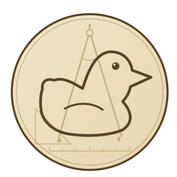
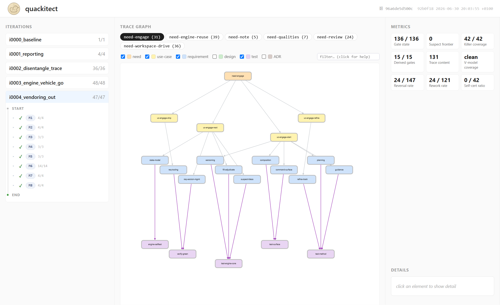

# quackitect

*The rubber duck that went to engineering school.*

**A human-driven gate ledger for spec-driven, systematic engineering.** An AI agent fills the checks; a human adjudicates the gates. The result is an **auditable, change-aware record of a project's design** — a Merkle-DAG of decisions that goes **SUSPECT the moment an input changes**, so nothing silently drifts.

> 🚧 **Under construction.** Early and evolving — the commands, spec format, and structure may change without notice. Here to explore the idea, not (yet) for production. No stability promises.

## Who it's for
Engineers and teams driving work with AI agents who need an **auditable design / decision record with human gates** — regulated or systematic engineering, requirements traceability, architecture decision records (ADRs), V-model walks, or anyone who wants the agent to *propose* and a human to *adjudicate*.

> **Code isn't the focus — but it does fall out of it.** Spec-driven tools like Spec Kit, Kiro, and OpenSpec exist to turn a spec into code. quackitect aims a level up: the **oversight and traceability ledger** that records *why* each design decision holds, gates the load-bearing ones behind a human, and reopens them when their inputs change. 

> Code is one of many deliverables: quackitect's own Go engine is built exactly that way.

## vs other spec-driven tools
|  | Spec Kit · Kiro · OpenSpec | **quackitect** |
|---|---|---|
| Job | spec → plan → **generate code** | spec → **gated ledger + deliverable** |
| Output | source code | an auditable Merkle-DAG of blessed decisions |
| On input change | re-generate | the affected cone goes **SUSPECT** → re-bless |
| Human role | review the diff | **adjudicate the gates** (never auto-passed) |
| Runtime | varies | one **dependency-free Go binary** |

## Start your project
The primary way to use quackitect is to **tell your AI agent what you need**. It runs the
onboarding for you.

> Say to your agent: **“let's start a new project.”**

Quackitect will walk you through all steps up to your first milestone.
Need more details, or a list of all functions? Ask it.

You're looking at quackitect's own design, tracked and build by quackitect. It **dogfoods itself.**

---
spec-driven development · requirements traceability · decision records · design-as-code · systems engineering · V-model · AGENTS.md · AI coding agents · audit trail · gate ledger · Merkle DAG
