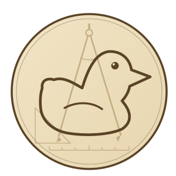
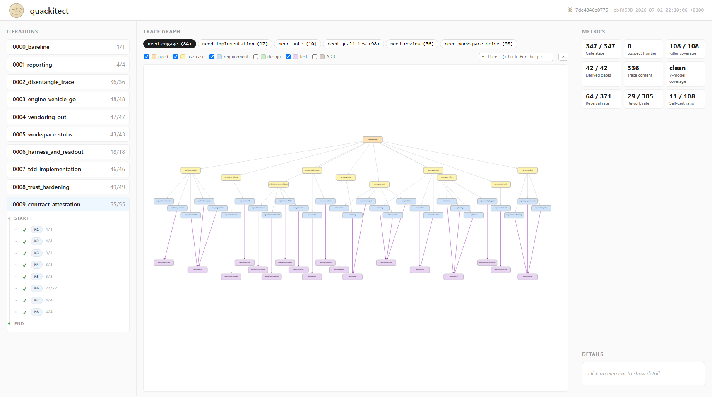

# quackitect

## Has this ever happened to you?

- You had a bright idea. You pushed the project for two months, drowned in tech debt, and now it collects dust.
- You're two years into a product. There is this one thing. The thing the customer said he didnt need. The thing you warned him would blow up the budget and the timeline if he ever changed his mind. Well. He changed his mind. There goes your architecture.
- New colleagues join the team. The old zombie discussions claw their way out of the grave. *"Why is this done this way?"*. Its been like that for twenty years. Nobody wrote it down.
- Your agent vibe-coded a thing. It looked great. Now it doesn't work, nobody can fix it, nothing's documented. And the bot just runs in circles.

Been there. Done that. Can't recommend.

There has to be a better way!

**quackitect**  
*The rubber duck that went to engineering school.*

quackitect is an [LLM](https://mb-89.github.io/quackitect/book.html#term-llm) Harness: rules and tools wrapped around an AI agent while it works. It knows how to properly architect. It's trained on forty years of engineering method: requirements engineering, architecture decision records, the V-model, verification and validation, the whole canon. You want to shoot a rocket to the moon? quackitect knows how they did it.

It asks the right questions, at the right time. It pushes back where you need it. It sharpens your ideas, writes down your decisions, understands your requirements and traces them into your design. It designs the deliverable, tests it, documents it. When (not if) you plan changes, it tells you the impact.

All you bring is the big ideas — and your judgement.

> 🚧 **Under construction.** Early and evolving — the commands, spec format, and structure may change without notice. Here to explore the idea, not (yet) for production. No stability promises.

## Who it's for
Engineers driving work with AI agents — software or any other discipline — who need to trust work they did not watch happen. An experienced developer reads between the lines. A model doesn't: where context is missing, it fills the gap with a plausible invention. So the intent has to be explicit *before* the build — the needs, the constraints that bind, the decisions and their reasons. quackitect governs that loop instead of trusting the run: the agent *proposes*, you *adjudicate* the [gates](https://mb-89.github.io/quackitect/book.html#term-gate), and a deterministic [ledger](https://mb-89.github.io/quackitect/book.html#term-ledger) keeps the record honest.

## vs other spec-driven tools
|  | Spec Kit · Kiro · OpenSpec | quackitect |
|---|---|---|
| Job | spec → plan → generate code | spec → gated ledger + deliverable |
| Output | source code | auditable [trace](https://mb-89.github.io/quackitect/book.html#term-trace) + deliverable |
| On input change | re-generate | every check the change touches reopens for review - you re-approve it |
| User role | review the diff | adjudicate the gates (never auto-passed) |
| Runtime | varies | one dependency-free Go binary |

> Spec-driven tools like Spec Kit, Kiro, and OpenSpec work the output end: turning a spec into code. quackitect bets on the opposite end. Models keep getting better at producing output — the decisive leverage moves to the design *input* and to keeping the decision history first-class. The two halves compose:
> - quackitect produces engineering design input (code, CAD-files, plans, documents, concepts in general, ...) plus the oversight and traceability ledger that records *why* each design decision holds. 
> - either quackitect or a different framework of your choosing implements from this input. For example, quackitect runs its own development. This book, this repo, this README came out of the loop it describes.

## Start your project
The primary way to use quackitect is to **tell your AI agent what you need**. It runs the
onboarding for you.

> Say to your agent: “clone https://github.com/mb-89/quackitect, and lets start a new project”

Quackitect will guide you through all steps up to your first [milestone](https://mb-89.github.io/quackitect/book.html#term-milestone).
Need more details, or a list of all functions? Ask it.

> Not ready to hand over a repo yet? **Watch this:** [From nothing to pong in 5 minutes](https://mb-89.github.io/quackitect/book.html#man-deck-pong)

<!-- This image is a committed snapshot (.github/report.png). The LIVE board: run `quack report`. -->

You're looking at quackitect's own design, tracked and built by quackitect. It **dogfoods itself** — every claim above sits in its own ledger, behind its own gates.

## Further reading

| Link | What it is |
|---|---|
| [The book](spec/book.html) | quackitect's whole spec as one page. Works locally and on GitHub. |
| [Read the book in your browser](https://mb-89.github.io/quackitect/book.html) | The same book on GitHub Pages. No clone needed. |
| [The five-minutes walkthrough](https://mb-89.github.io/quackitect/book.html#man-deck-pong) | From an empty folder to a shipped Pong game, measured. Opens as slides; the last slide plays the game. |
