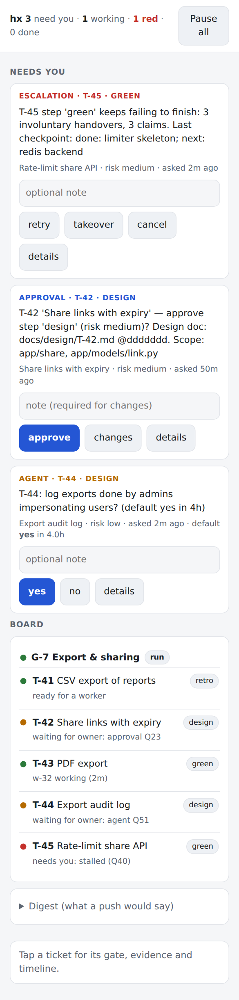
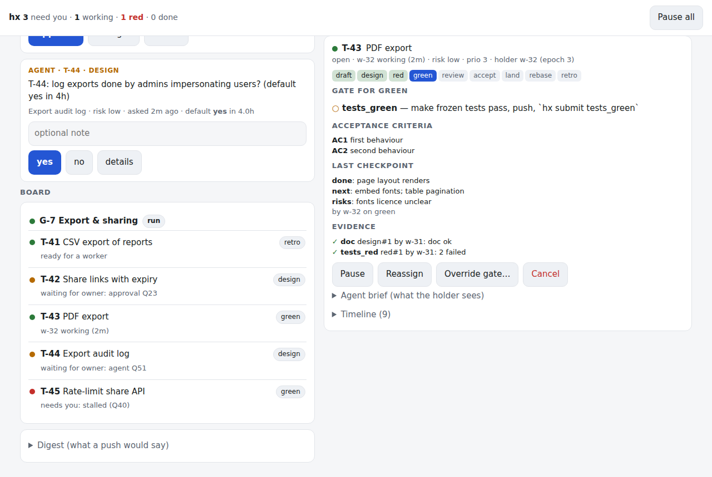

# hx: a harness for long, gated, multi-agent work

This is clean-room design C. `hx` lets LLM agents carry tickets through multi-step processes (draft →
design → failing tests → implement → review → accept → land → retro):

- every step has an owner (an agent, a helper agent or the human) and a gate over **verified evidence**
- agents crash, stall and wait, and the harness hands work over, detects stalls and asks the owner only
  when it must
- the owner works mostly from a phone

The documents:

- **[DESIGN.md](DESIGN.md)** answers the four questions and covers the data model, the loops, failure
  handling and the trade-offs that were rejected.
- **[EVAL.md](EVAL.md)** explains how to prove the harness beats a single agent, with the measurements
  that were run.
- **[COMPARE.md](COMPARE.md)** compares this design with the owner's existing system. It was written
  only after this design was finished.

## Quick start (standard library only, Python 3.11+, git)

```bash
python3 -m unittest discover -s tests -t .     # 73 tests, ~20 s (real git, real hooks, real HTTP)
python3 demo/run_demo.py                       # writes demo/TRANSCRIPT.md (a group of 3 tickets end to end)
python3 eval/sim.py                            # Monte Carlo: single agent vs hx on the real engine
python3 eval/overhead.py                       # hook latency, brief size, store throughput
python3 eval/pilot.py hookcheck                # real Claude Code session(s) through hx-0 (needs `claude`)
```

Try it by hand:

```bash
export PATH=$PWD/bin:$PATH HX_STORE=/tmp/hx-try/log.jsonl
hx ticket add T-1 --title "slugify" --criteria "lowercases" --criteria "dashes" --test-cmd "python3 -m unittest"
HX_SESSION=w1 hx claim                 # the brief: ticket, step, gate checklist, commands
HX_SESSION=w1 hx done                  # exit 2: GATE NOT SATISFIED, with the checklist
hx board; hx inbox                     # the owner's view
hx serve --port 8765                   # phone-first owner UI; open the printed URL with #token=...
```

## The owner's UI (real screenshots, headless Chromium)

| Phone (inbox first) | Desktop (board + detail) |
|---|---|
|  |  |

`demo/ui_check.js` starts a coordinator in a realistic mid-flight state (`demo/ui_scenario.py`), takes these
screenshots (plus `docs/ui-phone-dark.png`) and clicks through an approval and an answer, asserting that
the server's state changed. Run it with `NODE_PATH=$(npm root -g) node demo/ui_check.js` (needs Playwright).

## What is in the box

| Path | What it is |
|---|---|
| `hx/engine.py` | The deterministic core: `apply(state, event)` validates every transition, and `fold(events)` replays the log (invalid events are skipped and recorded). Covers gates, routing, loop limits, approvals as gate checks, leases with epochs, conditional expiry, escalations and per-ticket stats. |
| `hx/processes.py` | Processes as data: `feature`, `bugfix`, `chore`, `group`, and `mvp` (hx-0). |
| `hx/verify.py` | Verifiers that check pushed commits in clean exports: red (it loads, runs and fails, and every AC is referenced, then it freezes), green (descends from red, frozen blobs unchanged, tests and suite pass), design doc headings plus scope, structural review and retro checks, and the merge queue (merge the reviewed SHA, run CI on the result, CAS on main). |
| `hx/store.py` | Append-only stores: memory, a JSONL file with `flock`, and a git ref with compare-and-swap through `update-ref`. |
| `hx/service.py` | The single API: owner operations, agent operations, and the clock (`tick`: expire, nudge, revoke, escalate, deadlines, merge queue, dispatch, push batching). |
| `hx/views.py` | Projections: the agent's **brief**, plus the owner's board, inbox, health and digest, and a markdown board. |
| `hx/cli.py`, `bin/hx` | The `hx` command, used by agents, hooks, CI and the owner. |
| `hx/hooks.py` | Claude Code hooks: SessionStart brief, PreToolUse guards, PostToolUse heartbeat and notices, Stop guard, SessionEnd handover. They fail open. |
| `hx/server.py`, `hx/ui.html`, `hx/client.py` | The coordinator (`hx serve`): the owner UI, a JSON API for remote agents in sandboxes, and a background clock. |
| `hx/mcp.py` | Optional MCP stdio wrapper with the same agent commands as tools. |
| `examples/claude-settings.json`, `examples/skill/SKILL.md` | How to install the hooks and the protocol skill in a repo. |
| `demo/run_demo.py`, `demo/TRANSCRIPT.md` | A deterministic end-to-end demo and its transcript. |
| `eval/` | The simulation, the overhead measurement, the real-model pilot, and `results/`. |

## Installing in a repo used with Claude Code

1. Put `bin/` on PATH, or vendor `hx/`.
2. Copy `examples/claude-settings.json` to `.claude/settings.json`, and `examples/skill/` to `.claude/skills/hx/`.
3. Set `HX_STORE` (local) or `HX_URL` and `HX_TOKEN` (coordinator).
4. Set `HX_REPO` to the shared remote the verifier checks.
5. The dispatcher starts each session with `HX_SESSION`, `HX_TICKET` and `HX_ROLE`. The SessionStart hook
   claims the step and injects the brief.

The owner runs `hx serve` (UI, API and clock) or `hx tick` from cron.

## Status

The prototype covers the core. Production pieces are designed but not built:

- GitHub API adapters (check-runs as evidence, PR lifecycle, merge queue)
- per-session tokens
- snapshots for long logs
- web push

See DESIGN.md §3.7–3.8 and §9.
