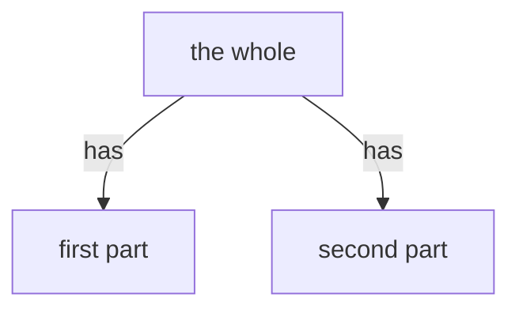

# element-tree

A flowchart without subgraphs: parent -->|has| child edges over declared elements.
Part-of nesting ONLY - ranking belongs to the onion layer map, an orthogonal dimension.
The function tree and the element tree are DIFFERENT trees (SyA: functional vs
static partitioning); allocation maps between them.

## By example (the mint stub)

