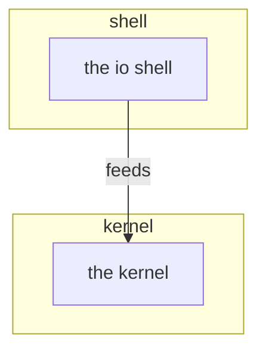

# onion

Concentric LAYERS over declared elements: one subgraph per layer, listed
innermost first. Calls point inward only. Only the rim touches the world.
The committed layout spec (req-onion-io-rendering) rules the render: inputs on
the top bus, outputs on the bottom bus, node sides by core direction, coupling
clusters as enterable coreless boxes. Any project whose software ranks by depth
reuses this kind; the engine's own model-engine-layers is the first instance.

