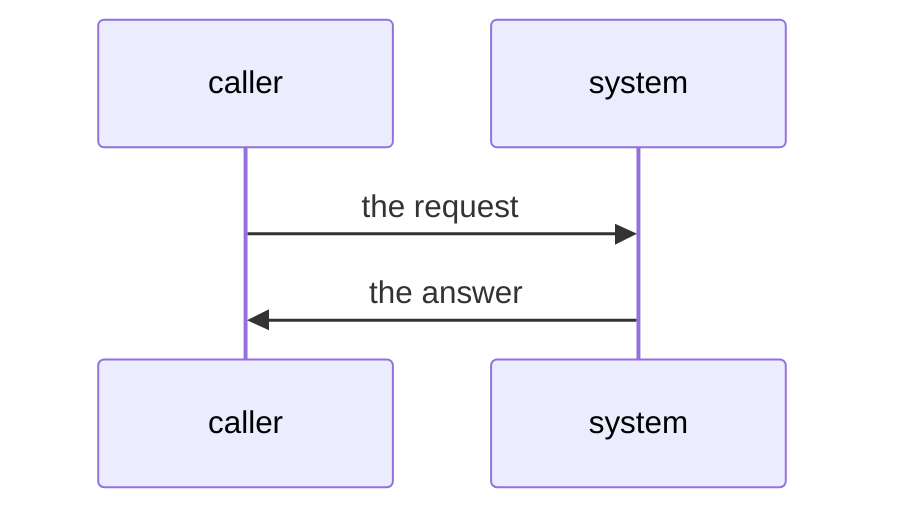

# sequence

sequenceDiagram: participants declared first (the TikZ discipline), messages carry
their payload as the label.

## By example (the mint stub)

```mermaid
sequenceDiagram
  participant caller
  participant system
  caller->>system: the request
  system->>caller: the answer
```
