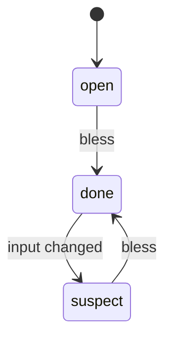

# state

stateDiagram-v2: states and labeled transitions. The transition label names the
trigger. Cheap to conformance-check against a code enum plus its transition set.

## By example (the mint stub)

