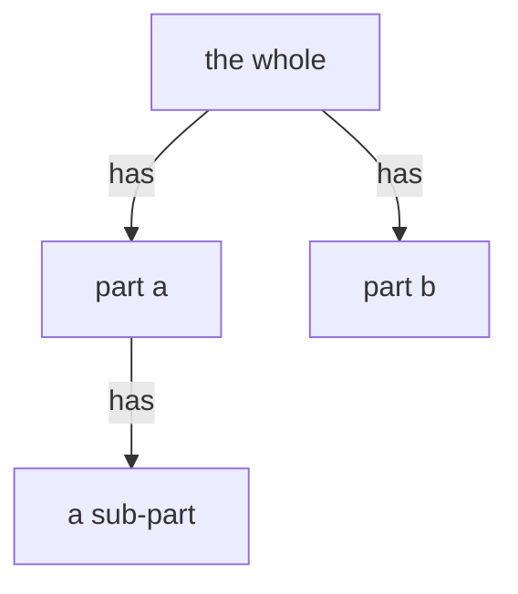

# structural

A GENERIC part-of structure: parent -->|has| child edges over declared elements.
One model per altitude. A shipped product, a physical assembly, and a software
breakdown are each their own instance. Nothing product-specific lives in the kind.
Part-of nesting ONLY. Ranking belongs to the onion kind, an orthogonal dimension.
Other relations may ride labeled edges beside `has`.

