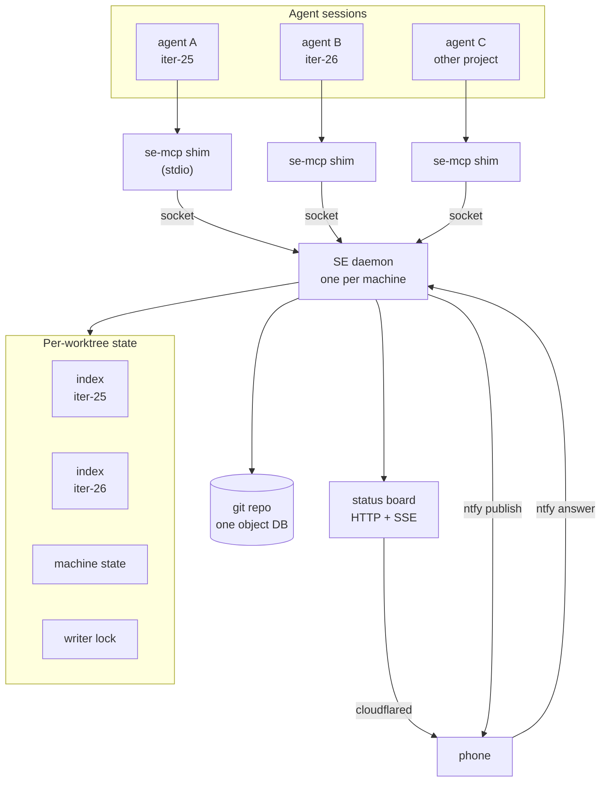
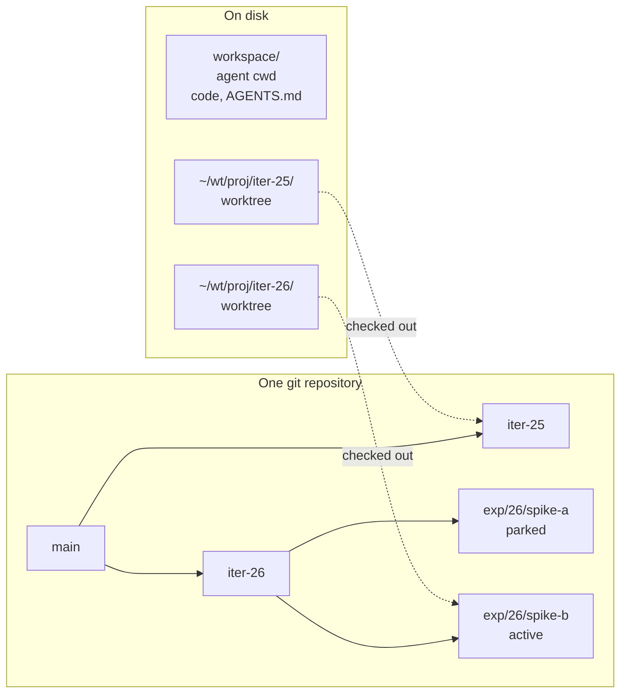
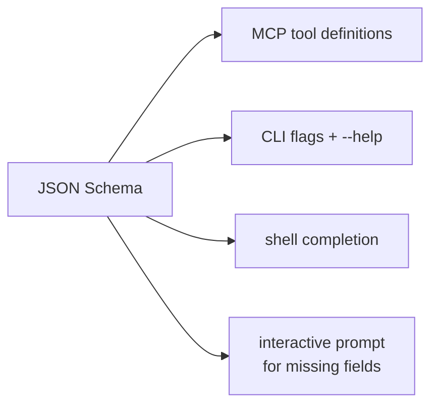
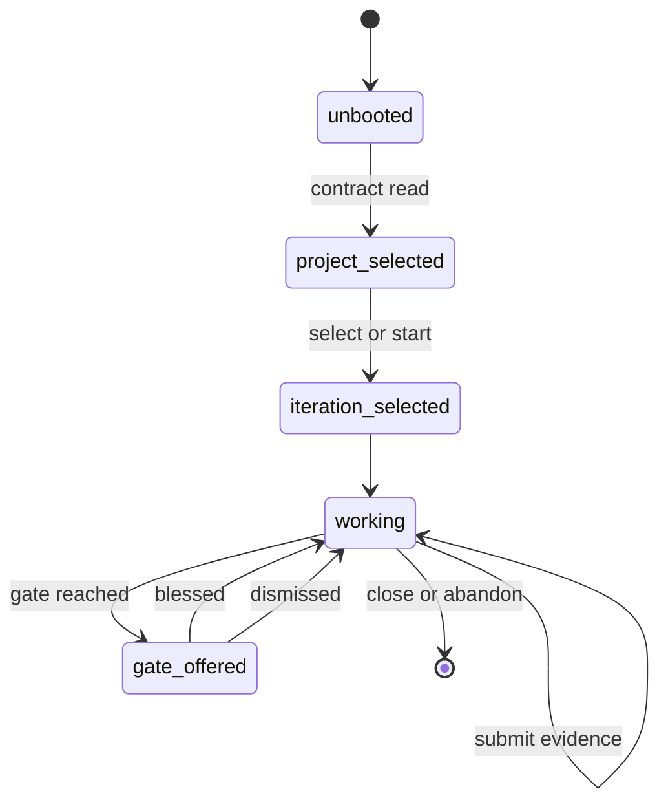
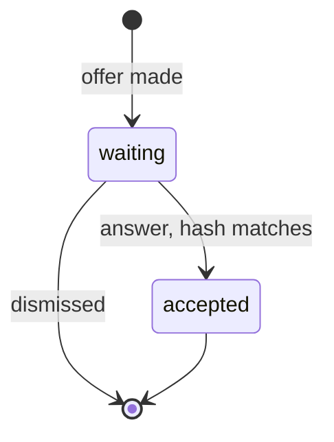
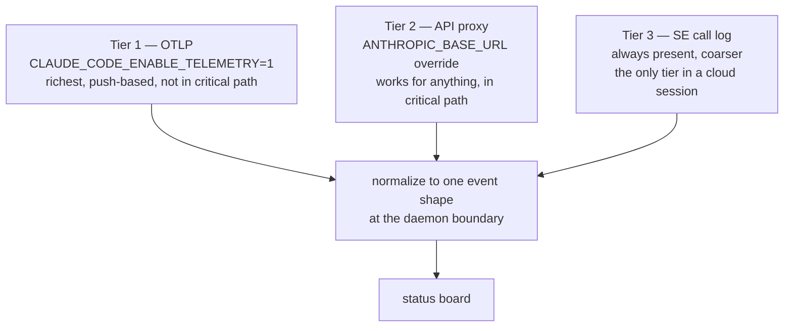
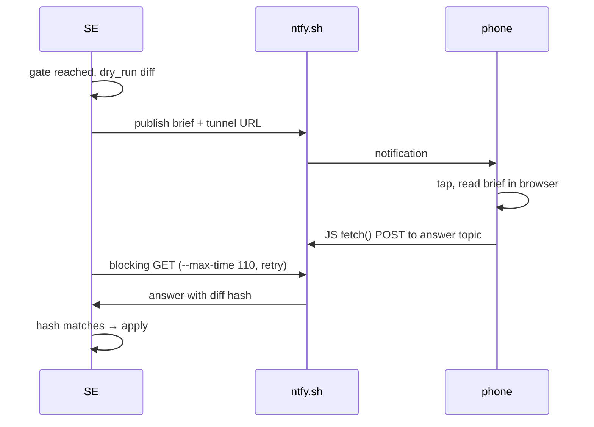
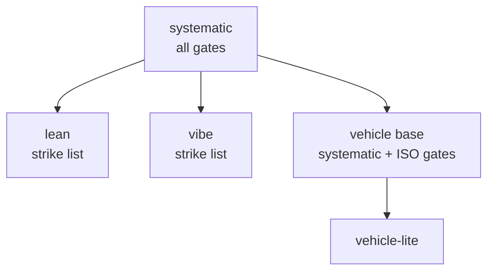
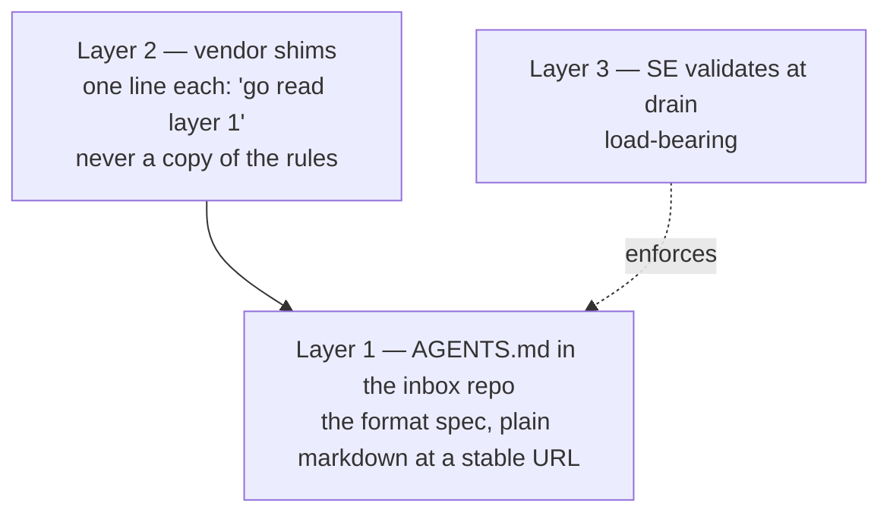

# SE — Systematic Engineering

Design document, v2.

**Status: not authoritative.** Nothing here has been through a gate. Route it
into the ledger before treating any of it as decided.

---

## How to resume

**This document is the continuation vehicle.** It carries the whole v2 design
discussion. A new session can pick up at any section.

### Where it came from

- A chat session on 2026-07-20/21 (the phone loop, git layout, tool surface,
  state machine, concurrency, observability, the knowledge layer).
- A parallel VS Code session on 2026-07-20, handed over as a digest (the three
  pillars, the edit model, modules, Benjamin, the dependency system).
- Benjamin's own project spec at `i0001_ideation`.
- A local Cowork session on 2026-07-21: digest inspection (buecher), red team
  and rulings (`wings-redteam.md`), iteration plan (`v2-iteration-plan.md`),
  partial P2 verification (`p2-cloud-handover.md`). Dated **2026-07-21
  update blocks** throughout this document come from that session.

### What a resuming session also needs

| Input | Why | Where |
|---|---|---|
| **quackitect repo (v1)** | the system being replaced; also the source of the v1 baseline measurement | `github.com/mb-89/quackitect` |
| **Benjamin project archive** | §8e summarizes it; the actual 24 requirements, 15 use cases and 24 references are in the project | local `.7z` / project dir |
| *(everything else)* | folded into this document: iteration plan §17, remote-loop operations §18, open handover items §19 | this file |

Superseded and safe to discard (all folded into this document 2026-07-21):
`remote-loop-handoff.md` (§4, §11); `v2-iteration-plan.md` (§17);
`handover-transport-setup.md` (§18); `p2-cloud-handover.md` (§19);
`wings-redteam.md` (rulings in §7/§8c/§8e/§16, prior-art table in §8e);
`p2-findings.md` / `p2cloudreturnC3.md` (results in §4/§11/§14/§16 —
archival detail only). **This document is the only file to carry.**

### State

**Ruled:** v2 rather than rebuilding v1. Go stays. v2 need not be smaller than
v1 — the test is that each addition is load-bearing for a named failure. Cloud
sessions must work from the start. Modules from day one. kb ships as a module,
not as a discovered MCP partner.

**Not started:** nothing has been built. No code, no repo, no ledger entries.

**Read §16 first** if you want the shortest path to what is decided, what is
open, and what is unverified.

### Two things worth doing before more design

1. **Measure v1.** Count tool calls per completed step in the current iteration.
   It is the only baseline v2 can be judged against, and it disappears once v1
   stops running.
2. **Run the four experiments in §16.** They total about an hour and three of
   them can invalidate whole sections.

---

**Rulings so far.** Go v2. Go the language — settled, not strongly held.
v2 does **not** have to be smaller than v1; the test is that each addition is
load-bearing for a named failure. Cloud sessions must work from the start.

---

## 1. What SE is

A process layer over a git repository. It holds a ledger of design decisions,
enforces a process by which decisions enter that ledger, and mediates all agent
access to it.

Two things it is not: a security boundary, and a tamper-detection system. The
hash chain exists for **change invalidation** — content changes, hashes change,
descendants become suspect — not for integrity against an adversary.

The problems it exists to solve:

- We change something and misunderstand the impact.
- We implement and forget a requirement.
- We remove a need and can't see what design is now dead weight.

The problem v2 exists to solve that v1 didn't:

- The agent is slow. Time goes into trivialities — ad-hoc scripts, reading too
  much, editing line by line.
- We can't see what the agent is doing.

---

## 1b. The three pillars

### Pillar 1 — guidance-first

At any point the agent asks SE "what now, and how do I do this step?" and SE
**produces** the answer: the next step plus the method slice for it — what to do,
how to verify, what to do when stuck. **Push, not search.**

v1 already steers by refusal. v2 makes steering the default channel rather than
the error channel. Side benefit: the agent stops loading whole method files, so
context stays lean.

Guidance lives as **nodes in the ledger**, tagged and referenced from state
machine transitions — versioned, traced and gated like everything else. Tailoring
a policy can swap method slices without touching the machine.

**Inline the guidance for the primary transition, pointers for the
alternatives.** The common path costs one call; only branching costs two.

### Pillar 2 — MCP-only lane

Everything the agent does goes through the MCP server. The console stays for the
human. This is what makes pillars 1 and 3 mechanically possible.

### Pillar 3 — the update-toll

The server timestamps the agent's last update. When a tool call arrives more than
N minutes after it, the server refuses **once**: "give me an update first." The
update rides as the tool argument, then the original call proceeds.

**This works because work IS tool calls.** The agent physically cannot keep
working un-narrated. No interrupts, no polling, no model cooperation, no harness
support — and it works in a cloud session where OTEL and the proxy do not.

It does not replace inference; they compose. The toll narrates an agent that is
working; silence-past-p50 catches one that has stopped calling entirely.

Details:

- The tolled update is structured — current step, next milestone, clock-time ETA
  — and lands server-side: heartbeat store → board → phone push. Chat rendering
  is unreliable in some harnesses; the server surface is not.
- Window length and wording ride config.
- Must not fire mid-attest-handshake. Arm it only after the first submit, or the
  first call of a session pays a toll for a session with no history.
- Idle-waiting needs no carve-out: no tool calls happen, so no toll fires. **But
  idle-wait must be a distinct board state**, or an agent parked on a gate looks
  identical to a hung one.
- Don't narrate toll status on the success path. Refuse when due, and carry the
  update schema inline in the refusal so paying it is one corrected call.

### Pillar 4 — modules by default

**RULED:** v2 is modular from day one. v1's module system arrived late (i23) and
its fitness is unproven. v2 inverts it: **multiple modules are the standard
state, a single module is the degraded state** — and the collapse is a designed
feature.

First module: `se`. Second, soon: `kb` (knowledge base).

**Structure never collapses, only presentation does.** The module dimension
always exists — real module ids, dirs, config, dotted node ids — even with one
module. Commands, views and renders hide the module qualifier while only one
exists. Adding module #2 flips presentation on and touches **zero existing
data**: no migration, no id churn.

**RULED:** modules are weakly linked. They may interact (kb ↔ se), but a module
must remain usable standalone elsewhere.

Declared dependency direction: `se` may depend on `kb`, never the reverse.
Cross-module references live in a declared seam (v1's connections lanes with
dotted ids are the proven shape). No module reaches into another's internals.

**The module INTERFACE is the urgent design object**, because co-development
forces it early. A module contributes: artifact types + schemas, its guidance
slices, its check lanes, its render views.

### Pillar 5 — kb lives in Benjamin

**RULED:** kb is not quackitect's. It belongs to a separate project (working name
**Benjamin**) whose first module it is. Benjamin and quackitect v2 are developed
together; the module import machinery must work from day one.

**RULED:** during co-development kb is an **import** (live link, no copy).
Vendoring is decided at ship.

**RULED (supersedes C2 of Benjamin's own M1 frame):** kb ships as a **module**,
not as a separate MCP partner that quack discovers and falls back from.
Knowledge management is too integral — it will always ship.

Why module wins:

- Pillar 2 says everything goes through **the** MCP server. A separate Benjamin
  process is a second doorway, and the toll, the call log and the board all key
  off there being one. As a module, kb's tools are `kb.*` on the same surface.
- If it always ships, the entire discover-and-fall-back path is dead code —
  written, tested and maintained for a case that never occurs.
- Weak linking (pillar 4) already gives standalone Benjamin, so module costs
  nothing there.

**The line that must hold: the module travels, the content never does.**
Vendoring kb's *machinery* into quack is correct — schemas, guidance slices,
check lanes, render views. Vendoring kb's *content* would put no-remote material
into a repo you push. "Vendor the module" sounds like it includes what's in it.
It does not.

Upstream-first, always: Benjamin is kb's single home. A fix found inside
quackitect flows to Benjamin first — otherwise the copy forks and rots. Reuse
v1's proven vendor-plus-ratchet pattern, and make re-vendoring a cheap
determinizer (one command), because co-development means it runs constantly.

**Benjamin is a librarian** — see §8e for what that means concretely.

### Pillar 6 — the import/vendor duality

See §8c for the full dependency system.

---

## 1c. One rhythm, three scales

The same shape appears at three levels, and naming it makes the whole system
learnable:

| Scale | Isolated during | Reconciles at |
|---|---|---|
| Within an iteration | steps | **reviews** (checks are legal only there) |
| Across iterations | the branch's life | **merge** (recompute diff, rehash, suspects) |
| Across projects | the iteration | **pull at start / push at ship** (dependency layer frozen between) |

Work proceeds against a stable snapshot; reconciliation is a scheduled event, not
a continuous background process. Zero watchers at every scale.

**A consequence worth stating: the frozen dependency layer removes the
cross-repo atomicity problem.** Because you never write to an imported module
mid-iteration, no transaction ever needs to span two repositories. Upstream
changes travel as proposals through the inbox at ship, never as direct writes.

These are the acceptance criteria. If v2 does these, it works. Each is testable.

### UC-1 — Capture a note from anywhere

I have an idea while away from my machine. I tell an LLM chat "note for SE:
…". It lands in a private inbox repo as a file. Next retro drains it.

**Passes when:** the note is retrievable by a retro that started after it,
without me touching a terminal.

### UC-2 — Adjudicate a gate from a phone

An agent runs, hits a gate, and stops. I get a notification. I open a link, read
the brief, and bless or dismiss. The agent continues.

**Passes when:** the full cycle completes with my machine asleep, and the bless
is recorded with the channel it arrived through.

### UC-3 — Work an iteration interactively

At my desk, one agent, one iteration. I walk it through the process. `next`
tells it what to do; it does; it submits evidence; the step closes.

**Passes when:** the agent completes an iteration without me correcting a
process mistake, and without it writing an ad-hoc script to do something SE
should have done.

### UC-4 — Two agents, two iterations, one project

I start agent A on iteration 25 and agent B on iteration 26 in the same project.
They work simultaneously without interfering.

**Passes when:** both complete, both merge, and the second merge correctly marks
suspects created by the first.

### UC-5 — Expedition, parked and resumed

Mid-iteration I start an expedition. I park it, start a second one, work that,
promote it. Later I resume the first.

**Passes when:** the parked expedition resumes at the state it was left in, and
the ledger is untouched by anything not promoted.

### UC-6 — Human edits by hand

I open the ledger in Obsidian and edit markdown directly. No agent involved.

**Passes when:** SE notices, rehashes, records the change as human-authored, and
any blessed node whose content changed drops to suspect. Nothing blocks me.

### UC-7 — Retro

At the end of an iteration, a retro reads the inbox, the call log, and the
iteration's history, and tells me where the process cost time.

**Passes when:** it produces a ranked list of contract clauses by
frequency × turns-to-recover, and the drained notes are marked drained.

### UC-8 — See what is happening

Multiple agents running. I open one page and see where each is, what it is
thinking, what shells it has spawned, and what needs me.

**Passes when:** a stuck agent is visibly stuck within a minute, without me
poking anything.

### UC-9 — Cloud session survives reclaim

An agent runs in a cloud VM. The VM is reclaimed while I'm out. I come back and
resume.

**Passes when:** a fresh session resumes from the ledger with no loss of
committed process state.

### UC-10 — Downstream project

A separate project (the work vehicle) uses SE with its own policy that extends
systematic. Multiple people work on it.

**Passes when:** claims and blesses are attributed to the accountable human, not
to "the agent", and the downstream policy can add gates systematic doesn't have.

---

## 3. Architecture



**Why a shim.** MCP over stdio means the harness spawns the server as a child of
the session. Three agents, three processes, unavoidable. So the spawned thing is
nearly empty — forward MCP calls over a socket — and all state lives in one
daemon per machine.

**Build per-process first.** Put the shim boundary in from day one, but don't
build the daemon until the unified board demands it. Then it's a change of what
sits behind the socket, not a rewrite.

---

## 4. Repository layout



The agent's cwd is `workspace/`. The ledger is never in it. The agent reaches the
ledger only through SE tools, and SE can move the ledger worktree between
branches without the agent noticing.

**Worktrees, not clones.** A worktree is a second checkout sharing one object
database — one `.git`, one set of refs, one remote. A commit in one is instantly
visible from another. Git refuses to check out one branch in two worktrees,
which catches the double-writer case for free.

**One worktree per concurrent execution context, not per branch.** A parked
expedition is a branch with no worktree. It costs nothing.

**Never `git stash`.** `refs/stash` is repo-global and shared across worktrees.
Two sessions would stomp each other with no isolation.

### Close and merge — the split

**The invariant: main holds live claims. Branches hold the record of how they
got there.**

Two kinds of node, with opposite fates:

| | Kind | Fate at merge | Why |
|---|---|---|---|
| Design nodes, requirements, tests | **Live claim** | **Merge into main** | Read constantly, by every future iteration, as one connected graph. Retrieval is not enough — they must be queryable together. |
| Gate records (`i26-m6-gate`) | **Event** | Stay on the branch | A fact about the past. Never revalidated, never propagates. Read on demand, about one iteration. |
| Evidence | **Event** | Stay on the branch | Heavy, read rarely, reachable by pointer. |
| Machine state | — | Stays on the branch | Dead once the iteration closes. |

```
git merge iter-27       # merge commit, tree = live claims only
git tag iter/27         # MANDATORY — the only named handle on the branch
git worktree remove ~/wt/proj/iter-27
```

The merge commit keeps both parents but its **tree contains only live claims**.
Gate records, evidence and machine state stay reachable through the second
parent forever, and never appear in a checkout of `main`.

**The tag is load-bearing, not archival politeness.** If gate records live only
at a branch tip, the tag is the only named handle on them. Lose it and they
survive by hash but become unfindable. SE creates it as part of close.

**What makes the split work is the pointer triple on the design node** —
iteration, gate ref, evidence commit. That is floor items 3 and 5. The floor
isn't bureaucracy; it's precisely what lets the heavy material stay off main.

**Accepted cost:** a cross-iteration audit over gate *contents* ("which
decisions were blessed through the weak channel") means walking N tags instead
of one query. Rare, and SE holds the tags.

### Why gate records must not propagate

A gate record embeds the blessed hash as a **snapshot value, not a live
reference**. So when the design node's content later changes, its hash moves and
the gate record's does not.

That gives the staleness signal for free — gate says blessed hash X, current
content hash is Y, X ≠ Y → *this decision was blessed against content that has
since changed.* A query over main, computed on demand, not a propagated flag.

Nothing propagates **out of** a gate record, and nothing propagates **into** one.
Suspect propagation walks design edges only. Closed means closed: an iteration's
gates are never revalidated. What stays live is the artifacts.

**Suspected v1 bug worth checking directly:** if v1 lets gate records
participate in propagation, every upstream change floods the suspect set with
historical gates — one per gate per iteration, growing linearly with project age
and never shrinking. That would produce exactly the "mass-suspect ergonomics"
symptom. Measure the fraction of a cone that is gate records versus live
artifacts. If it's mostly gates, this is a node-classification bug with a
one-rule fix, not an ergonomics problem needing a UI.

**Residual value of a gate record is context, not work:** when a live design node
goes suspect, "last adjudicated at i26-m6, here's what was decided and on what
evidence" is what you want in front of you while deciding. Provenance serving the
current decision, never resurrecting the old one.

### Branch isolation

Iterations do **not** see each other's in-progress work. Both branch from `main`
as it stood when they started, diverge, and merge back independently.

```
main ──┬── iter-27 ──┐
       │             ├─► main
       └── iter-28 ───────┘
```

Whichever lands second finds `main` moved underneath it: recompute the diff
against the new head, rehash, and anything the first changed that the second
depended on shows up as a suspect. Reconciliation happens at the merge, not
continuously.

That is what keeps the working tree from growing with project age. It does not
shrink the repository — use `--filter=blob:none` when cloning into a cloud VM.

**Operational rule, not a security one:** if superseded content lives only in
history, rebasing or force-pushing a published branch destroys ledger content.
SE refuses to do it.

### Cloud constraint on close

The cloud proxy restricts git push to the current working branch, so the
merge-into-main-and-push flow may be blocked in a cloud session. **Verify early.**

Safe design either way: a cloud session never merges locally. It pushes the
iteration branch and opens a PR, merged via the GitHub tools already available
there. That also gives `main` branch protection, so it's the better flow
regardless.

`~/.se/` is ephemeral in a VM — rebuild the worktree registry from
`git worktree list` on startup rather than treating it as durable.

**Sharpened 2026-07-21:** in a *Cowork* cloud session there is **no git write
path at all** — the proxy injects credentials only for session-configured
repos (this session type has none), and the GitHub MCP connector is
effectively read-only (`403 Resource not accessible by integration`). Cloud
iterations therefore presuppose a session type with the working repo
configured at session start (Claude Code cloud). Anonymous reads, worktrees
and `--filter=blob:none` partial clone incl. on-demand blob fetch all work
through the proxy — verified.

---

## 5. Tool surface

Flat list — MCP has no hierarchy. Dotted names group visually, which is what a
weak model actually attends to.

### Read

| Tool | Does |
|---|---|
| `se.get.node` | One node. `mode`: outline \| section \| full. Defaults to outline. |
| `se.get.search` | BM25 over content. Ranked snippets with anchors, never whole files. |
| `se.get.query` | SQL or Bases over views. `lang` required, no auto-detect. Accepts a stored base by reference. |
| `se.get.graph` | Named traversals: ancestors, descendants, neighbors(depth), suspects. |
| `se.get.history` | What changed since a hash, and who authored it. |

### Write

| Tool | Does |
|---|---|
| `se.set.apply` | Atomic list of operations. `dry_run` returns diff + hash; passing the hash executes. |
| `se.set.refactor` | Derived-scope ripple. `kind`: rename \| move \| supersede \| split \| merge. |

Operations inside `apply` are payload, not tools: `create`, `delete`,
`set_field`, `replace_section`, `add_edge`, `remove_edge`. Fifty edits is one
call carrying fifty operations.

No line-based or string-match editing anywhere. Everything addresses nodes,
fields and sections.

`add_edge` / `remove_edge` are the **only** way trace links are written.
`refactor` rewrites identifiers and may never create or destroy a trace edge.

### Loop

| Tool | Does |
|---|---|
| `se.loop.next` | The entry point. Always callable, never errors. Optional `iteration`. |
| `se.loop.start` | Opens an iteration. Policy selection is a step inside it. |
| `se.loop.submit` | Produces evidence for the current step. SE validates and closes it. |
| `se.loop.abandon` | Terminal, recorded with a reason. |

### Emit — pure projection, writes nothing

| Tool | Does |
|---|---|
| `se.emit.report` | Current state. |
| `se.emit.book` | Full documentation. |
| `se.emit.handover` | Context transfer. |
| `se.emit.release` | The shipped artifact. Checked as a late step in an iteration. |
| `se.emit.board` | Returns the board URL. |

**The group's invariant is that emit is always safe to call.** One member with
side effects destroys that and you never get it back.

### Other

| Tool | Does |
|---|---|
| `se.run` | Shell execution routed through SE, so it appears on the board. |
| `se.ask` | A question to the human, on the same rail as gates. (Cut — see §16.) |
| `se.help` | **Added 2026-07-21.** Keyword search over tool descriptions + guidance slices. Returns closest-match affordances (never recommendations), or the honest, permissive refusal: "no such tool — do it yourself." Every call logged with stated intent: misses are the live missing-tool demand signal (the runtime version of §15's history mining), hits are discoverability telemetry. Contract: ad-hoc work without a preceding help call is a violation, checkable from the call log at review. Day-one spine tool. |

**Added 2026-07-22 (P5 mining + owner rulings):**

| Tool | Does |
|---|---|
| `se.wait` | The declared wait lane. Blocks until a **mechanical** condition changes (verdict, file, offer state) or a timeout passes. Runs no checks — nothing on any read path executes checks. Long waits are not waits: the agent parks, the ledger holds the offer, a later session resumes. Tight-loop polling of a judgment surface is refused; the rejection's `remedy` carries the corrected `se.wait` call. (v1 lesson: the 2,355-call status storm, each call running ~9 live selftests.) |
| `se.set.migrate` | One-shot audited whole-ledger migration, by name from the engine's registry (engine code, test-first, never a loose script). Generates an apply manifest and rides the normal lane: dry_run → diff hash → grant → execute. Idempotent — re-run yields an empty diff, no-op. Recorded as a ledger event. First user: the P3 mint (`v1-import`). (v1 genus: migrate-actors/-edges/-layout.) |

`se.run` addition (same date): the engine keeps every run's result —
command, exit code, output — in the raw call log (no new store; the
log-everything ruling covers it). `se.loop.submit` **references** a run
record as evidence instead of the agent re-typing output into markdown
(~1,900 hand-copied evidence lines in the sebot corpus). A referenced
run is pinned into the iteration's evidence and survives call-log
cleanup. An engine-captured result cannot be fabricated by the agent.

### Cross-cutting rules

- Every result carries the node ID and its hash.
- Every response takes a token budget and truncates **honestly**: "14 more
  matches, narrow with X". Silent truncation makes an agent confident and wrong.
- No read returns more than was asked for.
- A failed `query` returns the schema in the error.
- Agents get a read-only connection and a statement timeout.

### Schemas

MCP ships full JSON Schema in `tools/list`, so the model has it before calling.
Schemas are **state-narrowed** where cheap: `iteration` is an enum of currently
open iterations. That makes invalid calls unrepresentable rather than rejected.

Caveat: the tool list sits at the front of the context, so changing it
invalidates prompt caching for everything after. Narrow only slow-changing
things; leave churny state to validation.

Schema is the source of truth and generates both surfaces:



The human fallback lane is not a separate mode. It is the same tool surface with
a different renderer.

---

## 6. The state machine

`next` is computable, not heuristic. A policy **is** a machine; tailoring is
removing transitions.



There is no `se.boot` tool. Unbooted means `next` returns "read the contract".
Blocking is an **instruction returned**, not an error.

### Edge roles

Every outgoing edge declares its role rather than having it inferred:

`normal` · `alternative` · `fallback` · `recovery` · `approval` · `error`

### Failure kinds — do not conflate

| Kind | Meaning | Response |
|---|---|---|
| **Rejected** | Illegal. Contract violation. | Never retry. Corrected call. No fallback edge. |
| **Failed** | Legal, attempted, didn't work. Tests red. | Opens fallback edges. |
| **Errored** | Infrastructure. | Retry same edge with backoff. |

Only **Failed** needs authored alternatives. If you don't separate these you'll
draw fallback edges for all three and the canvas becomes unreadable.

### Extended state, not more states

Attempt counters are variables the machine carries; transitions have guards over
them. "Try X, if it fails Y opens" is one state with two prioritized edges, the
second guarded on `attempts(X) > 0`. No combinatorial explosion.

### Implicit transitions

Every state has, without being drawn:

- **escape to parent** — leave the nested machine
- **ask human** — the andon cord

Guarantees no deadlock by construction. Draw only the fallbacks that carry
domain meaning.

**Priority must be total** or behaviour changes after a refactor:

```
authored > fallback > escape > ask-human
```

**Re-entry semantics must be declared per machine.** Shallow history (resume
where you left) or none (restart at entry). Default to restart — safer when the
world may have changed underneath.

**Escape must record which guard was exhausted.** Otherwise the retro sees
"escaped 40 times" with no attribution.

### Mechanical fill (owner ruling 2026-07-22)

A state may declare `filled_by: engine` plus the command to run,
declared on the state — never invented at run time. When `next` reaches
it, the engine runs the command itself, the result lands as evidence
(via the `se.run` capture lane), and the step closes with zero model
turns. A failing command is a normal **Failed** — fallback edges open.
Killer gates stay adjudicated: mechanical states fill, never bless.

This is the cheap replacement for LLM-reviewer re-execution — in the
sebot runs, reviewers re-running tests by hand were the only working
integrity mechanism, and the most expensive possible one (monitor fired
0 times in 50 checks; "re-ran" ×64 across the evidence corpus).

### Load-time checks

- Every machine has a validated path to a terminal state.
- No transition depends on state from a **sibling** machine.

### Authoring

Advanced Canvas (Obsidian plugin) for authoring; `.canvas` JSON exports to SE's
own format. **SE never reads canvas JSON directly** — otherwise you have a hard
dependency on a community plugin's schema. Pin the schema version in the
exporter and fail loudly on unknown shapes; a silent misparse of a state machine
means SE computes the wrong `next` and is confident about it.

Execution is pure Go/TS, no Obsidian anywhere.

### Instance scoping

Machine instances are keyed to the **worktree**, not to the agent or the branch.
Git already guarantees one branch per worktree, so the binding is enforced.

- **Machine state** (current node, guards, counters) → committed to the branch.
  A reclaimed cloud VM resumes by re-materializing the worktree.
- **Worktree path** → machine-local, `~/.se/`, never in the ledger.
- **Admission and identity** → per-session, per-shim.

Two scopes. Easy to conflate; the bugs are subtle.

---

## 7. Grants and the offer state machine

Two different grants:

- **Admission** — session-level. "You have read the contract." Gates the whole
  surface including reads. One round-trip per session.
- **Authorization** — per-write. "You have seen *this* diff."

### The diff hash is the grant

`apply` with `dry_run` returns a diff and its hash. `apply` with that hash
executes if and only if recomputing the diff against current state yields the
same hash.

That collapses three mechanisms into one:

- **Authorization** — holding the hash means having seen the diff.
- **Concurrency control** — anything that changed underneath alters the hash.
- **Replay protection** — a stale tap on an old brief can't match.

No nonce needed. The diff hash *is* the nonce, and it's content-derived.

### Three states, two of them recorded



**Dismissal requires no write.** Absence of a live offer *is* dismissal. Crash,
VM reclaim, dropped connection, human interrupt — all collapse to the same safe
state with no liveness assumption anywhere.

Rules:

- **Human interrupt = dismissal.** A returning `curl` from the subscribe loop
  = not dismissal.
- **Timeout = dismissal.** Offer deadline (~15 min) is wall clock, owned by SE.
  Transport `--max-time` is a separate clock. Do not conflate.
- A bless arriving via chat goes through the same validation as one arriving via
  ntfy. Two entry points, one guarantee.
- One iteration per brief. Never mix iterations — context switching is a tax on
  the scarcest resource.

### Out-of-band channels

The concept is not "detect the AI". It is: **the human acts through a channel
the agent doesn't control.**

| Channel | Strength | Available |
|---|---|---|
| Interactive TTY | strong locally — agent would need to drive a pty | desk only |
| ntfy answer topic | shared secret, URL secrecy | anywhere |
| signed answer + device key | non-repudiation | later epoch |

**Record which channel granted each bless.** Then the ledger can be honest about
how strongly each decision was authorized rather than treating them as equal.

### Bless with changes — 2026-07-21

- The brief renders every decision in the current gate's **cone** (never the
  whole ledger) as checkable options, the agent's proposal preselected.
  Untouched → **Bless**, binding the offered diff hash as before. Changed →
  **Bless with changes**: the answer carries (selections + base-state hash)
  and SE derives the diff deterministically — legal only because no model
  judgment sits between checkmark and edit (the named-operation argument).
- **No free-form path.** If flipping boxes isn't enough, don't bless;
  rediscuss in the harness. Counter-proposals from the phone are dead.
- Record per grant: as-offered vs with-changes. Default-accuracy rate is a
  retro metric on proposal quality.
- **Every decision takes the Pugh-matrix shape** — options, criteria,
  weights, scores, datum as structured, hashed fields. Degenerate matrices
  are legal (two options, one criterion, "no real alternatives" recorded as
  such). The **sensitivity check is engine-computed** (perturb weights, does
  the winner flip?) and rides the brief: "winner robust" vs "weight-sensitive
  — your checkmark matters." All-options-equal is a signal with two
  readings: decision doesn't matter, or a discriminating criterion is
  missing — the flag asks that question. Backwards-calculation stays an
  agent step, policy-required. Named hazard: **decision theater** (invented
  weights post-hoc justifying a predecided option); the sensitivity flag is
  the mitigation. Prior art in kb: Pahl/Beitz Sect. 6.4 (VDI 2225),
  Lindemann anti-bias decision records.

### Errors

A rejection cannot be constructed without: `clause`, `expected`, `got`,
`remedy`, `source`. Make it a type, not a convention, and test that every error
path returns a well-formed one.

- Clauses need stable IDs (`SE-C-014`). They live in the ledger, so they're
  nodes, so you can query which fire most.
- `remedy` is an **executable payload** — the corrected call, ready to retry —
  not a description.
- Success returns **affordances, not recommendations**: what is now legal, what
  state you're in, what's pending. A weak model treats a suggestion as an
  instruction and will abandon its plan to follow yours.

**Error quality is testable:** feed a rejection to a weak model cold and see if
it recovers in one turn.

---

## 8. The intermediate level — edit model

**RULED:** the LLM's output lands in a human-readable intermediate level on disk
(markdown, text formats). Renders (HTML etc.) derive from it. Obsidian is the
intended human editing surface.

**RULED:** everything not reviewable as text is not a first-class artifact.

**The intermediate level is the ONLY writable layer.** Renders are derived,
disposable, never edited.

**A human edit is not a special case. It is the designed input channel.**

### Four mechanisms

**1. Attribution by exclusion.** Agent writes go through the server. SE knows the
last hash it wrote per file — the index already holds it. Disk hash ≠ index hash
and SE didn't write it → human edit, by definition. Human edits are
**authoritative**; the agent never "fixes them back." Can drive AI-involvement
marks automatically.

This is O(files), not O(writes). **No write log needed** — durable "who changed
what" is git's job, and a parallel log would be a worse copy of it.

**2. CAS write-guard, always on.** CAS = compare-and-swap: the write carries its
own precondition. Agent edits are byte-exact old→new, refused when `old` no
longer matches disk. Mid-air collisions die at the write. Not a "check" — a free
property of every write. **This alone guarantees a human edit cannot be
clobbered**, with no lock, no scan, no watcher.

**3. Mechanical ripple.** Intermediate artifacts are hashed; an edit moves a
hash; dependents go suspect. Guidance-first delivers the delta at the next tool
call: "these files changed under you; here are the suspects; here is the
reconcile guidance."

**4. Semantic reconciliation.** Structure is linted deterministically; meaning is
agent work — walk the suspect cone, sort "still holds, here's why" from "needs
re-ruling," human adjudicates the short list in batches.

### CAS and the diff hash are one mechanism

Both are optimistic concurrency at different granularity. Build them separately
and one collision produces two rejections with different shapes. Instead, derive
the outer from the inner:

```
diff       = [ (file, old_hash, new_content), ... ]
diff_hash  = hash(diff)
```

Validating `diff_hash` re-walks the list and checks every CAS precondition
simultaneously. One check, one rejection path, and the error still names which
file moved. The outer gate cannot disagree with the inner ones because it is
computed from them.

Two properties fall out:

- **A bless is bound to a starting state, not just to a change.** You approved
  "rename it, *given the ledger looked like this*." If anything moved underneath,
  the bless is void rather than silently applied to a different world.
- **Nothing needs recording.** No lock table, no pending-grant registry. The
  precondition is in the diff and the diff is in your hand.

### When does SE scan for human edits?

**RULED: checks are legal only in reviews.** The check-storm is v1's disease; v2
makes over-checking illegal, not just discouraged. The contract's "no checking
between steps" prose becomes an engine refusal.

Safe because the CAS write-guard is always on and free — no scan is needed to
protect human edits from clobbering.

**Detection is opportunistic, not scheduled.** Any read or write that touches a
file compares its hash in passing and notices. Not a check, not a scan — a
property of access. That is what lets mechanism 3 deliver a delta without a
background watcher, and it retires the fsnotify design. Say this explicitly or
someone will implement a watcher to make mechanism 3 work.

- The 99.9% path: the human tells the agent what changed; conversation handles
  it; no machinery fires.
- The Obsidian-autosave accident: caught by the review scan via attribution by
  exclusion ("bytes changed, no author logged" → agent shows the diff → human
  rules accident or intended). Git diff at commit review is the second net.
  **Zero background watchers.**
- Accepted residual: a forgotten, unmentioned human edit surfaces at the next
  review that touches its cone — late but correct, and the suspect mechanism
  names why.

**Review cadence** in practice was never more than a few hours in v1, usually
less. That is often enough; no change needed.

### Hashing cost

Irrelevant. SHA-256 with hardware acceleration runs ~1–2 GB/s per core; the whole
ledger is single-digit megabytes of markdown. An apply touching fifty files is
well under a millisecond — four or five orders of magnitude below a model turn.

What could cost: disk I/O to read files for verification (mitigated by caching
hash keyed on path + mtime + size), and descendant rehash on ripple (bounded by
the cone, in memory once the index is warm).

Use a cryptographic hash even though this isn't a security mechanism. A collision
would mean a silently missed suspect — exactly the failure class the ledger
exists to prevent — and SHA-256 is already free at this scale.

### Pictures

**Drawn = text.** SVG is XML, Mermaid is text, Excalidraw files are JSON.
First-class, diffable, no compromise. Owner draws the target; the JSON hashes
into the node's inputs.

**Captured (photos, screenshots) = evidence class, second-class:**

- content-hashed, with the hash riding in the referencing markdown, so a swapped
  image still ripples suspect;
- **mandatory caption** — the one line saying what to see, the text proxy;
- **never sole truth.** What the picture shows that matters must also exist as
  text (caption, extracted table, traced diagram). The photo witnesses; the text
  asserts.

**CAD is open:** which text-first representation (parametric script, STEP-as-text,
code-CAD)? Selection criterion is the ruling above — if it can't live as
reviewable text, it can't be a first-class artifact.

---

## 8c. The dependency system

**RULED:** vendoring is general, not software-only. **Modules, software and
references** (snapshots into the outside world) all ride one system.

**RULED:** import and vendored are interchangeable **modes** of the same
dependency, flippable at any time, in both directions:

- development default: **import** (live link, no copy in the consumer);
- **vendor in** whenever you want to modify or freeze;
- at **ship**, the system asks per import-mode dependency: keep as import
  (receiver needs access to the source) or vendor in (self-contained).

### Declaration vs mode

Separate them. The **declaration** — identity, home, snapshot/version — is
constant; only the **mode** flips. References resolve through the dependency
layer by stable id, so a flip changes zero referencing content.

**Suspects ride content hashes.** A flip with identical snapshot content ripples
nothing. A snapshot **update** is what ripples.

This is the same move as declaration/presentation in pillar 4, and as
intension/extension for bases: the structural fact is permanent, the
representation varies.

### The third state: DIVERGED

Mechanically detected — the vendored copy differs from the declared snapshot.
**Same mechanism as attribution by exclusion:** disk hash ≠ declared hash. One
detector, two uses.

- Diverged never flips to import silently. The engine shows the diff; the owner
  rules push-upstream / discard / stay diverged.
- Ship flags diverged deps. Shipping a fork is a fact the receiver should know.

### References

Three vendoring depths, because of rights:

| Depth | Form | When |
|---|---|---|
| Pointer only | import | default |
| Full snapshot | vendored | only with redistribution rights |
| Excerpt + notes + hash | the rightless depth | your reading travels, the copyrighted source stays a pointer |

**RULED:** references carry a **rights fact** — whether we hold redistribution
rights. No full-snapshot vendoring without them. The ship question for references
has three answers, not two.

Metadata either way: URL/DOI, version, accessed-at, content hash of the snapshot
seen. Snapshot update = re-fetch, new hash, normal suspect ripple.

### Two sync points, frozen between

**RULED — pull, at iteration start:**

- automatic freshness check over all references and dependencies; the result is
  a list;
- a new upstream version gets **one** decision: pull or skip;
- pulls happen at iteration start, never mid-iteration.

Skip decisions are sticky **per version**: a skipped version never re-asks, the
next version asks anew. The start review stays short forever without permanently
silencing any dependency.

**RULED — push, at ship:**

- the flip review **displays** the full dependency list every ship (mode, ruling,
  divergence); it **asks** only where no sticky ruling exists or the state changed
  (new import, new divergence);
- a diverged vendored dependency triggers the push-back ask: offer the
  modifications upstream, or keep the fork.

Sticky rulings per dependency ("keep import — receiver has access" / "vendor from
now on") mean later ships ask only about new imports. **No growing ship ritual.**

**Clarified 2026-07-21 — the freeze governs snapshots, not imports.**
Pull-at-iteration-start and the frozen dependency layer apply to **vendored
deps and references** — things with a declared snapshot. An import is a live
reference by definition and exempt; that is the point of import mode during
co-development (Go: `go.work` at the sibling checkout — no re-vendor dance,
nothing committed that hardcodes the other repo's path). Pillar 5 stands.
Residual: live imports trade reproducibility, so at step-close / gate time
the **import stamp** records the imported module's commit hash in evidence
metadata — a lockfile entry per grant, mechanical, no freeze. Vendored deps
get this free from their declaration. Co-development guardrails: CI-enforced
dependency direction (kb imports nothing of se) and **no shared utils
package** between modules.

### Percolation — the upstream inbox

**RULED:** modifications made in a vehicle flow upward at ship as an **offer**.
Upstream never has to accept. Ship is the hand-over-and-present moment. Works
recursively: vehicle-of-vehicle → vehicle → quackitect.

Mechanism: the downstream ship deposits a proposal bundle (diff, rationale, base
version) into the upstream project's **inbox**. The upstream's next
iteration-start list shows incoming proposals beside new-version pulls — **one
inbound gate for both directions**. Accept / adapt / decline is the upstream
owner's adjudication: fill-vs-adjudicate, lifted to cross-project scale.

**This is the inbox adapter interface from §13, not a second mechanism.** Notes,
upstream proposals and version pulls are three adapters behind one
`list() / fetch() / mark_drained()`.

**RULED (deferred):** git pull-requests vs local-only transport is not decided
now; the mechanism must exist regardless. The inbox deposit *is* the mechanism;
git PRs are one transport for remote upstreams, addable later.

---

## 8e. kb — the knowledge layer (Benjamin)

Benjamin already exists as a quackitect project at `i0001_ideation`, with M1 and
M2 agent-blessed and the owner gates open. 24 EARS requirements traced through 15
use cases to 6 needs, 24 references. What follows is that spec plus today's
rulings.

### Vision

Benjamin the elephant librarian: a **local-first internal knowledge base** for an
engineer whose knowledge spans machines and projects and includes sources they
cannot share. Deterministic dump → PARA bins (agent-sorted when an agent is
present, human otherwise) → source/digest split.

**Explicitly an internal tool, not a PKM product.** It exists because many
sources are IP-bound and unshareable. The moat is the contract between the KB and
the AI partner, plus the privacy-tiered source/digest model — not "another
local-first KB" (Obsidian owns that) nor "agent memory" (RAG owns that).

### The source/digest split

Raw sources are machine-local and **never committed**. Digests are the syncable,
shareable artifact. That is what lets a source that cannot travel still
contribute to a decision.

### Three privacy tiers

| Tier | Meaning |
|---|---|
| `no-remote` | this machine only, never pushed |
| `private` | private remote, synced across the owner's own machines |
| `shareable` | shared or public remote |

Digests default to **private** and **inherit their sources' most-restrictive
tier**, so a default never loosens protection. Promotion is a **per-source
judgment**: a college textbook's full text is a no-remote source, while a
citation plus your own notes can be a shareable reference. What may leave is
decided source by source; the raw source never leaves regardless.

Tiers apply to **items** — sources *and* digests — not to digests alone.

**"Just don't sync the private tier" is explicitly rejected.** Cross-machine
consistency of private knowledge is the pain, not a nice-to-have.

### Provenance classes — do not conflate with tiers

A digest of an IEC clause is *derived from a source*. A research result is *what
a model said the web said in July 2026*. Same store, same shape, and you will
eventually cite a hallucination as if it were a standard.

Every kb item carries a provenance class alongside its tier:

| Class | Meaning | Authority |
|---|---|---|
| `human-authored` | your notes, your reading | authoritative |
| `digested-from-source` | derived from a specific artifact, cites it | authoritative for what the source says |
| `agent-researched` | generated, cites what it found | **fill — never authoritative until promoted** |

This is fill-vs-adjudicate at the knowledge layer. It composes with the excerpt
rule: a decision may rest on an excerpt, never on an unratified research result.

### Lifecycle differs by class

A book digest is stable — the book didn't change. A research result is stale by
default; the web moved. So the research cache carries **accessed-at and a visible
age**, while digests carry the **source's version**. Retrieval shows both.

### Research is acquisition

When quack researches, it routes through kb, and the result lands in a
machine-local research cache. Research **terminates in creating reference
declarations** — URL/DOI, version, accessed-at, content hash, rights fact — plus
a digest. That is §8c unchanged, not a new mechanism.

The rights fact bites immediately: most web material is pointer-only or excerpt
depth, not full snapshot. The research path cannot just dump text into a store.

### Canonical source identity — required from the first digest

Without a canonical identifier — ISBN, DOI, `IEC 61508-3:2010 §7.4.4` — the same
book digested on two machines under two names produces duplicate digests that
don't know about each other, and dedup becomes impossible after the fact.

Canonical citation was an auditability requirement (a citation must still say
what was relied on when the source is unreachable). It is **also** a dedup
requirement. Both need it present from the first digest.

### The index inherits the tier of what it indexes

An index over no-remote digests contains fragments of no-remote content, so the
index is no-remote too. This follows from inherit-most-restrictive, but it is
exactly the thing that gets built as "just a cache, it's derived" and quietly
synced. **Write it down before someone does.**

Scale is a real design input: existing digests run to tens of gigabytes. That
argues for kb's index being a **separate component** from SE's ledger index
rather than the same code with a different path.

### Honest degradation

Wing availability is machine-dependent by design — the work machine has internal
documents, the private machine has a private wing, and never both. So Benjamin's
answer to "search everything" is **never complete on any single machine**.

Absence must not look like nonexistence:
*3 results from 2 mounted stores; `work-internal` not mounted here.*

Same principle as the board, and it matters more here: a confident empty answer
causes you to re-derive something you already know.

### Tasks — scope

`uc-task` and `uc-advise` are **personal task management**, not software
development. Take out the trash, do fifty jumping jacks. GTD's four next-action
criteria (context / time / energy / priority) and Taskwarrior's deterministic
dependency urgency are the prior art; full calendar auto-blocking is deliberately
out.

**Tasks are notes and inputs into the loop. They never replace it.** SE owns
`next`.

**The advise output is for the human, not the agent.** The agent isn't doing
jumping jacks — so it never enters the guidance payload, which keeps
`se.loop.next` uncontested.

**The trigger is already in the design:** the toll update carries a clock-time
ETA. "Next milestone in ~20 minutes" is exactly the input GTD's time-available
criterion wants. The advisor fires off the toll, and agent latency becomes the
thing that schedules the owner's idle time. Neither spec anticipated this; it's
free.

### Wings — open

"Wings" is a container metaphor invented in conversation, not in Benjamin's spec.
The spec's federation model is **tiers plus transport**, and R1 logs the central
architecture question as: sync private digests across the owner's machines while
raw sources never leave and never hit a repo.

Wings may be an answer to that or a different framing of it. It is a **new idea,
not a recovered one**, and it is unresolved.

If wings survive, two things from today hold regardless:

- A wing's **declaration** (identity, contents, rights fact) travels; its
  **mount** (available here, at what path) is machine-local. Same
  declaration/mode split as §8c — not a parallel registry.
- **Wings are not modules.** Modules contribute machinery (artifact types,
  guidance, checks, views). Wings contribute content. Conflating the axes makes
  the module system and the library system one confused thing.

**Update 2026-07-21 (red-team session — route to ledger):**

- **Leading M3 candidate: a wing is a dependency of kind `content`**, riding
  §8c's declaration unchanged (identity, home, snapshot = manifest of item
  hashes, mode, rights fact). No new registry, no new mechanism; the word
  "wing" stays for humans. Second candidate to score: DataLad-shaped
  (git + git-annex location tracking, per-machine preferred content —
  study the design, do not take the dependency: Windows-hostile, two extra
  runtimes). M3 must score "no new concept" as one of its ≥2 candidates.
- **Transport: git repos; tier maps to repo visibility** — `no-remote` = no
  repo at all, `private` = private remote, `shareable` = shared/public.
  A wing's tier is an **admission ceiling**: items keep their own tier,
  refiling never loosens (non-negotiable 1 restated at collection scale).
  Enforcement is mechanical: item frontmatter carries its tier; a pre-push
  hook (LLM-free, always legal) refuses items more restrictive than the wing.
- **Fat manifest, committed** — per item: canonical ID, content hash, title,
  focus, TL;DR. Discovery works on a lazy clone with nothing fetched.
  **Full-text index never in git history** (binary churn, unmergeable);
  layer 2, when a wing earns it: index as a published build artifact keyed to
  the indexed commit. Derived-artifact invariant holds either way.
- **Canonical ID mandatory at creation** — the digest tool refuses without
  one. Confirmed cheap: the buecher corpus already carries ISBNs throughout.
- **Promotion recording everywhere** — every promotion
  (`agent-researched` → authoritative) records who + channel, wing-agnostic.
- **Shared wings**: colleagues attach each other's wings; textual merges are
  accepted as git competence. Sync/push stays manual and human-triggered —
  no self-pushing machinery; staleness is displayed honestly
  ("last synced N days ago"), never hidden.
- **Tasks**: DAG + urgency-as-config (Taskwarrior's polynomial as prior art)
  live in Benjamin as wing content. The advisor's output rides the gate
  brief as an optional JSON section — **never its own push**; a task check
  is a separate answer-topic message the offer machine ignores. The toll
  update is display (fills the board's train-of-thought panel), not
  dialogue: there is exactly one interactive agent→human surface, the brief.
- **Recurrence = seeding.** Template items mint one-shot instances, never a
  series. Rule vocabulary: org-mode's three anchors (`+` from-schedule,
  `++` skip-to-future, `.+` from-completion) plus interval; no iCal RRULE.
  Instance ID = hash(template + occurrence date) — deterministic, so
  concurrent seeding dedups instead of colliding (the Taskwarrior fix).
  From-completion instances mint only at predecessor completion. Decay
  policy per template (lapse vs persist), computed at read — zero watchers.

### Non-negotiables, whatever shape this takes

1. Rights and access travel with the item, and never move when it's refiled.
2. Nothing a decision rests on may live only in a source that can vanish —
   excerpt plus hash into the ledger at citation time.
3. Discovery and record are separate: the library finds it, the ledger commits it.
4. Retrieval degrades honestly.
5. It does not answer "what's next." SE owns the loop.

---

## 8f. Two graphs

| | Trace graph | Reference graph |
|---|---|---|
| Origin | Authored, deliberate | Query-derived |
| Hashed | Yes | No |
| Audit-bearing | Yes | No |
| Written by | `add_edge` only | Bases / SQL evaluation |
| Purpose | Traceability, coverage | Navigation, discovery |

A base in a markdown file produces reference edges. It never produces trace
edges. If it did, adding an unrelated note elsewhere would silently change a
node's hash and every descendant's — a ledger whose hashes move without anyone
editing anything.

**Hazard: false coverage.** In rendered markdown a base table and a hand-authored
trace field look alike. Coverage metrics count explicit links only, and the two
must render distinguishably.

**Promotion path:** the base surfaces seven candidate requirements; the human
promotes three into the trace field. Query discovers, human commits.
"Base matches N, trace field has M, N > M" is a legitimate prompt for review —
not an invalidation.

### The intent spine (ruled 2026-07-21, evening)

Validation cannot be mechanized; its *coverage* can. **Every item in the
graph links back, through `serves` edges, to the user story it serves** —
and every RENDER of an item (handover, book, report, brief) displays that
chain. User stories are the preferred anchor because they are concrete and
readable; needs are abstract. Whether a separate needs/intent-note level
exists above stories is an open owner question — the story level is the
ruled minimum. An item without a serves-chain is a lint finding, not a
judgment call. The brief shows the served story ABOVE the decision matrix,
so intent drift must survive the owner re-reading their own intent at every
adjudication. Where a story is executable, an acceptance scenario converts
that slice of validation into verification permanently. Residue: reading
the story and meaning it — human, accepted. `serves` is a trace edge:
authored via `add_edge`, hashed, audit-bearing.

**The removal test (owner, closing ruling 2026-07-21):** every requirement
carries a **`breaks_if_removed`** field — one line stating what concretely
breaks without it; recommended on other item kinds too. If it cannot be
filled, the item is a deletion candidate, not a keeper with a TODO. This
is the load-bearing test made into schema: the upward serves-chain says
what an item is FOR, `breaks_if_removed` says what it HOLDS — together
they are the mechanical prune criteria that let specs grow explicit
without growing hollow. Renders in briefs and reviews beside the item.

---

## 9. Observability

Three tiers. The **shape** is portable; no single mechanism is.



**OTEL where available.** Claude Code has native support:
`CLAUDE_CODE_ENABLE_TELEMETRY=1`, plus `OTEL_LOG_ASSISTANT_RESPONSES=1` and
`OTEL_LOG_USER_PROMPTS=1` for content. Goes only to the endpoint you configure.
Note: Claude Code does **not** pass `OTEL_*` to subprocesses including MCP
servers — set it explicitly in SE's config.

**Proxy as compatibility shim, not infrastructure.** Launched by a wrapper —
`se run -- claude` — which starts the proxy if down, sets the base URL, then
`exec`s the harness. Proxy exists before the agent by construction; nothing
permanent in your shell profile; if it fails to start, unset and run direct.
Use `exec`, not spawn, or you get TTY and signal weirdness.

Tee, never transform. Disable buffering (or you destroy streaming and make the
agent *look* stuck). Pass headers through untouched (or you lose prompt
caching). Fail open.

**Log everything raw; derive at read time.** Recording a "was this a correction"
flag at write time bakes in an interpretation before you know what you're looking
for. Log SE version, contract hash, and calling model per call, so a metric shift
is attributable to a change you made rather than model drift.

**Instrument successes too.** A `mode=full` read where `outline` would have done,
a query returning 200 rows when 3 were needed — never errors, invisible to a
rejection-focused log, plausibly a bigger share of the slowness than failures.

**Rank by recovery cost, not rejection count.** A rejection resolved in one turn
is feedback working. One taking four turns is where the latency lives.

---

## 10. The board

```
┌──────────────┬────────────────────────────────┐
│ iterations   │  stream of thought             │
│ + steps      │  (tabs per agent, anomalies    │
│ + progress   │   promoted, stream collapsed)  │
│              ├────────────────────────────────┤
│              │  shells                        │
│              │  (test batteries, scripts)     │
├──────────────┴────────────────────────────────┤
│ handover rail — what needs me                 │
│ (this is what renders to the phone)           │
└───────────────────────────────────────────────┘
```

Sidebar is **state**. Rail is **demands on your attention**. That distinction
justifies the overlap and is why the rail is what goes to the phone.

**The shell pane is the proof that "everything goes through SE" is aspirational.**
When an agent runs a test battery it uses the *harness's* Bash tool. SE never
sees it. Hence `se.run` — and it only works if the agent complies.

**Panes must degrade honestly.** In a cloud session there is no proxy and no
OTEL, so the thought stream must say "MCP calls only, no thought-level signal" —
not sit there looking calm. A board that can't distinguish quiet from blind is
worse than no board, and the whole point is restoring trust.

**Design for exceptions, not completeness.** At full token rate the stream is
unreadable. Anomalies promoted, stream collapsed by default. Anomaly = silence
past the step's p50, repeated rejections of one clause, retry loops.

**Liveness is inferred by the daemon, never self-reported.** A stuck agent
doesn't emit; a confidently-wrong one emits "fine". Last event four minutes ago
on a step whose historical p50 is 40 seconds is the signal. ETAs come from the
call log's duration distributions, not from the model guessing.

**Board = decisions. Harness = conversation.** Free-form chat from the board is
not possible — there is no API to inject a message into a running session from
outside. `se.ask` works only because the agent is *blocked on a tool call*.
Decided: keep the boundary clean rather than half-implementing chat.

Consequence: invest in brief quality instead. Alternatives considered, what
changed since the last related decision, which nodes go suspect on yes. Metric:
how often do you dismiss without deciding.

**Step granularity is an observability decision.** A 30-minute step is a
30-minute blind spot on every harness and no instrumentation fixes it. Target
~5 minutes.

---

## 11. The phone loop



No tunnel to your machine, no always-on box, no exposed host. The page is served
by `cloudflared tunnel --url` — outbound HTTPS, no account, no key, no UDP.
The answer is published by **JS in the page itself**, which is what defeats the
"a link is one-way" objection.

Not Tailscale: WireGuard wants UDP, the cloud sandbox forces an HTTP proxy, and
a tailnet auth key would sit in plaintext env config.

Security model is URL secrecy, deliberately. Random tunnel URL, random topic
names. Mitigations: `<meta name="referrer" content="no-referrer">`, no
third-party assets.

**Known limit, accepted:** the bless channel is unauthenticated. A shared secret
in a webpage cannot carry non-repudiation. Fine for solo; disqualifying for a
regulated downstream context.

**Verified 2026-07-21 (cloud session, `p2-findings.md`):** cloudflared cannot
run VM-side in a cloud sandbox — egress is proxy-mediated and TLS-intercepting
(injected CA), and cloudflared validates edge TLS against Cloudflare roots.
Fundamental, not configuration. ntfy *publish* from the VM works (HTTP 200
through the CONNECT proxy).

**Corrected ruling (same day, after owner pushback):** "host briefs on the
home daemon" is right only for local sessions, where the machine is on by
definition. Requiring the home machine for a *cloud* session's gate would
defeat the point of the VM (which is the unattended hours, not the
adjudication minutes). The adjudication surface is a **ladder**:

1. **Daemon awake** (desk, or home machine on): full HTML brief via
   cloudflared — matrix render, bless-with-changes, cone view.
2. **Cloud session, simple gate**: **ntfy action buttons** — the VM
   publishes the offer with `Actions: http, Bless, <answer-topic>,
   body=<diff-hash>; http, Dismiss, ...`. No page, no host, no tunnel; the
   diff-hash grant is unchanged because the hash rides the action body.
   Server-side verified 2026-07-21 (actions parsed and delivered
   structured); phone-side rendering is a documented ntfy feature,
   unverified here. Bless-as-offered or dismiss only — no with-changes.
3. **Cloud session, complex gate**: chat adjudication through the harness
   app (already designed: a chat bless passes the same validation), or the
   gate waits for tier 1.

The Pugh sensitivity flag selects the tier per gate: a robust winner is
action-button material; a weight-sensitive one deserves the full brief.

**Tier-2 upgrade (RESOLVED from docs, 2026-07-21):** Claude Code sessions —
local (CLI ≥2.1.183 / desktop, `/login` claude.ai auth) *and* cloud — can
publish **artifacts**: self-contained HTML pages at a private claude.ai
URL, phone-viewable, updating in place per republish. The CSP **blocks all
external requests** (fetch/XHR/WebSocket), so an artifact brief can never
POST to ntfy — display-only on the network side. But the docs' own
"bring the result back to your session" pattern supplies with-changes: the
page renders the matrix with live checkboxes and a **copy-as-answer**
button emitting the (selections + base-state hash) blob, pasted into the
session's chat from the phone. Chat channel → weak, recorded as such; SE
validates the hash as always. Not available to API-key/gateway/Bedrock
sessions — an adapter-availability fact. Final ladder: (1) daemon awake →
cloudflared brief + direct ntfy answer; (2) anywhere, simple gate → ntfy
action buttons; (3) anywhere, complex gate → artifact brief +
copy-as-answer via chat; (4) plain chat. ntfy stays the portable backbone
(§14 discipline); artifacts are the Claude-adapter luxury tier.

**UC-2 DRY RUN PASSED 2026-07-21 evening — the full loop, live:** KV PUT →
ntfy notification (Click URL, key in fragment) → phone tap → hosted brief
rendered (Pugh matrix, drill-down, bless-with-changes UI) → answer POSTed
to the fragment-derived topic → received on the blocking GET with selection,
as-offered flag and base hash. Machine hosted nothing. Implementation
lesson: **KV is eventually consistent (~60 s to edge)** — the transport
adapter must read-after-write (verify the brief serves) before publishing
the notification.

**VERIFIED END-TO-END 2026-07-21 — Workers KV transport built and tested**
(worker `se-brief` + KV namespace + scoped token; upload via one API PUT,
served with correct content-type, JS runs, fragment delivered; per-key
`expiration_ttl` = self-expiring handovers). Setup manual:
`handover-transport-setup.md`. Residual sandbox note: `*.workers.dev` TLS
failed from the Cowork sandbox egress proxy (browser and phone fine) — add
workers.dev reachability to C6.

**Leading candidate after further research (2026-07-21, owner-steered):
one command surface, statically hosted, encrypted at rest.** The owner wants
the SAME rich handover HTML (v1-style drill-down, bless controls) on desk
and phone — not an editorially compressed brief. Architecture:

- `emit.handover` renders one **self-decrypting single-file page**:
  ciphertext + inline JS decryptor; the key travels only in the URL
  fragment (never sent to any server). Host sees ciphertext only.
- SE (local daemon or cloud VM) fires it at a **static-deploy adapter**;
  ntfy carries the notification (click URL = page + `#key`) and the answer
  topic carries the bless — both legs verified.
- **Adapter 1 (RULED 2026-07-21, owner: Cloudflare — corporate networks
  rarely block Cloudflare domains): R2 public bucket, zero code.** One-time:
  bucket + public r2.dev access + bucket-scoped Object-Read-Write token
  (caveat: enabling R2 requires billing info on file, free tier 10 GB).
  Per handover: one `curl --aws-sigv4` PUT with Content-Type text/html to
  a random key → serves at `pub-<hash>.r2.dev/<key>`. No SDK, no CLI.
- **Adapter 1b: Workers KV + ~15-line worker** — no billing info needed;
  one-time worker pasted in the dashboard editor + KV namespace + KV-Edit
  token. Per handover: one Bearer PUT to api.cloudflare.com with
  `expiration_ttl` → **self-expiring** handovers (second granularity).
- **Alternates:** Netlify single-call ZIP deploy (verified reachable,
  simplest API of all, but different vendor); GitHub Pages transport repo
  (no new service; ~30–60 s latency; cloud sessions need it configured).
  Cloudflare **Pages** direct upload rejected: multipart manifest
  bookkeeping, wrangler-oriented, community reports of 200-then-500
  deploys. api.cloudflare.com verified reachable through the sandbox
  proxy 2026-07-21; `*.r2.dev` / `*.workers.dev` egress still unverified
  from the cloud VM (C6).
- **cloudflared: demoted to fallback adapter** for the desk case. The
  tunnel existed to serve the brief; static deploy serves it better and
  identically from cloud sessions.

Dead ends verified/researched 2026-07-21, recorded so nobody retries them:
ntfy attachments serve HTML without a Content-Type and Chrome downloads
instead of rendering (plus 3 h attachment lifetime); anonymous
fire-and-forget hosts that *render* HTML at a cryptic link essentially do
not exist — anti-phishing economics force text/plain or download
(PrivateBin is zero-knowledge but text/markdown only).

Size ceiling gone: full-iteration handovers are fine (static hosts take
MBs). Brief-quality discipline (§10) survives as *editorial* guidance —
default-collapsed sections, decisions first — not as a transport limit.

---

## 12. Policies

A policy is data: a set of gate IDs plus how each is satisfied — mechanically
checkable, or requires a bless. Policies live in the ledger, so changing one is
itself a gated decision.



**Reduction-only holds within a family, not globally.** The work vehicle needs
gates systematic doesn't have, so it extends, and *its* variants reduce from
that.

The payoff of reduction: any artifact decided under `vibe` can be diffed against
`systematic` to list exactly which gates were skipped. Rigor becomes
**upgradeable** rather than a one-way door.

**The irreducible floor is a flag on the gate in the policy template**, enforced
by the loader when a policy instantiates from it. A policy that could strike
anything could strike the marker that says what it struck.

**Ratified floor — four items:**

1. Policy in force is recorded per iteration
2. Every grant records its channel (TTY / ntfy / console)
3. Iteration provenance on blessed nodes — denormalized as a field, because
   after the merge the ledger is flat and branch structure is only recoverable by
   walking history
4. Evidence commit pointer on blessed nodes, where evidence exists — the only
   thing making off-main evidence findable

Explicitly **not** floor: "a step can't close without evidence" is a gate
requirement, belongs in systematic, and is legitimately strikable — a vibe policy
might not want it, and the diff against systematic would show exactly that.

Also **not** floor: a per-write author log. SE maintains its index; that's
implementation, not a gate, and attribution by exclusion needs no log.

**No `waive` command.** If a step can't be satisfied, amend the policy — itself
a gated, recorded decision. "The policy was changed mid-iteration, here's who and
why" is stronger signal than "someone skipped a gate."

Ship **one** policy — systematic — and no tailoring machinery until a second is
actually needed.

---

## 13. Inbox

Files, not GitHub issues. Issues would mean an inbox that exists only on
github.com, and enforcement via Issue Forms is an illusion anyway — the REST API
accepts any body you POST, so the agent path is unconstrained.

**Validate at the consumer, not the producer.** There will be many capture paths
— chat, mobile app, cloud session, a colleague — and you can't constrain them
all. SE validates at drain and quarantines what doesn't parse.

**Drain spans two repos, so it cannot be atomic.** Make ingest idempotent and
order the writes: ledger first, then mark drained. Crash between them and the
next retro re-offers, ingest recognizes it, no-op. At-least-once delivery with
idempotent consumption.

**Requires stable note identity assigned at capture.** Filename won't do —
claiming moves the file. Content hash won't do — notes get edited.
`inbox/20260719T1432Z-a3f9.md`, ID also in frontmatter.

**Format must be forgiving enough that a naive agent gets it right by accident.**
Every required field is a way for the didn't-read-the-spec case to fail.

**Drained notes move to `inbox/drained/`** rather than being flagged in place —
"what's pending" is a directory listing, and the capture surface stays visibly
small on a phone.

**Which inbox repos are attached belongs in the ledger**, versioned and gated —
not in an environment setting you'll forget you configured.

**Trust boundary:** a shared inbox is a channel other people write into. Notes
are claims to be adjudicated, never directives to execute.

### Spec layering



Thin shims never drift because they contain no content to drift.

---

## 14. Enforcement — what is actually load-bearing

Ranked by strength. Only the last is correctness.

| Layer | Strength | Portable |
|---|---|---|
| Schema (unrepresentable states) | strongest | yes |
| Structured rejections | strong | yes |
| Deny rules `.claude/settings.json` | real but porous to subprocesses | Claude Code only |
| PreToolUse hooks | stronger, path-aware | Claude Code only |
| Contract text | weakest | yes |
| **SE validates at the consumer** | **load-bearing** | **yes** |

**SE cannot deny reads. At all.** If the file is readable by the process, it's
readable. Deny rules cover Claude Code's file tools, not arbitrary subprocesses.

**Writes are different:** a hand-edit breaks the hash chain, so out-of-band
writes aren't preventable but *are* reliably detectable.

**Threat model: careless agent, honest human.** The agent isn't adversarial — it
greps because grepping is cheap and edits directly because that's the shortest
path to done. Against carelessness, deny rules plus a CLI that's genuinely the
easiest route are sufficient. Designing against an adversary you don't have is
how you get OS user separation and a setup script nobody understands.

**Git is the leak, not curiosity.** Agents don't wander upward unprompted, but
`git status` reports from the repo root and puts `content/` paths in output the
agent reads every turn. Hence the ledger on its own branch in a worktree outside
the repo — then git in `workspace/` genuinely cannot see it.

---

## 15. Speed — where the time actually goes

**Diagnosis: round-trips, not compute.** Every read, edit and check is a model
turn measured in seconds. A rename touching ten files is ~20 turns. Nothing in
the storage layer fixes that.

The levers, in order of value:

1. **`next` returns the task with context pre-assembled.** Collapses the
   exploration overhead that is most of the latency.
2. **Transaction documents.** One `apply` with 50 operations instead of 50
   calls. Atomic, and `dry_run` gives you the gate brief for free.
3. **Named operations for determinized cases.** `rename` walks the backlinks
   itself. No model judgment in the ripple.
4. **Outline-mode reads.** Most reads need the skeleton, not 400 lines.
5. **A warm index.** Process spawn for a Go binary is milliseconds against model
   turns in seconds — per-call latency is irrelevant. The index matters because
   it removes the *reason* to grep.

**Use notation the model has already seen.** SQL (SQLite dialect,
`WITH RECURSIVE` for traversals) over Cypher or Datalog — not because it's
elegant for graphs, but because training density is what makes weak models
reliable. A bespoke DSL is the worst possible choice.

**Expose views, not tables.** Otherwise the schema is your public API and you can
never refactor the store.

**Every ad-hoc script the agent writes is a missing SE tool.** Grep v1's history
for shell invocations, cluster them, and the recurring ones are the v2 tool list
— derived from evidence rather than from a design conversation. Count tool calls
per completed step in v1 now; that's the number v2 has to beat.

---

## 16. Open questions

### Settled today

- **v2, not a rebuild of v1.** Go stays as the language.
- v2 does not have to be smaller than v1. The test is that each addition is
  load-bearing for a named failure — the toll for status storms, guidance-first
  for re-derivation, MCP-only for both.
- Cloud sessions must work from the start.
- Human hand-edit model — closed, section 8.
- Irreducible floor — ratified, four items.
- Guidance payload field names are **not** architectural. What was architectural
  (guidance lives as ledger nodes; primary inlines, alternatives point) is
  decided.
- `se.ask` is **cut.** Board = decisions, harness = conversation. The board has
  exactly two agent→human payloads: toll updates and gate offers.
- Inbox draining is **adapter-based** — `list() / fetch() / mark_drained()`, with
  a local directory as adapter one. Repo, issues, email later.

Settled 2026-07-21 (route to ledger; details in the dated blocks above and
in `wings-redteam.md`):

- Wings' leading M3 candidate is `content` as a dependency kind; git repos as
  transport; tier = admission ceiling; fat manifest in, committed index out.
- Canonical ID mandatory at creation; promotion recording everywhere;
  mechanical pre-push hooks always legal.
- Pugh matrix is the universal decision shape; bless-with-changes,
  mechanical-only, cone-scoped, no free-form path.
- The toll update is display, not dialogue; one interactive surface (brief);
  modules contribute JSON payloads, SE owns all rendering.
- Freeze applies to snapshots only; imports are live; the import stamp.
- Recurrence is in, as seeding with deterministic instance identity.
- Backup of `no-remote` material is the owner's problem, explicitly out of
  SE/kb scope. No self-pushing sync anywhere.
- **"Measure v1" is superseded as a scalar baseline** (comparability fails:
  different step unit, content, contract). v2 self-instruments from
  iteration 1 and is judged against itself; the bootstrap exit test is
  absolute (zero ad-hoc scripts, one-turn rejection recovery, felt speed).
  What survives of the v1 work: mining its history for recurring ad-hoc
  scripts (the tool list), optionally failure-mode proportions.
- **`se.help` added to the tool surface and the bootstrap spine** — the
  live capture of tool-gap demand; see §5.

Settled 2026-07-21 evening (deep research + V&V discussion):

- Owner thesis (input/process primacy + quality ratchet) recorded and
  research-backed; three quality classes with correctness as invariant
  floor (§19).
- **Build ledger-thick, scaffolding-thin**; every steering mechanism gets
  an expiration date and a standing retro question.
- **The intent spine**: serves-edges to user stories on every item,
  rendered everywhere (§8f). Stories preferred over abstract needs.
- Felt speed never stands alone; the self-instrumented series is the
  arbiter. Log-everything is a trial this iteration, not a conviction.
- The sebot blind-A/B methodology is a recurring evidence engine;
  colleagues on older versions are a lagging release ring harvested via
  the inbox.
- **Spec growth is structural**: AI-directed specs are legitimately bigger
  (explicitness replaces shared human context); SE acts as the artificial
  laziness that prunes the non-load-bearing rest (§19 thesis block).
- **The removal test**: `breaks_if_removed` mandatory on requirements —
  unfillable means deletion candidate (§8f). Day-one schema item.

Settled 2026-07-22 (bootstrap-prep discussion):

- **Language: TypeScript everything** (see owner queue for grounds); Go
  is v1-fallback only, until UC-4.
- **Con-notes dropped.** All edges are node-local typed frontmatter
  links; rich edge context lives on the source node; an edge needing its
  own lifecycle becomes an item. `add_edge`/`remove_edge` are the apply
  ops that edit link fields — trace-edges-only-via-declared-ops survives.
- **First slice: loop-first confirmed**; `se.loop.next` returns the
  evidence-form work packet (§20); projections and the Obsidian renderer
  distribute into i3+ iteration planning.
- **Delegated adjudication (supersedes v1 adr-veto-chat-grant AND
  loosens fill-adjudicate's "adjudicator must be human"):** the
  adjudicator is a NAMED role, human by default, **agent-delegable per
  policy or per run — killer gates included**. Records carry
  `adjudicated_by` + channel; agent-blessed gates are transparently
  queryable; the owner audits at run end and must always have the option
  of absence. Autonomy is now a policy knob, not a future one — the
  diff-against-systematic shows exactly where it was used.
- **Call log: raw, forever-until-1GB.** Everything through the single
  call path is kept; at ~1 GB a cleanup decision is offered, never
  auto-executed. v1's retro-bound deletion is anti-kept with its
  measured loss.
- **Decision-timing principle (owner, candidate fundamental):** make
  decisions at the point where they need to be made — not without data,
  not when nobody waits for them. Applied immediately: MCP
  transport (SDK vs hand-rolled) becomes an open question node for
  implementation time, not a pre-ruling.
- **Bootstrap runs as a fresh session** against this document.
- **P3 proposal DELIVERED**: `p3-extraction-proposal.md` — 126/126
  decisions verdicted (keep 56, keep-am 15, re-derive 11, drop 14,
  anti-keep 8, ⚑ owner 3: chat-grant supersede-with-teeth, call-log
  supersede, MCP-SDK-vs-handrolled) + supporting layers + four v1 use
  cases proposed as additions to v2's UC set. Awaiting owner
  adjudication; on bless, bootstrap mints the starting ledger from it
  (provenance `migrated-from-v1`).
- **Term-link law (owner, 2026-07-22):** every abbreviation and
  technical term is a clickable link to its glossary definition on
  every render surface; links injected at render time from the
  glossary, never hand-written; the one-line statement rides as the
  tooltip, the full definition opens in the details panel; Obsidian
  gets wikilinks + native hover preview. Lint: unlinked known term
  (renderer bug) and term/abbreviation without a glossary entry
  (missing definition — add one). Reference reader: the average
  engineer. Full statement in `p4-day-one-schemas.md` §11.

### Still open — owner's queue order

~~00. Language~~ — **RULED 2026-07-22: TypeScript everything.** Supersedes
   "Go stays" (which was settled-not-strongly-held). Grounds: the owner
   waived the static binary (RUNME + winget Node is the distribution
   bar); hybrid mandates permanent type duplication across the Go/TS seam
   (a standing single-source-of-truth violation); the Obsidian renderer
   must be TS regardless; and §15's training-density principle applies to
   the implementation language itself — v2's primary developer is an
   agent, and TS is the highest-density notation agents have. Accepted
   costs, managed not ignored: npm supply-chain discipline (minimal
   pinned deps, artificial-laziness review per package) and an `npm ci`
   per fresh cloud VM (cacheable). Performance: budgets per the spike
   (~100 ms pill, ~150 ms matrix redraw), WASM for measured hot
   algorithms only. Go survives solely as v1-fallback until UC-4.
~~0. Intent-anchor level~~ — **CONFIRMED 2026-07-22**: needs fold into
   value_prop slides (need | outcome); no dedicated needs node level;
   serves-spine anchors at user stories / value_props. Open question 0
   closed.
1. **Wings, or whatever replaces them** — §8e. Benjamin's R1 is the same
   question: sync private digests across machines while raw sources never leave
   and never hit a repo. This is Benjamin's M3 (≥2 candidate architectures scored
   on weighted criteria, centered on sync/transport and tiering) and it is the
   natural place to resume.
2. **Rendering** — announced twice, never reached.
3. **Guidance payload shape** — pillar 1's per-step answer format.
4. **The module interface contract** — exact list of what a module may
   contribute, and how module guidance slices compose in SE's answers.
5. **The dependency resolver** — how stable ids map to import/vendored locations
   per artifact kind (module, software, reference).
6. **Rights defaults for references** — when full-snapshot vendoring is allowed,
   when excerpt-only.
7. **The shape of the existing digests** — ~~open~~ **answered 2026-07-21**
   for the buecher corpus: one markdown digest per source with YAML
   frontmatter (title, **isbn**, source path, digested date, focus) plus an
   `_INDEX.md`; sources are 6,337 PDFs / ~100 GB (`no-remote` by position),
   digests are KB-scale. Canonical identity present throughout; tiers
   assignable by directory; provenance uniformly `digested-from-source`.
   **The corpus is adoptable as-is** — the design's hardest requirement was
   already lived practice. Prior technical work: full-text query pipeline in
   `ai/sebot_creator` (`_handoff/query.py`), digest prompt in `ai/sebot_v0`.
   Other digest collections (`sya_kb`) not yet inspected.
8. **CAD representation** — which text-first form.
9. **Toll payload schema** and the exact monitoring surface it feeds.
10. **Whether v1's mass-suspect problem is a gate-classification bug.** Measure
    the fraction of a cone that is gate records versus live artifacts. One-rule
    fix if so.

### Unverified — cheap, and three of them can invalidate whole sections

- ~~CORS on the ntfy `fetch()`~~ — **VERIFIED PASS 2026-07-21**: `access-control-allow-origin: *` on preflight, POST and subscribe. The phone bless path survives.
- ~~cloudflared surviving the cloud sandbox proxy~~ — **VERIFIED FAIL
  2026-07-21**: TLS-intercepting proxy breaks the edge handshake
  (QUIC/UDP blocked, direct TCP no egress, proxied CONNECT dies at TLS —
  injected CA vs Cloudflare roots). Fundamental. Brief hosting goes
  daemon-side; see §11.
- ~~Push a merge to `main` from a cloud session~~ — **RESOLVED 2026-07-21
  (Claude Code cloud, configured repo, `p2cloudreturnC3.md`): `main` is
  fully writable, force-push included. The git proxy imposes NO per-branch
  scoping** — the "stay on your branch" behavior is instruction-layer
  convention only. Design consequence: any real "no direct push to main"
  guarantee must be **GitHub branch protection**, server-side; SE's
  refuse-to-force-push rule is load-bearing, not redundant. Bonus facts:
  dedicated git proxy with proxy-side per-repo credential injection
  (env tokens are literal placeholders); cloud sessions **sign commits**
  with a per-session SSH key (attribution input for the grant-channel
  floor); mid-session filesystem resets are intermittent, not guaranteed —
  push/publish immediately still stands.
- ~~ntfy.sh cache duration~~ — **VERIFIED 2026-07-21**: exactly 12h, read
  from the publish response (`expires − time` = 43200 s).
- The remaining environment-dependent checks (VM→ntfy reachability,
  cloudflared under the sandbox proxy, push-to-main vs PR, inactivity
  timeout) are handed to a cloud session: `p2-cloud-handover.md`.
- ~~Artifact page → ntfy `fetch()`~~ — **RESOLVED from documentation
  2026-07-21: CSP blocks all external requests.** Artifact briefs are
  display + copy-as-answer-via-chat; the unmediated answer leg stays with
  ntfy action buttons. Still unverified: phone-side rendering of ntfy
  action buttons (one-tap check, test topic exists).
- ~~Cloud session inactivity timeout~~ — **MEASURED 2026-07-21: ~10–15 min
  idle until reclaim** (Cowork cloud VM; heartbeat method, caveat dissolved —
  background activity does not keep the VM alive, so the number is real).
  Consequence confirmed: cloud sessions cannot idle-wait on gates; UC-9
  resume-from-ledger and offer dismissal-by-absence are load-bearing.
  Claude-Code-cloud parametrization still unconfirmed. Bonus verified:
  partial clone with on-demand fetch PASSES through the proxy; worktrees
  work (git 2.43).

### First milestone

Not seven tools. The thinnest thing that tests **guidance-first + MCP-only +
the toll** on one linear iteration:

```
se.loop.next · se.loop.submit · se.get.node · se.set.apply · warm index · toll
```

No worktrees, no expeditions, no board, no policies beyond systematic, no phone
loop. Run one real iteration and compare tool-calls-per-step against v1 on
comparable work. If that doesn't feel faster, nothing downstream matters — and
you found out in days rather than weeks.

**Day-one anyway, because they are cheap now and expensive later.** These are
schema decisions, not features — same class as the irreducible floor:

- **Dotted module-qualified node ids**, and the module dimension present in
  config and directory layout. Presentation hides it while there is one module.
  Retrofitting this means id churn across the whole ledger.
- **The dependency declaration format** — identity, home, snapshot, mode, rights
  fact. The *machinery* (flip, ship review, divergence detection, upstream inbox)
  can come later; the declaration cannot, or every dependency recorded before it
  needs rewriting.
- The four floor flags.

**Deferrable without cost:** the flip machinery, ship review, sticky rulings,
upstream inbox transport, the third reference depth. All of it reads the
declaration; none of it changes it.

**Measure v1 now.** Count tool calls per completed step in the current
iteration. Costs nothing today; there's no baseline later.

**Every ad-hoc script v1's agent wrote is a missing SE tool.** Grep v1's history
for shell invocations, cluster them, and the recurring ones are the tool list —
derived from evidence rather than from a design conversation.

### Bootstrap session

Plan it in advance. **It ends when v2 can host its own iteration, not when v2 is
good.** Everything after runs under v2 with v1 as fallback. Prep is the ledger
extraction — decide which v1 nodes survive *before* the session, not live.

**New hazard v1 couldn't produce:** destructive git operations on your own repo.
A bug in `worktree remove` while you're developing inside a worktree of that same
repo deletes your working directory. Exercise the git layer against throwaway
fixture repos in tests. Cheap rule: SE refuses to operate on the repo it was
built from unless explicitly flagged.

---

## 17. Bootstrap and iteration plan

Phased; later items scheduled by trigger, not number. Ruled 2026-07-21.

### Phase 0 — prep, no building

- **P1 (reworded):** no v1 scalar baseline — comparability fails (different
  step unit, content, contract). v2 self-instruments from iteration 1 and
  is judged against itself. Surviving v1 work = P5.
- **P5 — mine v1's history** for the agent's recurring ad-hoc shell
  invocations → the evidence-derived v2 tool list. Optionally failure-mode
  proportions (re-reading / re-deriving / correcting). Do before v1 retires.
- **P3 — ledger extraction list** decided on paper before bootstrap.
- **P4 — day-one schemas frozen on paper:** dotted module-qualified ids;
  dependency declaration (identity, home, snapshot, mode, rights — wing =
  kind `content`); four floor flags; Pugh decision shape; import stamp;
  kb frontmatter (tier, canonical ID, provenance class); **user-story node
  kind + `serves` trace edge** (intent spine, §8f — renders everywhere,
  lint on absence); **quality-class declaration** (ephemeral /
  newly-possible / formerly-human, §19) per iteration or artifact;
  **`breaks_if_removed`** field, mandatory on requirements (§8f removal
  test).
- P2 environment checks: **done** except §19 items.

### Bootstrap session — ends when v2 hosts its own iteration, not when good

Scaffold: two repos (quackitect v2, benjamin), `go.work` link, module dirs,
CI guards (dep direction kb↛se, no shared utils). Then the spine in order:

1. ledger store + warm index (SQLite FTS5) over extracted v1 nodes
2. `se.get.node` + `se.set.apply` (dry_run → diff hash → CAS — one mechanism)
3. state machine, systematic only, single linear iteration
4. `se.loop.next` (guidance inlined) + `se.loop.submit`
5. the toll (armed after first submit)
6. TTY gate (offer, text brief, console bless)
7. `se.help` (§5) — logged tool-gap capture, in from day one

Absent: worktrees, expeditions, board, daemon (shim boundary in), phone
loop, other policies, emit beyond minimal handover.

**Exit test (absolute):** iteration i1 of v2's own development completes
with zero ad-hoc scripts (gaps went through `se.help`), rejections recover
in one turn, feels fast. v2's call log from i1 is the baseline series.

### Bootstrap session plan — B0–B6 (ruled 2026-07-22)

The operative plan. It expands the spine list above; where they differ,
this section wins.

**Repos (owner ruling 2026-07-22):** the quackitect branding stays.
v2 lives as a **branch of `mb-89/quackitect`** — same repo, v1 stays
runnable on its own branches until UC-4. Benjamin is a **new private
repo `mb-89/benjamin`** in the same account, cloned as a sibling
checkout; the npm workspace links the two locally (supersedes the
`go.work` line above, per the TS ruling). B0 micro-decision, default:
the v2 branch is an **orphan branch** — clean tree, same repo, remote
and history intact; v1's tree stays fully reachable on its branches.

Inputs, in reading order: this document → `p3-extraction-proposal.md` →
`p4-day-one-schemas.md` + `p4-edge-vocabulary.md` → `p5-tool-demand.md`.

The session runs at the desk. It may span several sittings; every phase
ends at a state that is visible and testable, so any sitting stops clean.

| Phase | Builds | Pass condition |
|---|---|---|
| **B0 — scaffold** | v2 orphan branch in quackitect; benjamin sibling clone; npm workspace; module dirs `se`/`kb`; CI guards (kb imports nothing of se, no shared utils); RUNME.ps1/.sh (winget Node, install, verify); git-layer tests against throwaway fixture repos; SE refuses to operate on its own repo unless flagged | a fresh machine runs RUNME and gets a green check |
| **B1 — store + index** | ledger as markdown + P4 envelope; SQLite FTS5 warm index (nodes, edges, hashes) | index rebuilds from files alone; hashes stable across rebuilds |
| **B2 — read/write pair** | `se.get.node` (outline/section/full); `se.set.apply` (dry_run → diff hash → CAS execute, one mechanism); typed rejections (clause, expected, got, executable remedy, source); **MCP transport SDK-vs-hand-rolled decided here**, with implementation data (decision-timing principle) | a mid-air collision dies at the write with a one-turn-recoverable rejection |
| **B3 — the mint** | `se.set.migrate v1-import`: 56 keep + 15 keep-am (amendments applied), 11 re-derive question nodes, 8 anti-keep graveyard, bulk layers; provenance `migrated-from-v1`; first term-lint run → the definition worklist | re-run yields an empty diff; 126/126 accounted |
| **B4 — machine + loop** | systematic machine, one linear iteration, P4 state schema incl. `filled_by: engine`; `se.loop.next` (evidence-form work packet) + `se.loop.submit`; machine state committed to branch | a scripted walk closes a dummy iteration with no human and no agent |
| **B5 — guard rails** | the toll (armed after first submit, update schema in the refusal); TTY gate (offer, text brief, console bless, diff-hash grant, channel recorded); `se.help` (logged misses); `se.wait` | a console bless lands with channel + hash on the grant record |
| **B6 — self-host, exit** | iteration i1 of v2's own development runs under v2 | **absolute:** zero ad-hoc scripts (gaps went through `se.help`), rejections recover in one turn, feels fast; i1's call log is the baseline series |

Deliberately absent, unchanged: worktrees, expeditions, board, daemon
(shim boundary in), phone loop, other policies, emit beyond a minimal
handover.

### i1 — dogfood and hardening

Fix what self-hosting revealed; typed rejections (weak-model one-turn
recovery test); evidence + gate records with floor flags + import stamp;
minimal `se.emit.handover`. Pass = UC-3 + fresh-session resume.

### i2 — concurrency layer (the parallelism unlock)

Worktrees, branch isolation, close/merge split (live claims to main,
events stay, mandatory tag), suspects on second merge; measure the
gate-record fraction of suspect cones (v1 bug hypothesis). Pass = UC-4.
After i2, development itself forks into two tracks.

### Track A — se surface

1. board minimal (sidebar + rail; triggers shim→daemon) + `se.emit.report`
2. phone loop on the §11/§18 KV transport: HTML brief, Pugh render,
   bless / bless-with-changes (selections + base-state hash), cone-scoped;
   read-after-write before notify (KV is ~60 s eventually consistent)
3. observability tiers (call log first; honest-degradation labels)
4. cloud iteration (configured-repo session; branch protection on main —
   the proxy enforces nothing, §16)

### Track B — kb (benjamin repo, imported live)

1. item schema live: tier, canonical ID enforced at creation, provenance
2. fat manifest (ID, hashes, title, focus, TL;DR) — lazy-clone discovery
3. **wings M3 decision session first (owner, Pugh matrix, ≥2 candidates
   incl. "content-dependency-kind, no new concept")**, then wing
   declaration + mount registry + pre-push tier hook (mechanical)
4. inbox adapter 1 (local dir), idempotent drain → UC-1
5. adopt buecher digest as first wing (passes admission already)
6. task items (DAG, urgency-as-config); advisor as brief JSON section
   (needs A2); recurrence as seeding (org-mode anchors, deterministic
   instance ids = hash(template+date), from-completion mints at
   predecessor completion, decay computed at read; no RRULE)

### By trigger

Expeditions (first real spike wanted, earliest post-UC-4) · emit.book /
release (first ship) · vendor-flip, ship review, sticky rulings, upstream
inbox transport (first ship or UC-10) · policy tailoring (second policy
wanted) · index-as-published-artifact (first heavy wing). Out: CAD
(later, own decision), `se.ask` (cut).

### Session discipline

One iteration per session where possible; one per brief always. Bootstrap
and i1 at the desk. First cloud iteration as early as A4 allows. Manual
retro-lite each iteration until UC-7. v1 stays runnable until UC-4 passes.

---

## 18. Remote-loop operations (built + verified 2026-07-21)

Workers KV hosts self-contained handover HTML; ntfy notifies and carries
the answer; the decryption/session key rides only the URL fragment.
UC-2 dry run passed end-to-end (§11).

**One-time setup** (browser, ~15 min; done for this instance): Cloudflare
free account → KV namespace → hello-world worker, code replaced with the
~15-line KV-serving worker (Content-Type text/html; Cache-Control
no-store; Referrer-Policy no-referrer) → binding `HANDOVERS` → custom API
token, sole permission *Account / Workers KV Storage / Edit*, stored as
env var `cloudflare_kv`. No billing info needed on this route.

**This instance's values:** account `4e61e9a711de4f89b7b8ff6b8a0eb78a` ·
namespace `176de3480962444398711cc8c6a37d2e` · serve URL
`https://se-brief.mb4rthel.workers.dev/<key>` · token in `cloudflare_kv`.

**Publish** (one call; key = long random; `expiration_ttl` seconds ≥60):

    curl -X PUT "https://api.cloudflare.com/client/v4/accounts/<acct>/storage/kv/namespaces/<ns>/values/<key>?expiration_ttl=43200" \
      -H "Authorization: Bearer $cloudflare_kv" --data-binary @handover.html

(PowerShell: `curl.exe` + `$env:cloudflare_kv`; cmd: `%cloudflare_kv%`.)
Then **verify the serve URL responds** (eventual consistency ~60 s), then
notify: `curl -H "Click: <serve-url>/<key>#<secret>" -d "<summary>"
https://ntfy.sh/<topic>`.

**Troubleshooting:** fresh-subdomain TLS failures = cert minting, wait
minutes · env var needs a fresh terminal · PowerShell `curl` alias ≠
curl.exe · 403 = token perms/account id · worker 404 on fresh write =
consistency or wrong namespace/binding name · KV free tier (1 GB,
1 000 writes/day) is orders beyond gate usage.

---

## 19. Handover — the open items (the only list a next session needs)

1. **C6, authenticated leg from a cloud VM:** put `cloudflare_kv` into the
   cloud environment's env vars (claude.ai/code → environment settings),
   then from a session: the §18 publish + serve-check. Reachability of
   api.cloudflare.com already verified; `*.workers.dev` egress from the
   VM still unknown (local sandbox TLS-failed it; browser/phone fine).
2. **Transport adapter code** (Track A2): encryption (AES key in fragment,
   worker serves ciphertext + inline decryptor), random key generation,
   read-after-write, ntfy publish — all currently manual steps in §18.
3. **ntfy action buttons on the phone:** documented, server-verified,
   one-tap render check never done (needs a live topic + a thumb).
4. **Wings M3 decision session** — owner, before Track B3. §8e candidates.
5. **`sya_kb/digest` and sebot pipelines** never inspected (buecher was;
   §16 item 7). Second digest collection may differ.
6. **P5 mining of v1 history** — before v1 retires (§17 Phase 0).
7. Housekeeping: throwaway repo `mb-89/p2-scratch` deletable; KV test
   keys expire on TTL by themselves.
8. **Owner thesis, recorded 2026-07-21 (route to ledger as a fundamental):**
   with AI, design input and process quality become MORE important; design
   output can be delegated to AI when the input is good; and quality must
   RATCHET UP, never down, when work moves from humans to AI — else slop.
   Deep-researched same day: **both clauses hold** — clause A at HIGH
   confidence (scaffolding RCT: 39% vs 77% maintenance failure; context
   engineering; DORA amplifier), clause B scoped to persistent/risky
   software (GitClear decay at ecosystem scale; rescue economics), with a
   slop-is-rational carve-out for genuinely disposable work → the policy
   family IS the scope rule. **Refined by owner (same day) into three
   classes, with correctness as the invariant floor for all:** (1)
   ephemeral output — correctness ratchets, maintainability/structure/docs
   explicitly out of scope; (2) newly-possible work (effort-reward used to
   forbid it) — no inherited baseline, correctness floor plus a freshly
   set bar; (3) formerly-human work — full ratchet, all qualities, up
   only. Class is a recorded per-iteration/per-artifact declaration riding
   the policy machinery. **Supervision paradox, owner ruling:** an
   atrophy risk for beginners, not consolidated experts; residual kept =
   calibration drift in NEW domains that are only ever adjudicated —
   expedition work counts as recency training, no extra mechanism.
   **Log-everything is a trial this time, not a conviction.**
   **Spec growth is structural, not pathological (owner, late 2026-07-21):**
   human-era specs were underspecified because writing effort was the
   constraint, and human readers filled the gaps from shared context. AI
   fills gaps with plausible slop, so AI-directed specs must be MORE
   explicit — and AI can afford to write that explicitness. Expect specs
   bigger than their human-era equivalents even when AI works against
   them; do not read size as failure. Laziness/effort was the natural
   governance against wasted specification; AI lacks it, so **SE supplies
   the artificial laziness**: every spec item load-bearing for a named
   failure (the existing v2 test, extended down to spec items), a
   serves-chain to a story (no chain → mechanically prunable), prose and
   statement lints, and spec-size-per-story as a retro *metric*, never a
   limit. This re-reads the SDD overhead critique: bloat is only the
   non-load-bearing remainder; explicitness itself is the new baseline
   cost of unambiguous delegation.
   **Residual critique owned — reframed by owner as V&V:** spec-vs-intent
   drift is the validation half; it cannot be mechanized, but three things
   around it can (ruled 2026-07-21, late): (1) **intent layer early and
   strong** — needs / use cases / user stories as day-one node kinds, with
   a leaning toward "stories for everything" as a rule; every requirement
   and non-trivial decision carries a `serves` edge to a story; untraced =
   lint finding. Add story kinds + serves-edge to the P4 day-one schemas.
   (2) **Briefs render the served story above the matrix** — validation
   happens at adjudication with the owner's own intent text in view;
   drift must survive that re-reading. (3) **Convert at the edges**:
   executable stories become acceptance scenarios (validation → 
   verification permanently). Irreducible residue: reading the story and
   meaning it — human, minutes per gate, accepted.
   **Solo-gap mitigations:** colleagues on older versions = a lagging
   release ring — harvest their friction via the inbox as field data;
   and the sebot blind-A/B methodology is a reusable evidence engine —
   re-run at milestones (fresh blind agent reviewers, fixed rubric,
   occasionally a colleague) so the n=1 criticism gets a regenerating
   answer. **Source caveat:** the Anthropic cognitive-debt RCT
   numbers (17% comprehension, 39/77 maintenance) are via secondary
   coverage — verify against the primary before ledger citation.
   Plan changes ranked in
   `deep-research-ai-process-thesis.md`: build ledger-thick /
   scaffolding-thin (harness half-life is real — expiration dates on every
   steering mechanism), counter the supervision paradox with scheduled
   owner hands-on work, never let felt-speed stand alone (METR), right-size
   early ceremony.
9. **Read `digest-ai-era-methods.md`** (agent-researched, 2026-07-21) —
   classical-methods-vs-AI-era validity analysis + the 2024–2026 canon
   (SDD wave, DORA GenAI, AGENTS.md/llms.txt, AI4SE) with per-claim
   links. Feeds P3 rationale rewrites and the kb reference additions.
   Key reframe: attention didn't become free, it moved twice — to the
   context window and to human adjudication bandwidth.

### §19b — ai-folder inventory (swept 2026-07-21, input for P3/P5)

**quackitect (v1)** — 72 MB, git → github.com/mb-89/quackitect, 41 commits
(Jun 28–Jul 17). Ledger: 126 decisions (2 TODO stubs), 39 glossary, 26
references, 22 RAID, 11 usecases, 11 stakeholders, 10 trace, 8 methods,
25 iterations × M1–M8 docs (1,421 iteration files — the behavioral
record). Edges as `edges.jsonl` per kind (addresses/chosen/refers/refines/
supersedes/verifies/rejected); `ledger/attest.json` = 4,533 attestations;
23 Obsidian `.base` queries; engine in `product/engine-go`.
**P5 caveat: raw `calls.jsonl` is retro-bound by design — aggregated then
deleted; no copy exists.** Mining source = retro aggregates, task files
(e.g. `i13-bs05-calls-summary.md`), M-docs. v2's log-raw-forever ruling
fixes a real loss.

**sebot_projects** — the methodology evidence. `COMPARISON.md`: blind A/B,
freestyle vs sebot-process, same model/brief, independent blind reviewers:
**26/40 vs 37/40**, gaps in correctness (2→5) and tests (1→4). Plus
`benchmark/` (matrix runs incl. `_matrix_driver.log`), `keel/` (M2–M9
project), three todo_* builds. Empirical backing for the SE premise.

**sebot_creator** — 7.4 GB: `corpus.db` 7.2 GB SQLite FTS over the college
corpus (14,310 course materials indexed; 33,347 catalog rows; books pass),
`catalog.csv/md`, resumable build scripts, `_handoff/query.py` (the query
pipeline §16 item 7 mentions). Alive and restartable per its STATUS.md.

**sya_kb** — §19 item 5 CLOSED: digest (412 KB, 7 files + notes) of the
Siemens Healthineers "System Architect Learning Program" (~23 decks +
~298 own notes in the 1.2 GB `kb/` Obsidian vault). Deliberately neutral
digest, indexed, with runbook/progress/source manifest. **Clearly
work-internal → no-remote tier; confirmed NOT in any git repo — no leak.**
Different digest style from buecher (multi-file + harness map vs
one-file-per-source): input for the wing/manifest schema.

**sebot_v0** (19 MB, git → gitlab mb-vcs/sebot) and **sebot_v1** (4 MB,
no repo) — prior SE-methodology generations, spec/ + src/; v0 carries the
digest_source prompt. **kbs** (2 MB: `fin`, `misc` — small KB vaults with
home.md/sys, same shape as sya_kb/kb). **trader** (56 KB docs).
**college** — ~100 GB incl. `buecher/dl` (6,337 PDFs) + the 11-digest wing
(§16 item 7).

Leak scan: only quackitect (github) and sebot_v0 (gitlab) have remotes;
all KB/corpus material is repo-free. Nothing moved, nothing uploaded.

### §19c — deep-sweep findings (late 2026-07-21, P3/P5 prep)

**Decision-quality profile (P3 raw):** of 126 decisions, ~110 carry dense
load-bearing statements; ~12 are explicit retirements/vetoes (keep as
anti-decisions — e.g. chat-relayed grants scrapped for lack of structural
proof); 2 TODO stubs (`adr-6cfyu3a`, `adr-fu55aja` — drop or fill).
References layer (26) already practices pointer-depth: SyA decks + the 11
buecher digests + industry refs (spec-kit, Kiro, Tessl, BMAD, OpenSpec,
Diataxis, DORA, Nygard, EARS, ISO 25010/29148).

**v1 already ruled much of v2's "new" remote loop** — extraction, not
invention: `adr-ntfy-actions` (X-Actions buttons → answer topic),
`adr-handoff-html` (one browsable page per bless, cone as collapsed rows),
`adr-dotted-module-ids`, `adr-io-lane-default` (dry-run-first apply lane),
`adr-attest-ritual`, `adr-veto-chat-grant` (chat grants scrapped — v2's
"weak channel, recorded" stance must be reconciled with this HARDER v1
ruling at P3 adjudication), `fill-adjudicate`, `suspect-bless`,
`state-model` (state derived from evidence, never stored),
`adr-expedition-promotion-gate`, `adr-question-nodes-provenance`.

**P5 source map (raw call log is gone, retro-bound deletion):** tool
genealogy in determinizer decisions (each names the friction it killed);
22 RAID entries incl. UX-failure taxonomy (rubber-stamp habituation,
lockscreen pocket-answers, relay retention); M8 handover debt lists ×25;
agent-guide command-table growth over 41 commits; **true raw behavioral
records survive in sebot_projects**: `todo_engage/RUN-LOG.md` (full blind
run, 50 checks, 9 gates, monitor-firing 0, END red-team ACCEPT) and
`benchmark/_runs/` (2 matrix runs; driver log truncated).

**Book-corpus verdict:** broad Springer dump, no hidden SE shelf — the 11
digested were the right picks. Digest-worthy additions for v2 themes:
Handbook on Decision Making; Grundlagen der klassischen TRIZ; Knowledge
Engineering and KM + Wissensmanagement für Schutzrechte (rights-fact
angle); Daten- und Informationsqualität; Automotive SE; RAMS Handbook;
Agile Prozesse (XP→Scrum→MAP, policy-tailoring prior art); DfSS+Lean
Toolset; Das Ingenieurwissen. Notably absent: INCOSE-style SE, RE
textbooks, MBSE/SysML.

Everything else previously "open" is closed in the dated blocks: ntfy
CORS/cache, cloud idle timeout (~10–15 min), cloudflared (dead, replaced),
push-to-main (no proxy scoping — use branch protection), artifact CSP
(display-only), C3/C4/C5, UC-2 dry run.

---

## 20. Injected spike — projection / rewrite direction (2026-07-21, separate session)

Source: `rewrite-projection-spike-handover (1).md` (spike + trace/realization
expansion). **Expedition findings: zero authority, enters as fill, owner
promotion pending.** The source session did not know this document's
2026-07-21 rulings; convergences below are independent derivations.

### Independent convergences (strong signal — same day, no shared context)

- **The skip-failure rule, broadened.** The spike lands on this document's
  removal test independently — and extends it to the METHOD itself: "every
  required process part must state what breaks if skipped — node types,
  fields, examples, checks, reviews, projections. If the breakage cannot
  be named, the method should not require that part yet." Adopt the
  broadening: `breaks_if_removed` applies to schema elements, not just
  requirements. Its six breakage questions (what agent failure prevented,
  what person mistake caught, what trace gap invisible, what decision
  unsupported, what evidence unproducible, what projection misleading) are
  the fill guide for the field.
- **The spec-growth bracket.** "More structure than a person would write,
  less than a model can mechanically fill with slop" — same thesis as
  §19's artificial-laziness ruling, phrased as a two-sided bound. "The
  test for a schema is not whether it looks complete but whether it
  changes behavior" — keep verbatim.
- **Agent-drift diagnosis** (imitate local precedent, report completion
  without evidence, hallucinate missing rules) matches §14's threat model;
  "schemas are the work surface that keeps agents inside the method."
- **Trace spine** (vision → value_prop → user_story → use_case →
  requirement → function → architecture → design_element → realization →
  check → evidence): the §8f serves-spine extended in both directions,
  WITH the same deferral instinct — upper nodes exist as concepts, but
  mandatory enforcement waits until the engine uses them. Feeds open
  question 0 directly. The V-model render of the same spine (examples as
  bridge artifacts born left, maturing toward realization, producing
  evidence right) is a keeper projection.
- **Uncertainty rendering:** every projection shows what is asserted /
  derived / inferred / missing / hidden / out-of-scope. This is honest
  degradation extended to matrices and views — matrices otherwise look
  more certain than their source edges. Adopt as a render law.
- **Realization over implementation** as the general term (code, CAD,
  drawings, procedures, supplier artifacts) — discipline-specific checks
  pluggable (unit test / interference check / tolerance stack / ERC /
  dry run). Answers part of the CAD open question's framing.

### Genuinely new contributions (adopt-candidates)

- **Evidence forms as the `next` work packet** — the best concrete answer
  yet to open question 3 (guidance payload shape): `next` returns legal
  functions + recommended one + guidance + evidence-form schema +
  renderable HTML form + current filled state + validation errors +
  review state. Validation checks shape; review checks quality; schema
  pass is never work pass. Field-targeted validation errors AND
  field-targeted review comments. The same form HTML rides handovers —
  which unifies with the §18 KV transport and §7 bless-with-changes: ONE
  form machinery, agent-facing for fill, owner-facing for adjudication.
  Prior art honestly listed: XForms, JSON Schema, Gherkin, ADR templates,
  issue forms.
- **Example nodes with lifecycle and authority.** Lifecycle: intent →
  formulated → scripted → executable → assertive → catalogued. Authority:
  illustrative / regression / demonstration / acceptance. Examples become
  nodes only with independent lifecycle or evidence value; the check
  wraps the example (example teaches, test defines pass/fail, evidence
  records the run). Extends §8f's acceptance-scenario conversion into a
  full maturity model, and the example browser is a projection, never a
  hand-maintained gallery — agents copy real usage instead of inventing.
- **Black-box-first design elements** with white-box detail only where
  earned (risk, coupling, novelty, volatility, safety, quality impact,
  hard-to-change realization).

### Conflicts — owner gates required, do not drift into these

1. **Language: TypeScript vs Go.** The doc's ruling is "Go stays —
   settled, not strongly held"; the spike makes the TS case (Obsidian
   custom Bases views are TS plugins; projection core, MCP, HTML, CLI in
   one language; distribution via RUNME.ps1 + winget Node — satisfies the
   §8e installer constraint). Counter-steelman (the spike's own): keep
   the Go engine, avoid plugin churn and dependency drift, keep the
   single static binary. Polyglot middle grounds exist but buy the worst
   of both. **This is a Pugh-gate decision that precedes bootstrap** —
   it decides the scaffolding. Elevated to the owner queue.
2. **Edge storage: node-local typed links vs reified connections.** Spike:
   authored truth in frontmatter typed links (Breadcrumbs-compatible),
   runtime edges derived in-memory, no edge files. v1/v2: connections
   lanes (`edges.jsonl` + con- notes), `add_edge` as the only trace
   writer. Hash-chain and CAS survive either way (node hash covers
   frontmatter). Node-local wins authoring ergonomics in Obsidian;
   reified wins prose-bearing edges and cross-module seams. Candidate
   synthesis: node-local as authored form for trivial edges, con- notes
   stay for prose-bearing ones, `add_edge`/`remove_edge` become the apply
   ops that edit link fields — the invariant (trace edges only via
   declared ops) survives the storage change. Needs a ruling.
3. **Obsidian-native live views vs Obsidian-independence.** §6 rules
   "execution pure, no Obsidian anywhere"; the spike puts live projection
   views INSIDE Obsidian (registerBasesView). Reconcilable as a renderer
   adapter (modules contribute JSON, renderers vary — the Obsidian plugin
   is renderer #3 after HTML and CLI), but the dependency posture (plugin
   API churn) needs the owner's eyes. First-slice ordering also differs
   from §17's bootstrap spine (projection-first vs loop-first).

### §20b — The transition table (fill, 2026-07-21 late)

The spike specifies methods for ONE transition and is silent on the rest.
This table completes the skeleton: per transition, the edge kinds, method
candidates (sourced from kb's digests — Benjamin feeding SE's method layer
for the first time), and the transition check. **These cells ARE pillar
1's guidance content**: the method slice `next` serves at a step is a row
of this table. All fill; methods are candidates, not rulings.

| Transition | Edge(s) | Method candidates (source) | Transition check |
|---|---|---|---|
| vision → value_prop | `serves`↑ | positioning template (ref-crossing-the-chasm); lightweight canvas | names user, pain, and displaced alternative |
| value_prop → user_story | `serves`↑ | stakeholder pipeline (Winzer/generic-se digest); story template actor-want-why | actor + want + why present; stakeholder traced |
| user_story → use_case | `serves`↑ | scenario writing: main success + extensions (Cockburn-style); SyA RE deck (ref-sya-re) | one actor, one goal; extensions listed |
| use_case → requirement | `serves`↑, `addresses` | **EARS** (ruled, meth-ears); Anforderungsliste four core areas + quantification rules (pahl-beitz digest); ISO 29148 quality criteria; qualities via ISO 25010 | EARS-shape lint; verification method named; `breaks_if_removed` filled |
| requirement → function | `addresses` | functional decomposition / function structures (pahl-beitz); use-case-step→function mapping; structured analysis (systementwurf-mechatronik digest) | every req maps to ≥1 function; functions are verb+object |
| function → architecture_candidate | `allocates` (candidate→func) | the spike's catalog: functional/static partitioning, interface analysis, SyA FRAME (ref-sya-architecting), reference architectures, TRIZ (book shortlist), DSE, set-based design, **morphological analysis** (methodische-entwicklung digest + LLM-augmented revival) | ≥2 candidates or recorded waiver; each allocates ALL functions |
| candidate → architecture_choice | `chosen` / `rejected` | **Pugh matrix** (ruled default, §7) with engine-computed sensitivity; VDI 2225 (pahl-beitz); ATAM-style quality critique; anti-bias record (methodische-entwicklung) | matrix + datum present; rejected candidates preserved as history |
| choice → architecture_baseline | `supersedes` prior baseline | **DSM partitioning/clustering** to validate modularity (meth-dsm-*, structural-complexity digest); interface declaration | every function allocated exactly once; interfaces declared at both ends |
| baseline → design_element | `refines` | black-box-first fields (spike §20); white-box only with recorded earn-reason (risk, coupling, novelty, volatility, safety, quality, hard-to-change) | element owns functions + interfaces; no orphan responsibilities |
| design_element → realization_artifact | `realizes` | the realization loop (check-first slice, §20); discipline-specific practice per artifact kind | check defined BEFORE the slice; evidence per slice |
| realization → evidence (V right side) | `verifies` (check→design/arch/req), `validates` (→use_case/story), `demonstrates`/`exercises` (examples) | discipline checks: unit/contract test, interference check, tolerance stack, ERC/SPICE, dry run, inspection (spike + mess-pruef-dok digest for records: value ± uncertainty) | local verifies design; interface verifies architecture; system demo verifies reqs; validation validates stories — levels never conflated |

**Edge-vocabulary reconciliation needed at P4** (one pass, owner):
v1's seven kinds (addresses, chosen, refers, refines, rejected,
supersedes, verifies) + today's `serves` + the spike's new ones
(`allocates`, `realizes`, `validates` as distinct from `verifies`,
`demonstrates`, `exercises`, `depends_on`). Candidate ruling: ~12 kinds,
each with a one-line meaning and a `breaks_if_removed` — the skip-failure
rule applied to the edge vocabulary itself.

### §20c — Recovered from the source transcript (2026-07-22 session, 546 KB)

The handover had compressed out nearly the entire per-transition method
discussion. Recovered from `chat-transcript-full-2026-07-22.jsonl` (58
owner messages, 152 assistant turns). **These carry more weight than
§20b's kb-guessed cells — they were discussed and steered by the owner.**
Corrections to §20b are marked.

**Structural rulings from the transcript (owner-steered):**

- **Stakeholders exist but do NOT enter the trace.** (Corrects §20b's
  stakeholder-pipeline cell for value_prop.)
- **Vision is axiomatic** — not derived from anything in the trace; may be
  multi-part. **Day-to-day trace starts at value_prop**; stories trace to
  value_props, never directly to vision ("everything links to the same
  parent" makes the matrix useless).
- **Needs are NOT dedicated nodes** — they fold into value_prop slides as
  `need | outcome`. This substantially answers open question 0: the level
  above stories exists but as slide *content*, not as graph nodes. Owner
  confirmation at P4 remains.
- **value_prop = DIN-A4 one-pager**: audience + metadata top; left =
  targets (need / outcome); right = actuals (today / difference); fields:
  audience, need, outcome, alternative, difference, validation_signal
  (+optional risk, evidence, source, priority). Evidence refs filled at
  validation.
- **user_story = slideshow**: s1 starting situation … s_end recap
  what-achieved; each slide = statement left | evidence right
  (evidence_refs filled during validation) — **the story doubles as the
  validation container**. Stories are concrete examples; **use cases
  generalize stories** (`generalizes` edge), requirements refine use
  cases, `requirement requires function`, `function allocated_to
  architecture_element`.
- **After requirements the trace SPLITS**: verification branch
  (requirement → test/analysis/inspection/demonstration → evidence) and
  design branch (requirement → function → architecture → design).
  **Validation attaches to stories and value_props, never to
  requirements.**
- **Qualities do not verify architecture** (owner catch, conceded in
  session): architecture is *evaluated* — ATAM scenario walks, trade-off
  analysis, fitness functions, spikes — a distinct artifact kind,
  **architecture evaluation**, never called verification. Edge set:
  quality_req `constrains` architecture; arch decision `addresses`
  quality_req; evaluation `evaluates`; test `verifies` the quality req.
- **Matrix naming**: user-facing "Function Dependency Matrix"; method
  layer: function×function = DSM, function×architecture = DMM,
  req→func→arch composition = MDM derivation.

**Method cells, transcript-sourced (supersede §20b guesses where they
differ):**

- **Vision**: a **Vision Packet**, not a statement — to-be world +
  value-prop slides + Moore pitch (for/who/category/benefit/unlike/
  difference) + scope & non-goals + **PR-FAQ as pressure test after
  drafting** + acceptance as axiom. v1 already ships method files:
  `moore-vision.md`, `pr-faq.md`, M1-frame.
- **Stories**: 3C, Connextra, story mapping, example mapping, INVEST —
  combined, not chosen; the slideshow schema above.
- **Use cases**: Cockburn shape — scope, level: user-goal, trigger,
  preconditions, success + minimal guarantees, frequency; main scenario
  3–9 steps; extensions branch from numbered steps; verb+goal names; NO
  UI mechanics; requirements derive from steps and extensions.
- **Requirements**: keep v1's mature model — EARS, four kinds
  (functional / quality / constraint / interface), must_wish, weight,
  verify_method, six-part quality scenario, EARS-exemption with reason.
  Add: `requires` (functions), `source_refs` (story / use case / norm /
  decision / field evidence — no longer stakeholder-only).
- **Requirements → functions**: functional analysis (NASA-style),
  Pahl/Beitz function trees (verb+noun, solution-neutral), FAST
  (how-down / why-up), IDEF0 (inputs/controls/outputs/mechanisms), FFBD,
  N2/DSM. Function node: statement, refines, inputs, outputs, controls,
  risks; risks attach at risk-analysis time.
- **Functions → candidates**: function DSM with ONE relation meaning per
  subset (passes_data_to, depends_on, controls, shares_state_with,
  must_be_synchronous_with); coupling-reason classification (shared data,
  sequence, timing, shared failure mode, same actor, same policy, same
  external interface, same lifecycle); clustering; then **architecture
  forces** adjust (qualities, risks, deployment, ownership, security,
  failure isolation, performance, data authority, lifecycle, platforms,
  human roles). SyA three-step: functional partitioning (basic /
  additional / safety / support functions), static partitioning,
  allocation. **A candidate = elements + complete function allocation +
  interfaces + rationale** — not just a cluster.
- **Architecture → design elements**: SyA/FRAME (make/reuse/buy,
  feasibility, cost, states, supplier input), arc42 building-block
  black/white-box, C4 depth-only-as-needed, IEEE 1016 viewpoints,
  GRASP/SOLID responsibility assignment, Fowler evolutionary design
  (up-front only for hard-to-change).
- **V&V**: verification methods test / analysis / inspection /
  demonstration declared per requirement (`verify_method`, early); the
  story itself is the validation container (slides fill evidence_refs);
  test pyramid adapted (many unit, some integration, **contract tests
  for CLI/MCP parity**, few end-to-end killer journeys, manual
  exploratory validation); Gherkin where it reads well.

**Edge vocabulary as actually discussed** (input to the P4 pass):
`derives_from` (value_prop→vision), `realizes` (story→value_prop; chosen
over supports/delivers — "a story is a concrete realization path"),
`generalizes` (use_case→stories), `refines` (req→use_case; function→req),
`requires` (req→function), `allocated_to` (function→arch element),
`constrains`, `addresses`, `evaluates`, `verifies`, `validates`,
`depends_on`, `consumes`/`produces` (function↔data).

**Meta-finding for emit.handover** (route to retro): a 546 KB session
compressed to a handover that lost the entire method layer — the owner
had to notice from memory. v2's `emit.handover` needs a **coverage
check**: the handover lists the session's topics (cheap: the owner's
message subjects) and marks each covered / dropped-deliberately /
dropped-by-accident. Silent compression is how method knowledge dies.

### Disposition

Convergences: fold into rulings at P3 (they confirm, not change).
Adopt-candidates: evidence forms, example nodes, and the §20b/§20c
transition content go to the owner queue as fill for adjudication —
**§20c supersedes §20b cells where they conflict.** Conflicts 1–3: gates,
with #1 (language) on the critical path BEFORE the bootstrap session.
The edge-vocabulary pass joins P4 with §20c's discussed list as its
starting set. Open question 0 is substantially answered (needs fold into
value_prop slides) pending owner confirmation.
