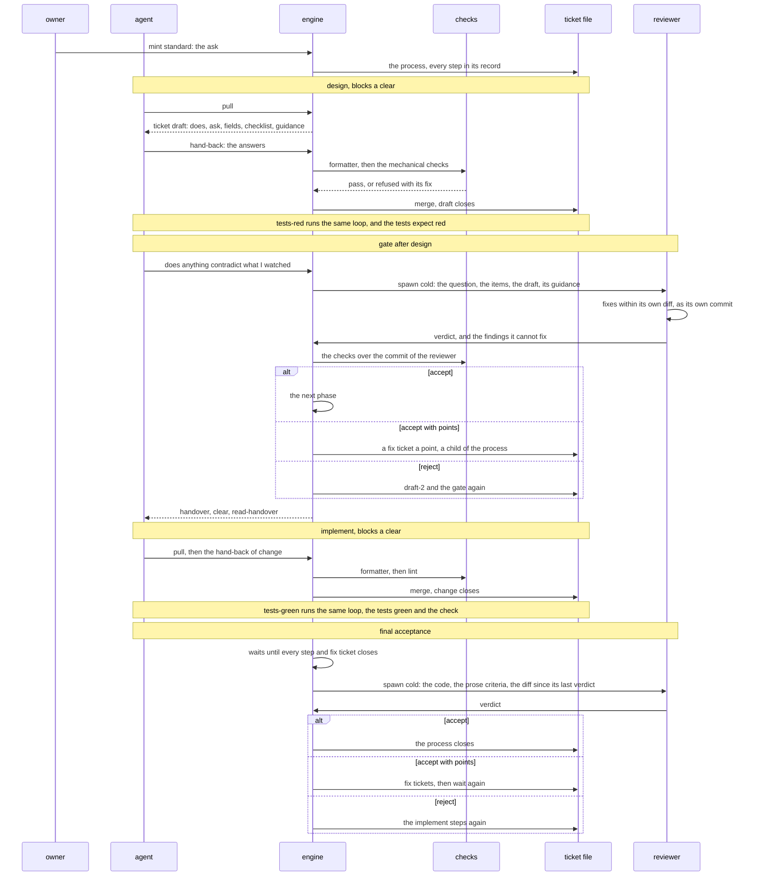

# Scope

Level two turns a process into a thing the engine holds, out of the agent's sight. A hand pulls a ticket of one step, answers it, and pulls again. The engine keeps the route, merges every answer into the file, runs the gates, and hands out the next step.

This note holds what the owner decides in the session that opens level two. It holds the answers to an attack on the design and to the strongest case against it too. The chapter The sequence draws a standard process from the mint to its close.

# The levels

| level | what it holds | who works it |
|---|---|---|
| zero | the doors over the agent | the plugin |
| one | the ticket: one step, its requirements, its guidance | any hand, an agent or a person |
| two | processes, gates, deliveries and the resolver | the engine alone, with no model call |
| three | applications built as processes: the retro, a sprint, an overhaul, an expedition, reverse engineering, the v3 milestone matrix | processes on level two |

Level two is the organisation of work, and nothing in it asks a model. A person works every level the way an agent does.

# The shapes

| shape | what it is |
|---|---|
| ticket | one step. Trivial work, a note and a question for a person are tickets |
| process | a route the engine holds. A process nests, and the standard route is one |
| delivery | the outermost process: one branch and one final acceptance. The group today |
| backlog | the tickets and processes that stand in no delivery |

- A delivery holds no delivery.
- The answer to a question mints its work as a ticket of its own size.
- A fix stands one size below what it fixes: a trivial ticket fixes a standard process.

# The loop

1. A hand pulls. The engine takes the next step of a held process by `depends_on`, and hands it out as a ticket.
2. The ticket carries what the step does, the ask, the fields, the checklist, the checks the hand-back meets, and the resolved guidance.
3. The hand answers with the fields payload. No hand writes the ticket file.
4. The engine runs the formatter and then the mechanical checks. It merges the answer into the process file and hands out the next step.
5. A bare pull after a clear or a compaction hands out the step in hand again, with its guidance.

Level two builds on the pull of level one. The hold, the payload and the ephemeral tickets stand today. The engine stays cold and runs at each pull, and the index is the warm part.

# The sequence

A standard process in the backlog, so its last gate is the final acceptance.

# The ticket files

- The ticket files hold the truth. A process, and a delivery, keeps its own ticket file.
- The steps of a process stand in its ticket file, each with a state, as `steps` and `record` stand today. The work editor draws the progress from it.
- A file references another, and copies nothing from it. Evidence stands in the ticket file, or in a note the ticket file links: a design input, a design output.
- The step in hand stands in the hold as an ephemeral ticket.
- A fix ticket is a ticket file of its own, and a child of its process. It goes to the front of the queue, and the process goes on after it.
- An inserted step joins the ticket file, and the count grows.
- A step a condition skips closes as skipped at the first hold.

# The standard process

| phase | steps | the clear |
|---|---|---|
| design | draft, then tests-red | blocks a clear |
| gate after design | the reviewer | the clear runs after it |
| implement | change, then tests-green | blocks a clear |
| final acceptance | where the process stands in the backlog | |

- Tests-red closes the design phase. Each done line meets a test that fails, or a checkpoint the hand answers where no command decides.
- The check reads the tests a process lists as expected red as red, until its tests-green closes.
- A process inside a delivery ends after implement, and the final acceptance of the delivery reads it.

# Gates

- A gate stands between two phases, and at the end of a process.
- The engine spawns the reviewer cold at the gate, a hand other than the author. v3 rules that the gate spawns it.
- The brief names the question this gate answers. The reviewer scopes its own attack inside it. An objection blocks only where this gate resolves it, as v3 rules.
- Before the clear, the session asks one question: does anything here contradict what it sees in the phase.
- The reviewer is the quality hand too. It fixes within its own diff, as its own commit: a form fault, a missing test for an edge case, a small check. Past that it mints a fix ticket.
- The commit of a gate counts as the output of the gate, and moves no input of the phase it closes.
- The judge leaves the code.

| verdict | what the engine does |
|---|---|
| accept | hands out the next phase |
| accept with points | mints a fix ticket a point, a child the process waits on, and goes on |
| reject | inserts the steps to work again |
| a second reject | inserts a person step |

A fix ticket names the command deciding it where one exists, and a prose criterion elsewhere.

# The final acceptance

- It waits until every step and fix ticket under it closes.
- It reads the work, the commits of the gates, and every prose criterion under it. The engine decides the commands.
- A rerun reads the diff since the tip of its last verdict, with the merges in it, and runs every command in full.
- It answers the verdicts a gate answers.
- Past its own cap, the process closes `became` onto a question ticket.

# Person steps on the cloud

- A cloud box holds no person. A person step there leaves through `branch unblock` as a question ticket.
- The delivery closes behind the question, or waits for it, as the step decides.
- The bless on a cloud box stays with the agent, as the owner rules.

# The delivery

- Its route runs sync, split, the children, the final acceptance, and the delivery retro.
- A gate after the split stands where a delivery declares one.
- The retro runs after the acceptance, and reads the delivery alone.
- A ticket the split assigns to a delivery moves to its branch alone.
- An engine verb merges a conflict in a record by step and by `hash_before`, since no hand edits a record.

# The trivial ticket

- One step, with no gate and no reviewer.
- Its criteria are commands where a command decides, and prose elsewhere.
- The final acceptance above it reads a prose criterion. In the backlog, the backlog check of the tree retro reads it, after the audit.

# The other processes

| process | its route |
|---|---|
| experiment | run, then decide by a person: keep, drop or grow |
| tree retro | feedback by a person, collect to audit, the backlog check, chapter to classify, the report the owner passes, then the mint |

The retro mint names the process each class needs. Today `src/engine/retro/mint.js` writes every class as a standard ticket.

# The bless

- A gate can ask for a bless beside its verdict, and waits for it.
- At a desk, a button in the sidebar lets the agent bless. The editor writes that key, and the write door refuses the agent a write to it.
- On a cloud box, the environment decides. The shell door refuses a command that sets the variables naming the box or the hand.
- A bless binds to the hash of what it blesses, and an edit strips it.

# Guidance

- Every note at the top of `spec/guidance` goes into the output style.
- The standing layer holds the canary and the handover alone.
- A note carrying `env` moves under a subfolder, since the style holds one text for every box.
- The engine resolves a note under a subfolder by tags. Each folder name is a tag, and a note adds `tags` and `env` in its frontmatter.
- A note reaches a step that carries every tag of the note, where its `env` matches. Each step carries `tags` in its process.
- Every note reaches some step. The check refuses a note that reaches no step, and a test pins the notes each step resolves.
- The pull prints each resolved note as a section of the ticket, its rules numbered as the note numbers them, with its examples.
- The spawn hook hands a helper the notes at the top. The gate ticket in its prompt carries the resolved ones.
- A verb prints the guidance a step resolves, so a reader sees it without a guess.
- The pull prints the rules into the context, so no step asks for evidence of a read.

# The size cap

One tool answer reaches the model whole up to a cap. Past it, the client writes the answer to disk and hands back a preview.

| measured | whole | cut |
|---|---|---|
| v3, an MCP tool, desk and cloud | 50,000 bytes | 52,500 bytes |
| this session, a function hook tool of level zero | 48,823 bytes | 50,861 bytes |

- The engine keeps each rendered answer under a margin below the cap, named in the config.
- Past the margin, the engine splits the hand-out and keeps the step whole. The next pull on the same step carries the rest.

# Evidence and stale steps

- Evidence past a size, or of the form `file`, stands in a file the record links.
- The ticket file holds the hash of each input and of the definition of the step. The engine asks the index for a hash, and the index reads the file again where it needs to.
- A moved input marks exactly the steps whose checks read it, as v3 proposes in the record of its iteration i18.
- The query runs fast over the index.
- An append adds to a node and moves its hash on, and the steps reading it stay whole. v3 carries the append, and level two takes it back. The hashes chain, and each one reads the hashes before it.
- A process stays editable at runtime. An edit downstream of the step in hand keeps the earlier steps. An edit upstream sends the process back to the last step that stands whole.
- A recovery step stands written in a process, or a gate inserts it.

# The schema

The schema holds the fields the engine acts on. Every field that stands today stays: `not`, `when`, `needs`, `checklist`, `asks`, `options`, `on_fail` and the words of `by`.

| field | what the engine does with it | stands today |
|---|---|---|
| `by` | hands the step to a person or an agent, or runs it itself under `engine` | yes, and `engine` is new |
| `depends_on`, `input` | orders the steps and reads what moves | yes |
| the evidence forms | checks a command, a verdict, a list, a file | yes, and `file` is new |
| `tags` | resolves the guidance | new |
| a gate and its bless | waits for a verdict, then a bless | new |
| an answer that edits the process | inserts steps or a nested process | new |

A clear flag stands on each process and each phase.

# What the reviews find

An attack on the design and the strongest case against it both run before this note. Each finding meets its answer here.

The owner reads each finding, and the table holds the ones that stand.

| finding | the answer |
|---|---|
| a gate fixing a test moves an input, and the process rewinds | the commit of a gate moves no input of the phase it closes, and the append moves a hash on |
| a person step on a cloud box meets the same agent | a branch sends the work of a person out as a ticket, and the bless stays with the agent |
| the second run of the final acceptance skips a trunk merge | it reads the diff since its last verdict, with the merges, and runs every command |
| the final acceptance has no exit at its cap | past its cap the process closes `became` onto a question |
| a hand-back stages the edits of a sibling hand | the hand-back stages the ticket and the paths of its step, as `every-landing-takes-a-verb` asks |
| a typo in a tag drops guidance without a word | every note reaches some step, and the check refuses one that reaches none |
| an agent sets the variables that allow a bless | the doors refuse the write and the command, as a small fault |
| the cap sits between the two answers the probe reads | a margin below it, and the hand-out splits while the step stays whole |
| every pull runs the whole engine from cold | the time budgets, as the chapter Time budgets says |
| a runtime edit brings back the reopen cascade of v3 | the append, and a stale set that stays exact |
| a backlog ticket with a prose criterion waits for the retro | a cost the owner accepts |

# Costs the owner accepts

| cost | who argues against it |
|---|---|
| the reviewer grades the fix it makes at the gate | v3 rules that a hand rules on no text of its own pass |
| a process waits on its fix tickets | v4 mints findings loose, since a child holds the parent open |
| guidance resolves by tags | v2 and v3 built selectors, and the tree settled on a list per step |
| the pull carries more work | v3 names the pull its slowest call |
| a prose criterion in the backlog waits for the retro | the judge read it at the hand-back |

# Time budgets

- Each call a hand makes carries a time budget: the pull, the hand-back, the resolver, the query for stale steps.
- The budgets stand as requirements of the engine, and a test in the battery times each call against its budget.
- The engine stays cold while every call meets its budget.

# Findings

- A finding reaches the owner as a question ticket, or as a note.
- A finding names the failure it shows, the evidence it checks, and marks what it leaves unchecked.
- A finding the design answers already is no finding.
- The owner and the agent settle how findings reach the owner in a later session.

# What waits for level three

- the v3 milestone matrix, and the step that spawns the rest of it
- the sizes of a process
- the register of risks and assumptions

# The order of work

- The deliveries standing open on the cloud land first, since level two stands on the floor they move.
- Level two builds after them, one delivery at a time.
