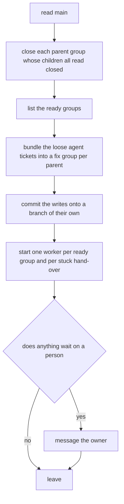
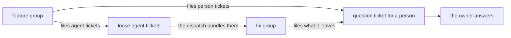

# Scope

The owner asks that the cloud works its own queue. One routine fires on a
clock, runs a verb that computes the plan, and starts a worker per ready group.
A worker hands its group over as a pull request, and GitHub lands it once the
check passes. The system runs the queue, and the state lives on `main`.

The asks, one to a line:

- Fire one dispatcher an hour, whose prompt runs a skill and nothing else.
- Compute every decision in `./RUNME.sh dispatch`, and leave the model to start sessions and message the owner.
- Start one worker per ready group, whose prompt runs a skill and nothing else.
- Hand a finished group over as a pull request that merges itself on a green check.
- Bundle the tickets an agent takes into a fix group, which files none for an agent.
- Let a group hold groups, so a big move runs as a chain of parent groups.
- Boot a session off the repo alone.
- Keep the old road working until the new one stands whole.

# The dispatcher

One routine fires every hour. Its prompt reads `run the dispatch skill`, and
the skill stands in the repo under `.claude/skills/`. The dispatcher works no
ticket and judges no ticket's size. It sees that every ticket reaches a hand,
then leaves.

`./RUNME.sh dispatch` computes the plan and makes every write. The skill runs
the verb, starts the sessions the verb names, and messages the owner. So the
model's part stays as small as the platform lets it. Each run:

`./RUNME.sh dispatch --dry` prints the same plan and writes nothing:

| the part of the plan | what it holds |
|---|---|
| ready groups | each open group on `main` whose dependencies stand closed, holding no group, and held by nobody or by a stale hold |
| stuck hand-overs | each group standing at done whose branch stands on origin behind `main`, or past `work.staleAfter` |
| fix bundles | the loose agent tickets each fix group takes, one fix group per parent |
| parents to close | each parent group whose children all read closed on `main` |
| questions | each open ticket waiting on a person, with the group it holds open |

No lease stands, because a second run of any step changes nothing:

| the step | why a second run changes nothing |
|---|---|
| a bundle | the verb writes it before any worker starts, and a grouped ticket reads loose no more |
| the write branch | it carries the name of the `main` commit it reads, so a second run finds it standing |
| a start | a take claims its branch, so a second worker takes the next group, or none |
| a message | the owner reads the same question again, and nothing moves |

## The writes ride a branch

The owner rules that a bundle lands on `main`. The rule on `main` takes a pull
request alone, so the verb commits its writes onto `claude/dispatch-<commit>`,
named after the `main` commit it reads. The skill opens a pull request over it
with auto-merge. A fix group reaches a worker on the run after that merge.
While such a branch stands, the verb writes nothing new and starts workers
alone. Until the hand-over lands, a desk lands that branch through `branch
merge claude/<name>`, per [[spec/design_output/work#a-cloud-branch-comes-in]].

# The workers

One session works one group. Its prompt reads `run the work skill`, and the
skill runs these, in order:

1. `./RUNME.sh branch take`, which claims the next free group or stuck hand-over.
2. The work, as [[spec/guidance/cloud/cloud]] says.
3. `./RUNME.sh branch done`, which writes the tickets' close on the branch.
4. A pull request over the branch, through the GitHub connector, with auto-merge on.

A hold past `work.staleAfter` reads as released, per
[[spec/design_output/work#a-stale-group-is-yours]]. So the next run starts a
worker on the group of a worker that dies.

# Feature groups and fix groups

| | a feature group | a fix group |
|---|---|---|
| what it holds | the work an ask names | loose agent tickets, whatever they touch |
| who mints it | a person or an agent, through `./RUNME.sh mint ticket` | the dispatch verb alone |
| its ticket | a group ticket | a group ticket carrying `fix: true` |
| what it files | tickets for an agent, and tickets for a person | tickets for a person alone |

A fix group carries fixes alone. A ticket's hand reads off the ticket: one standing at a `by: person` leaf, or at draft, waits on a person, as
`waitsOnPerson` in `src/scripts/work-answer.js` reads it. Every other open
ticket is an agent's.

A fix group files no ticket for an agent. What it leaves goes out as a question
ticket for a person, which holds its parent open until the owner reads it. So
the feature groups and the fix groups take turns, and a chain of follow-ups
ends at the owner:

# Groups hold groups

A group holds groups. A child group names its parent under `group`, the way a
ticket names its group. The group route's `split` step takes a child that is a
group itself.

| the rule | what it says |
|---|---|
| the wait | a child group waits on its own `depends_on` and on every ancestor's, which the dispatch collects up the parent chain |
| a dependency holding | its group's ticket on `main` stands at `state: closed`, per [[spec/design_output/work#a-dependency-waits-for-trunk]]. A parent carries no branch, so the ticket on `main` answers alone |
| the close | a parent closes once no child stands open, and the dispatch writes that close |
| the hand | a parent reaches no worker, and its children do |
| the filing | a ticket a group files lands in that group's parent, or stands loose where the group stands at the top |

`branch done` does the filing. Each open ticket the group frees, and each
ticket the branch adds with no group, takes the group's parent under `group`.
So a fix bundle becomes a fix group under that parent, and a ticket for a
person holds that parent open until the owner answers.

A stage of a big move, such as the migration, is a parent group, and
`depends_on` orders the chain. Several parents stand open at once where nothing
orders them. A review between two parts of a move becomes a ticket for a
person inside the parent. So a parent chain does the work of a switch. The
running migration moves onto parent groups later, as a step of its own, and
keeps its switches until then.

A flat group is the ordinary case. Nest a group for a big move alone, and the
guidance says so.

## The editor draws a parent

The work tab nests a row under the row its `group` names, at any depth, per
[[spec/design_output/tree-view#the-name-column-nests]]. So a parent, its groups
and their tickets draw with no change. One mark is new: a parent row shows what
holds it open. Its open children stand under it, and a letter lights where a
ticket for a person stands open anywhere under it.

# The hand-over

| the step | who acts | what happens |
|---|---|---|
| the close | `branch done`, on the branch | the group ticket closes, every open child files into the parent, and the cloud marker drops |
| the pull request | the worker, through the GitHub connector | it opens over `work/<name>` against `main`, with auto-merge on |
| the check | GitHub | `.github/workflows/check.yml` runs on Linux and Windows as a required status |
| the merge | GitHub | it merges once green and up to date, and deletes the head branch |
| a stuck pull request | the dispatch | a group at done whose branch still stands, behind `main` or past `work.staleAfter`, counts as open work, and a worker syncs or fixes it |

The verb reads a stuck hand-over off git alone. A branch at done still standing
on origin carries no merge yet. Its tip says whether it stands behind `main`,
and the span says it stays red.

`branch merge` on a desk shrinks to landing a group at done that carries no
pull request.

# Firing the workers

| the version | what runs the dispatch | what starts a worker | where a question goes |
|---|---|---|---|
| first | the hourly routine, through the dispatch skill | the skill, through the cloud-sessions connector | a message to the owner |
| later | a scheduled GitHub Action running `./RUNME.sh dispatch`, with no model | the Action, firing the work routine's API trigger once per ready group | a GitHub issue |

The later version starts once the owner makes the work routine's API token. The
trigger, as its sources say:

| what | the value |
|---|---|
| the call | `POST https://api.anthropic.com/v1/claude_code/routines/<trig_id>/fire` |
| the headers | `Authorization: Bearer <token>`, and `anthropic-version` at the version the fire page names |
| the caps | 30 fires an hour a routine, and 100 an hour an account |
| the sources | `https://code.claude.com/docs/en/routines` and `https://platform.claude.com/docs/en/api/claude-code/routines-fire` |

The Action reads the URL and the token off the repo secrets `ROUTINE_FIRE_URL`
and `ROUTINE_FIRE_TOKEN`.

A wake on each merge, through an event trigger, serves better over time, and
stays out for now.

# The boot

A session boots off the repo alone. A `SessionStart` hook in
`.claude/settings.json` runs the install, and the environment's setup script
retires once that holds.

# What the owner sets once

| where | the setting |
|---|---|
| the repo settings | Allow auto-merge |
| the repo settings | Automatically delete head branches |
| a rule on `main` | a pull request, the check green on both systems, and the branch up to date |
| the repo secrets, later | `ROUTINE_FIRE_URL` and `ROUTINE_FIRE_TOKEN` |

A merge queue needs a repo an organization owns, so none stands.

# The old road runs on

The new system grows beside the old one and takes over a step at a time, as
the migration does. Each step lands whole, and the road before it keeps
working.

| the step | what lands | what the old road still does |
|---|---|---|
| 1, today | nothing new | the owner's hourly `work` routine runs `branch take`, and a desk session merges groups at done every quarter hour and runs the phase gate |
| 2, the dry run | `dispatch --dry` computes and prints the plan, and writes nothing | the desk runs it beside its own work and compares |
| 3, the hand-over | `branch done` writes the close on the branch, and the worker opens a pull request with auto-merge | the desk merges any group at done that carries no pull request, so both roads land work |
| 4, the dispatch | the dispatch skill runs on an hourly routine, writes the fix bundles and starts the workers | the `work` routine keeps its clock as a fallback, since a take repeats safely |
| 5, the groups | nested groups and fix groups replace the `migration` switches for new work | the running migration keeps its switches until it ends |
| 6, the end | the desk's merge watch stops, and the setup script retires | nothing. Later, the Action with the API token replaces the dispatch skill's starts |

```mermaid
flowchart LR
  s1["1: work routine takes, desk merges"] --> s2["2: dispatch --dry beside the desk"]
  s2 --> s3["3: pull request hand-over, desk merges the rest"]
  s3 --> s4["4: dispatch skill live, work routine as fallback"]
  s4 --> s5["5: nested and fix groups for new work"]
  s5 --> s6["6: desk merge stops, setup script retires"]
  s6 -. "once the owner makes the token" .-> s7["the Action fires the work routine"]
```

# The known costs

| the cost | why |
|---|---|
| the dispatch verb stands in JavaScript, beside level zero's other verbs | the Go migration moves every verb into `quack` in phase 4, and ports `dispatch` with them |
| a fix waits a run | a bundle lands by pull request, and the run after it starts the worker |
| the first live run bundles the whole loose backlog | every loose agent ticket on `main` counts |
| a desk push onto `main` takes the owner's bypass | the rule on `main` takes pull requests alone |

# What the owner rejects

| the alternative | why not |
|---|---|
| the dispatcher fixes small things itself | it turns into a worker nobody reviews |
| a long-lived agent running the queue | the system runs the queue, and the state lives on `main` |
| a lease | every step repeats safely |
| a config switch per group | an unclear point becomes a ticket for a person, which holds the parent open |

For the argument, see [[spec/rationales/dispatch-stays-mechanical]].

# What stands open

- Whether the dispatch's writes ride a pull request, as this note says, or reach `main` through the owner's bypass. The rule on `main` and a cloud box's push hang on it.
- Which token opens the Action's pull request. A pull request opened on the workflow's own token starts no workflow. So the required check stays silent on it.
