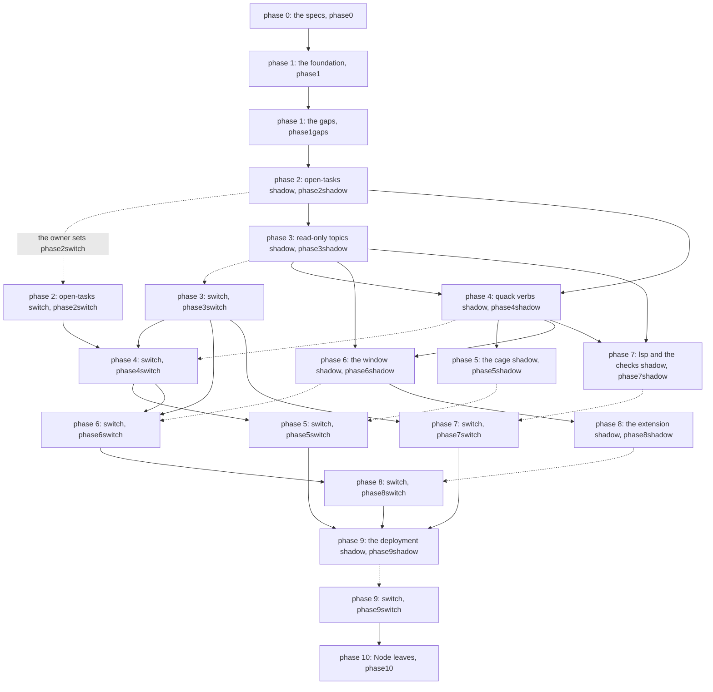

# Scope

The owner asks that cloud boxes carry this tree to the model in
[[spec/design_input/the-index-holds-the-model]], one slice at a time. The work
blocks no other work, and it needs the owner at one moment a phase: the switch
that lets the cloud take it.

The asks, one to a line:

- Land everything on `main`, and let the cage keep `main` whole.
- Grow the new system beside the old one, and let it take over one slice at a time.
- Run the phases below as a graph, each one a group of tickets in the existing process.
- Let a group start once the groups it needs land.
- Hold each phase behind a switch the owner turns on, and hold nothing else.
- Read the settled rulings before any question, and ask none of them again.

`main` carries every step, because the cloud boxes and the routines pull
`main` alone.

# How a slice moves

| the stage | what happens | done when |
|---|---|---|
| build | the new module stands on `main`, and nothing reads it yet | its tests and the generic contract tests pass |
| shadow | old and new both compute, and every mismatch writes a `shadow` row to the session log | `./RUNME.sh log --kind shadow` names no mismatch of the slice for the time the owner judges enough |
| switch | the slice's one config key, `migration/config/slices/<slice>`, moves from `old` through `shadow` to `new`, and one commit rolls it back. The `migration` module declares it as a shared key, in the default file alone, and the slice's shadow adds it | the readers run on the new path |
| delete | the old code and its tests go, in the same group | no reference to the old path remains |

The retro counts the files a content ticket reaches, before the move and after
it. So a change reads as local where the model says it is.

# The owner turns phases on

A phase holding a switch runs as two groups. The first builds the slice and
runs it in shadow. The second switches it over and deletes the old path.

Each group names its own key under `migration` in `spec/config/level0.json`,
through `enabled_by`. The cloud takes a group once its key reads `true` in that
file on `main`. So the owner turns a phase on by setting its key to `true` on
`main`, once the shadow before it runs clean. The mechanism and the owner's
edit stand in [[spec/design_output/work#a-switch-holds-a-group]].

The cloud answers every other question itself, as [[spec/guidance/cloud/cloud]] asks.
Every group outside the migration keeps moving.

# The phases

Each group names the groups whose work its children need under `depends_on`,
and nothing more, so groups needing none of each other run side by side. A
switch group names its own shadow group, and each group keeps its key under
`enabled_by`. A phase number names the slice, and sets no order past the edges
below.

A child names a sibling alone, where its work needs the other first. Nothing
outside the migration waits on these groups, and none carries `urgent`. The keys `phase0`, `phase1`, `phase1gaps` and every `phaseNshadow` read `true`,
so a shadow group starts once the groups it names land. Every `phaseNswitch`
key and `phase10` read `false` until the owner reads the shadow before it.

| phase | the groups, each with its key under `migration` | done when |
|---|---|---|
| 0, the decisions and the specs | [[spec/tickets/the-migration-writes-its-specs]], `phase0` | the inner protocol and the road to the `lsp` IO module stand chosen in [[spec/design_output/model#the-inner-protocol]]. The model note covers every part |
| 1, the foundation, with no change in behaviour | [[spec/tickets/the-foundation-lands-unchanged]], `phase1`, then [[spec/tickets/the-foundation-closes-its-gaps]], `phase1gaps` | the index answers `/v1` and the old API side by side, and the check stands green on Linux and Windows |
| 2, the pilot: `work/open-tasks` | [[spec/tickets/open-tasks-shadow-lands]], `phase2shadow`, then [[spec/tickets/open-tasks-switch-lands]], `phase2switch` | the badge and the work tab's brackets read one name |
| 3, the read-only topics | [[spec/tickets/read-topics-land-in-shadow]], `phase3shadow`, then [[spec/tickets/read-topics-switch-over]], `phase3switch` | no JavaScript twin of a Go check stands |
| 4, the actions and the command line | [[spec/tickets/quack-verbs-land-in-shadow]], `phase4shadow`, then [[spec/tickets/quack-verbs-switch-over]], `phase4switch` | agents call `quack` and no `./RUNME.sh` verb, and `cli.js` leaves the tree |
| 5, the cage | [[spec/tickets/go-cage-lands-in-shadow]], `phase5shadow`, then [[spec/tickets/go-cage-switches-over]], `phase5switch` | the bridge server leaves the tree |
| 6, the window | [[spec/tickets/tui-shell-lands-in-shadow]], `phase6shadow`, then [[spec/tickets/tui-shell-switches-over]], `phase6switch` | the window reads its data off the index alone |
| 7, the `lsp` IO module and the checks | [[spec/tickets/lsp-door-lands-in-shadow]], `phase7shadow`, then [[spec/tickets/lsp-door-switches-over]], `phase7switch` | the LSP's own server, port and index client leave the tree |
| 8, the extension | [[spec/tickets/sidebar-lands-in-shadow]], `phase8shadow`, then [[spec/tickets/sidebar-switches-over]], `phase8switch` | the extension spawns no verb and reads no file itself |
| 9, the deployment | [[spec/tickets/module-processes-land-in-shadow]], `phase9shadow`, then [[spec/tickets/module-processes-switch-over]], `phase9switch` | a crash in one part leaves the others running, and raises an alarm |
| 10, Node leaves the boxes | [[spec/tickets/node-leaves-the-boxes]], `phase10` | `install.sh` installs no Node |

The graph, each group with its switch, and the owner's hand between a shadow and
its switch-over:

Every arrow is `depends_on`. A dotted one marks the owner's switch as well, set
once the shadow before it runs clean.

What each edge carries:

| the group | waits on | because |
|---|---|---|
| open-tasks shadow | the gaps | the queue module stands on `q/qtest` |
| read-only topics shadow | open-tasks shadow | the pilot builds the `migration` module, the slice key and the `shadow` row every later shadow reuses |
| the actions shadow | open-tasks shadow, read-only topics shadow | the pull reads the queue module, and hands the rules the `guidance/` topic answers |
| the actions switch | open-tasks switch, read-only topics switch | `cli.js` leaves, and with it the count chain and the JavaScript checks, so both slices stand at `new` first |
| the cage shadow | the actions shadow | Copilot reaches the cage through `quack hook`, and MCP lists the actions as tools |
| the cage switch | the actions switch | the bridge serves the agents' tools until the index answers them |
| the window shadow | read-only topics shadow, the actions shadow | the log view reads `log/`, and the work view's keys call actions |
| the window switch | read-only topics switch, the actions switch | the window drops its own reads and writes once those paths stand at `new` |
| the editor checks shadow | read-only topics shadow, the actions shadow | the rules move into the check module, and `quack lsp` joins the command line |
| the editor checks switch | read-only topics switch | the LSP's rules leave once the `check/` names answer alone |
| the extension shadow | the window shadow | the sidebar draws the base files, and a badge reads the label the window draws |
| the extension switch | the window switch | the sidebar and the window read one name off the index |
| the deployment shadow | the cage, editor checks and extension switches | the IO process holds every listener, so each IO module stands alone first |

A group's ask names its work, and its children carry the done criteria. A
group's `split` step mints the children a later phase finds it lacks. Phase 2's
first groups, `open-tasks-land-in-shadow` and `open-tasks-switch-over`, close
with their work unbuilt, and the two groups the table names build it. What each
folder holds today, and where it goes, stands in
[[spec/design_output/migration]].

# The rules of every slice

| the ruling | why |
|---|---|
| every pair of duplicate implementations meets as golden files before its JavaScript copy goes, and the owner reads each difference at the merge | several pairs already disagree |
| Go alone writes frontmatter, after one commit that rewrites every ticket in the Go writer's form | five parsers and three writers become one of each |
| the prose checks move to Go, with wink as the reference until its differences stand accepted | they are the last reason Node runs at runtime |
| Linux and Windows behave the same, and CI runs both | the cloud boxes run Linux, and some people work on Windows |
| a group closes only when its own done criteria hold, checked by the command each names, and no child it names stands open | a group closing over open children merges its work unbuilt, and `branch done` refuses it, per [[spec/design_output/work#a-box-leaves]] |

# The settled rulings

The owner settles these, and a box reads the note before it asks:

- the model itself, in [[spec/design_input/the-index-holds-the-model]]
- the pure Go driver for SQLite, in [[spec/rationales/the-index-drops-cgo]]
- one Go module, in [[spec/rationales/go-stands-as-one-module]]
- git as the archive and the transport, in [[spec/rationales/git-stays-the-archive]]
- the cage refusing while the index stands down, in [[spec/rationales/the-cage-refuses-while-down]]
- every other ruling of the model and of this note, in [[spec/design_output/migration#the-argument-for-each-ruling]]

A question a later phase raises goes into a funnel note under `spec/funnel`, and
the owner rules it. The ruling then stands in the model, and the funnel note
leaves.
