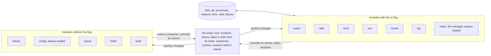
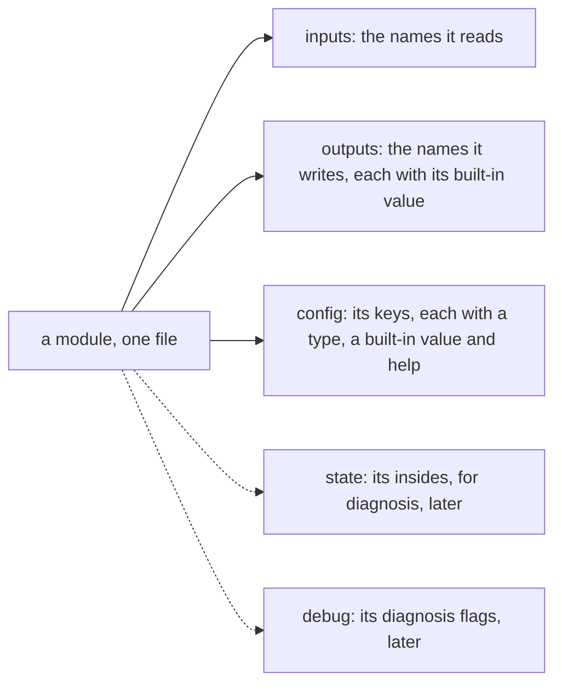
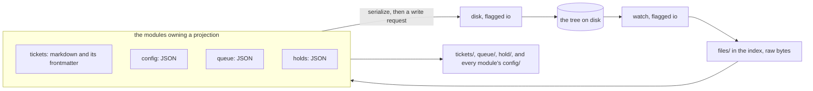
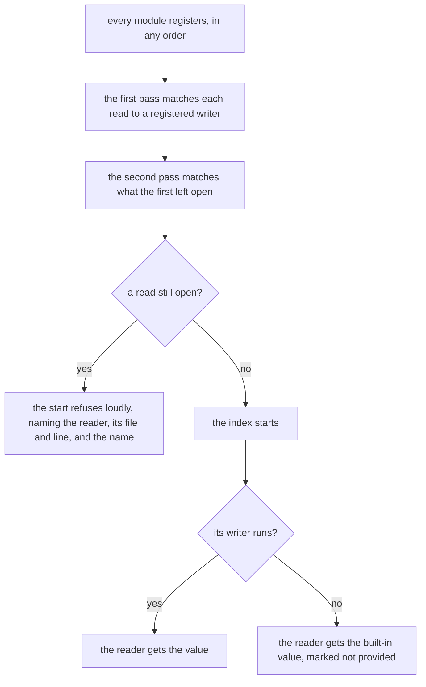
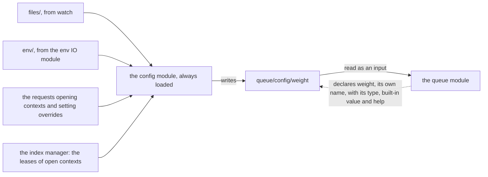
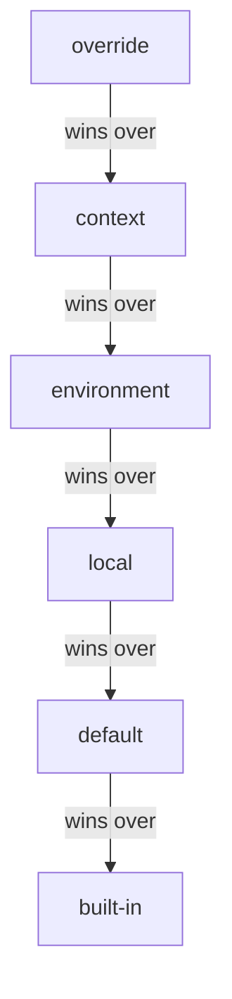
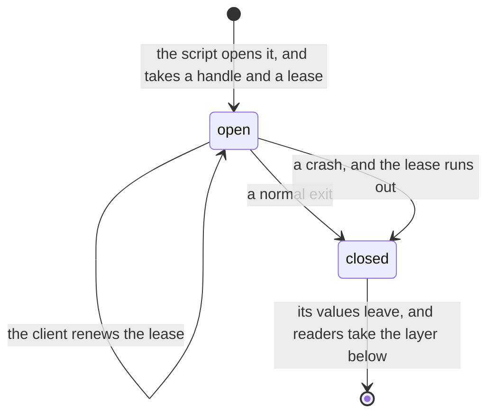
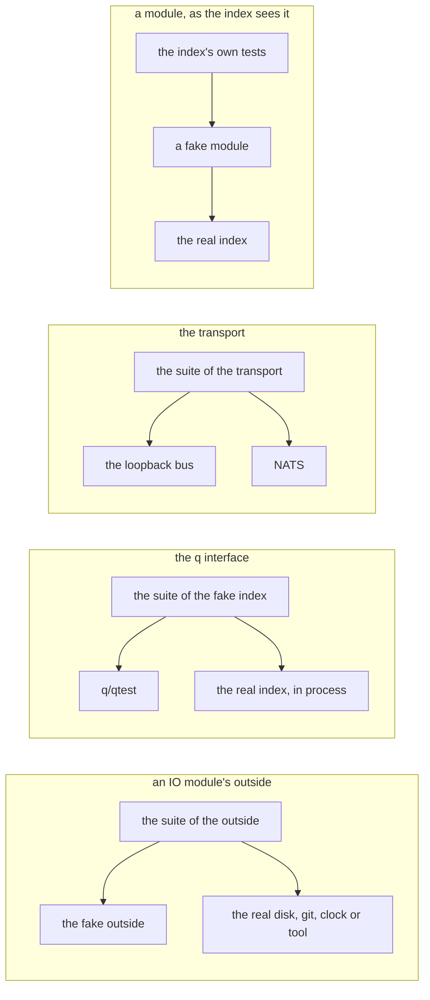

# Scope

The target architecture, whole. It covers the index and its modules, the IO
modules, operations, watchdogs, the inner protocol, the processes, the surfaces,
the views and the hook protocol. The old system calls an IO module a door. Each
part stands in a chapter of its own, and the rules stand in
[[spec/design_input/the-index-holds-the-model]]. The order of the migration
stands in [[spec/design_input/the-migration-runs-in-slices]].

# The index and its modules

The index model: the core, the contract every module keeps, and names with
their writers. It covers the provider kinds, snapshots and revisions, actions as
requests to IO modules, the resolution at start, config off the registrations,
and `quack why`. Every later phase of [[spec/design_input/the-migration-runs-in-slices]]
builds on this note. The rules stand in
[[spec/design_input/the-index-holds-the-model]], and this note gives them their
shape.

## The whole system

The parts, and which of them touch the world outside:

An IO module alone reaches past the index, and every module reaches another
through the index alone.

## A name

A name is a path of lowercase segments, such as `work/open-tasks`. The first
segment is its topic, the module folder that provides it.

A module names its own values locally. The framework adds its topic prefix to
everything it writes, so `weight` in the queue module becomes
`queue/config/weight`. A module spells a full name only for what it reads from
another module.

| the part | what it holds |
|---|---|
| the name | the path, unique in the catalog |
| the type | the Go type of its value, which the catalog records |
| the built-in value | the value a reader gets while no provider answers |
| the provider | the one registration answering it |
| the deadline | `q.Deadline`, or the deadline its kind's config key holds |
| the doc | `q.Doc`, which every surface shows |

A family is a name with a key segment, such as `ops/<id>` or
`session/<id>/fill`. The catalog holds a family once, with one provider, one
type and one built-in value. Keys come and go inside it, so the index adds no name at
runtime.

| the segment | what it takes | such as |
|---|---|---|
| `<key>` | one segment | `ops/<id>` |
| `<key...>` | the rest of the name, one segment or more, and it stands last | `files/<path...>` |

A module declares a family the way it declares a name, and the registration's
name carries the key segment. `matches` in `src/q/q.go` answers each key in its
place.

## The index core

The core knows no name's meaning, and holds no business logic, no input layer
and no `q.Given`. [[spec/design_input/the-index-holds-the-model#every-part-is-a-module]]
names what it does, and the code holds it in `src/q`:

| what the core does | where it stands |
|---|---|
| resolves each read to its writer | the catalog, at start, per [[spec/design_output/model#the-index-resolves-in-passes]] |
| stores name to value | `Store` |
| takes a write from the name's registered writer alone | `Commit`, which names the writer and refuses every other name |
| hands out one snapshot | `Snapshot` |
| pushes changes | `val.<name>` on the bus, per [[spec/design_output/model#the-inner-protocol]] |
| answers the built-in value | where no value stands, or where its writer runs nowhere, with the mark `not provided` |

## A module registers five groups

Every module, an IO module among them, registers these groups at `Register`:

| the group | how a module declares it | built |
|---|---|---|
| inputs | the struct fields a provider reads, each with the tag `q:"<name>"`, and the events a fold takes | now |
| outputs | each `q.Derived`, `q.Fold` and `q.Action` it registers, with its built-in value | now |
| config | `q.Cfg(key, builtin, help)` by local name, the type read off the built-in value | now |
| state | `q.State(name, reader)`, its insides, readable for diagnosis | later |
| debug | `q.Debug(flag, help)`, a switch for a diagnosis | later |

State and debug stand in the contract now, and no code builds them yet. A module
writes its registered outputs alone, and the core refuses a commit naming
another. A module knows nothing about where its config values come from. It
reads a key like any other input, per
[[spec/design_output/model#config-comes-off-the-registrations]].

## The topics and their writers

Every topic has a module writing it:

| the topic | the module writing it | what it holds |
|---|---|---|
| `files/<path...>` | the `watch` IO module | the contents and hash of every file in the tree, by path, the runtime files under `.se/` among them |
| `buffers/<path...>` | the `lsp` IO module | the text of a file an editor holds open and unsaved, by path |
| `clock/minute` | the `clock` IO module | the time, cut to the minute, and a push each minute |
| `session/<id>/events` | the `hooks` IO module | the events of a session |
| `session/<id>/` | the modules folding the events | the values the folds answer |
| `<module>/config/<key>`, each carrying the flag `config` | the config module | every key a module declares, as its layers set it |
| `env/<name>` | the `env` IO module | the `SE_` variables, read at start |
| `tickets/` | the tickets module | every ticket, read off `files/` |
| `queue/` | the queue module | the score, the outline and the places, read off `tickets/` |
| `work/` | the work module | the rows and the count of open tasks, read off `queue/` |
| `hold/` | the holds module | the holds a box keeps, read off `files/` |
| `session/alarms` | the index manager | the alarms standing, per [[spec/design_output/model#the-alarms-standing]] |
| `ops/<id>` | the index manager | the operations, per [[spec/design_output/model#operations]] |
| `index/` | the index manager | the catalog as rows: `index/names`, `index/actions`, `index/docs`, `index/health` |

A check reading a path reads its buffer where one stands, and its file
otherwise.

## Everything on disk mirrors

`files/<path...>` mirrors the whole tree. Two IO modules touch the disk: `watch`
brings each change in as `files/`, and `disk` writes on request. Every other
module reads `files/` through the index.

A structured thing on disk is a projection of `files/` by the module owning it.
The module declares a glob, a codec that parses and serializes, and a kind:

| the files | the module | its codec | its topic |
|---|---|---|---|
| `spec/tickets/*.md` | tickets | markdown with its frontmatter | `tickets/` |
| `spec/config/level0.json`, `.se/.runtime/config.json` | config | JSON, keyed by module and then by key | every `<module>/config/` |
| `.se/.runtime/plan.json` | queue | JSON | `queue/` |
| `.se/.runtime/hold/<hand>.json` | holds | JSON | `hold/` |

The kinds carry their direction in their names:

| the kind | the truth | what it covers | when the system writes | when it reads back |
|---|---|---|---|---|
| loaded | the file, which a person edits too | tickets, config, the plan, the holds | on an explicit save | on every change, through `watch` |
| saved | memory | operations, session folds, alarms | behind the scenes, in batches | once at start |
| dump | memory | any prefix, through `quack dump <prefix>`, for diagnosis | on request | not at all |

A saved file restores name by name and type by type, the rule TwinCAT keeps
for its persistent variables:

| what the file holds | what the start does |
|---|---|
| a name no module registers any more | skips it |
| a name whose type changes | refuses it, and reports it |
| no value for a name a module registers | gives the name its built-in value |

No kind loads a file into any name. A load like that gives a name a second
writer, and one owner per name breaks.

A write goes back one way. The owner serializes with the same codec, and sends
a write request to `disk`. The watch then closes the loop.

| the case | what holds |
|---|---|
| a write | it names the revision of the file it read, and `disk` refuses it where the file changes since. The module reads the file again |
| a module's own write, coming back | parsing the same bytes again changes no value, so it costs nothing |
| a large file, or one read rarely | `files/` holds its hash, and the content loads when a module reads it |
| a saved file | it stands in a folder the watch covers, such as `.se/state/` |

The codec is the one code knowing a file format, and it keeps one contract
suite:

| the case | what holds |
|---|---|
| every file committed today | `serialize(parse(file))` equals the file, byte for byte |
| every value a module writes, its edge cases among them | `parse(serialize(value))` equals the value |

So the suite also catches a writer that rewrites a file it leaves unchanged.

## The index manager

The index's own management is a module the index always loads, `index`, under
`src/modules/index`. It holds the supervision of the processes, the leases, the
alarms, the operations and their retention, and it carries `q.IO()`, because it
starts and ends processes. It registers like any module:

| the group | what it holds |
|---|---|
| inputs | every `lease.<part>` heartbeat, and each operation's moves |
| outputs | `index/`, `ops/<id>`, `session/alarms`, and the leases of open contexts |
| config | the `watchdog.*` deadlines and waits, and the `ops.keep*` windows |

For the leases and the alarms, see [[spec/design_output/model#watchdogs]].

Every inbound call carries a session id. A name that depends on the caller
stands under `session/<id>/`, such as `fill`, `rows` and `hand`. So a stale
claim reads `clock/minute`, and the hand reads the caller's box off its own
session.

## The provider kinds

| the kind | what it answers | when it runs |
|---|---|---|
| `q.Derived` | a function of its inputs | when an input moves |
| `q.Fold` | a state reduced over the events of `session/`, one event at a time | when an event lands |
| `q.Action` and `q.Op` | a list of requests to IO modules | when a caller calls it |

A provider runs once at a time, and a change during a run leaves one run
pending. A provider runs when a name it reads moves, and one reading nothing
that moves stays where it stands. So a save moving one file runs the providers
reading that path alone.

## The events of a session

`session/<id>/events` is the family the `hooks` IO module writes events to. Every
event carries one shape, `q.Event`:

| the field | what it holds |
|---|---|
| `seq` | the event's place in its session, rising by one |
| `at` | the time off the `clock` IO module, to the millisecond |
| `kind` | the harness's name for it, such as `tool.call` or `prompt.submit` |
| `harness` | the harness sending it, such as `claude-code` or `copilot` |
| `hand` | the box, the session and the agent, where the harness names one |
| `fields` | the event's own payload, as the harness sends it |

## A fold keeps its state

A fold registers with a step over one event:

    q.Fold("session/<id>/fill", 0, func(state int, event q.Event) int { ... })

| what holds | how |
|---|---|
| the state | the fold's value, one per key of its family, in the index's database |
| the place | the `seq` of the last event the step reads, which the database keeps beside the state |
| a restart | the index reads the state and its `seq`, and hands the step each event past it |
| the step | pure: it reads the state and the event, and calls nothing |

A fold reads no other name. A value reading a fold and another name is a
`q.Derived` over both.

An alternative provider stands in a file of its own, and registers with
`q.Alt("work.remote")`. The config key `providers.<name>` picks one at start,
and the registration with no `q.Alt` stands where the key is empty.

## Snapshots and revisions

The model carries one revision, and every commit raises it.

| the step | what holds |
|---|---|
| input | the index reads every input at one revision, and hands the struct over |
| run | the provider reads the struct alone |
| commit | the output names the revision it reads, and lands in one transaction |
| a change during the run | the commit lands, and the next run starts at once |

So a value always reads as a function of one consistent snapshot, and a busy
input still lets values through.

## An action lists requests

An action answers an ordered list of requests going out. Each names the IO
module that accepts it, the verb, the arguments and its undo:

| the field | what it holds |
|---|---|
| `module`, `verb`, `args` | the request, as `io.<module>.<verb>` takes it |
| `undo` | the request that takes it back, or `q.NoUndo` with the reason |
| `then` | a function the index calls with the answers, which answers the next list |

`then` keeps each step pure where a later request depends on an earlier answer.
A hand-back writes, stages, commits and runs the check, and `then` reads the
check's answer before the push.

The index runs the requests. The module's action answers the list as its
commit, and the index sends each request, in order, to the IO module that
accepts it. It holds the writer queue of
[[spec/design_output/model#one-writer-per-tree]]. A module names a request,
and reaches no IO module itself.

A request that fails stops the list. The index runs the undo of every request
before it, newest first, and the action fails with the reason.

## The index resolves in passes

Modules load in any order, so a read names a name no module registers yet. The
index resolves each read to its writer in passes:

| the pass | what it does |
|---|---|
| the first | matches every read to a registered writer, and leaves the rest open |
| the second | matches what the first leaves open, once every module registers |
| the start | runs once every read has its writer, and refuses on a read still open |

A read still open after the second pass is a bug. The start refuses loudly,
naming the reader, its file and line, and the name. A writer that registers and
runs nowhere leaves no read open, such as one that crashes, or an alternative
nobody loads. Its readers take the built-in value, with the mark `not provided`.

The index checks the rest of the catalog at start, and refuses on each fault:

| the fault | what the refusal names |
|---|---|
| a name with two registrations | both files and lines |
| a name with no built-in value | the file and line |
| two providers active for one name | both, and the config key that picks |
| a read naming no name in the catalog after the second pass | the reader, the struct field, and the name |
| an input whose type differs from the name's type | the field, and both types |
| a cycle among derived names | the names round the cycle |
| a view reading or calling what the catalog lacks | the base file, and the key |

The check starts the index, so a fault shows before a merge.

## `quack why`

The index keeps the file and line of each registration, so it answers where a
value comes from:

| the part of the answer | what it holds |
|---|---|
| the value | the value, and whether a provider answers it, it stands at its built-in value, or it stands stale since a time |
| the provider | its registration, and the file and line |
| the inputs | each input's provider, down to `files/` paths, `session/` events and `clock/minute` |
| the readers | every provider, view and surface reading it |

The same answer stands as the agent tool `index/why`, and as the details of a
row in the window's `index` tab. The answer stops short of git, which is live
input nowhere, per [[spec/rationales/git-stays-the-archive]].

## Config comes off the registrations

No central config topic stands. A module declares its keys with `q.Cfg` by
their local names, and the framework files each under `<module>/config/<key>`.
That subtopic carries the flag `config`. Each key takes a type, a built-in
value, a help line, and the mark `shared` where the project shares it.

A module knows nothing about where its config values come from. It declares its
keys and reads them like any other input, and its code and its API name no
file, environment, context, override or layer. The config module and the
surfaces alone know the layers, such as `quack cfg show` and a config editor.
In `qtest`, a case seeds a config value the way it seeds any other input.

Every list of keys comes off the registrations:

| what comes off them | what stands today |
|---|---|
| the config schema, `spec/config/level0.schema.json` | a file a person writes by hand |
| the built-in values | the values in `spec/config/level0.json` |
| the slash commands | the projection over the tracked file |
| the command-line help, the window's `index` tab, and a config editor showing every `*/config` subtopic | nothing |

`spec/config/level0.json`, the default file, keeps the values someone sets, and
nothing else. The default file and the local file both key by module and then
by key, such as `{"queue": {"weight": 3}}`.

The `migration` switches keep a namespace of their own. A `migration` module
declares them as shared keys and holds nothing else, and the queue module reads
`migration/config/<phase>`. So the default file keeps its `migration` block,
and each group's `enabled_by` names its key as it stands.

## The config module

`config` is a small module the index always loads, beside the index manager and
apart from it. The core stays dumb, and the manager stays about the system's
health. The config module owns every name under a `*/config/` subtopic, and
gathers its layers:

| what it gathers | where it comes from |
|---|---|
| the default file and the local file | loaded projections of `files/` |
| `env/<name>`, the `SE_` variables | the `env` IO module, at start |
| the contexts and the overrides | requests it holds in memory |
| the leases of the open contexts | the index manager |

It resolves the layers, and writes the value that wins.

The `*/config/*` subtopics stand as the one place a module declares names
another module writes. Declaring a key registers an input and its schema. The
config module is the registered writer, and the start resolves it in its passes,
like any other.

## A key's layers

A key's value comes off its layers, and the highest standing wins:

| the layer | where it stands | how it changes |
|---|---|---|
| override | memory, gone at restart unless saved | `quack cfg set`, or a config editor. `quack cfg reset <key>` or `--all` drops it |
| context | memory, gone when its script ends or crashes | `with cfg.context(weight=9)`, or `quack cfg with <key>=<value> -- <command>` |
| environment | `env/<name>`, the `SE_` variables read at start | the machine's shell |
| local | `.se/.runtime/config.json`, this machine | `quack cfg save` |
| default | `spec/config/level0.json`, the project's file in git | an edit and a commit |
| built-in | the registration of the module declaring the key | its code |

An override is what a person sets, and it wins over every context.
`quack cfg show <key>` prints the whole stack and the layer that wins, the way
`git config --show-origin` does. An edit to a loaded file reloads by itself, and
an override standing keeps winning, with the file values listed under it.

A shared key takes the default file alone, with no local file, environment,
context or override. So the whole project reads it alike. The `migration`
switches are such keys: the queue module declares them, and a take reads them
off `main`, per [[spec/design_output/work#a-switch-holds-a-group]].

Overrides replace the wipe of the local file when a new editor window opens,
which `src/extension/lib/session.js` makes today.

## A context holds a lease

A context is a set of values a script opens for itself, the way a Python
context manager scopes them. It takes a handle and a lease, the lease of
[[spec/design_output/model#a-lease]], and the client that opens it renews it:

| the case | what holds |
|---|---|
| contexts nest | the inner one wins, and hands back to the outer one on exit |
| two unrelated live contexts set one key | the config module refuses the second one loudly, naming the holder |
| a context closes | the index pushes every reader the layer below |

Nothing about a context reaches the disk.

## A module meets the index

A module package stands under `src/modules/<topic>`. It speaks to the index and
to nothing else. It reads its inputs off the snapshot, and a request goes out
inside an action's commit alone. The index hands it to the IO module that accepts
it. So its one peer, the
index, has a fake, and every test of the module runs against that fake. An
agent working a module reads the module and the names it reads, and nothing
past them.

## The fake index

`q/qtest` is the fake index. It runs one module in memory:

| the step | what it does |
|---|---|
| build | a catalog off the module's `Register` alone, and the catalog check over it |
| seed | the names a case names: `files/`, `buffers/`, a `<module>/config/<key>`, `clock/minute` and `session/` events |
| run | a derived provider, a fold over the seeded events, or an action with its input |
| assert | the commits the run makes, and the list of requests an action answers |

A request in the list takes the answer the case hands it, so a `then` reads it.
The harness opens no database, no disk, no git and no port.

The `onlyq` analyzer in [[spec/design_output/model#the-build-checks-imports]]
holds a module and its tests to `q`, `q/qtest` and the pure standard library. A
fixture file rides in through `embed`, or the case seeds it.

## The test matrix

Every fake stands for a contract, per [[spec/guidance/code/testing]]:

| what the test covers | what it runs against |
|---|---|
| a module without the `io` flag | `q/qtest` alone |
| an IO module | `q/qtest`, and the fake of its outside world |
| a fake of the outside | its contract suite, run against the fake and the real outside |
| the fake index | its contract suite, run against `q/qtest` and the real index |
| a codec | its round-trip suite, over every file committed today |
| the index | a fake module |
| the cage | the replays of recorded session logs, end to end |

No other test crosses a module boundary.

## The fake keeps a contract

The fake index stands for one contract: the `q` interface a module sees. One
suite of cases, written once, runs against `q/qtest` and against the real index
in process, as a library, with no port and no NATS. So the fake a module relies
on behaves like the index it stands for.

The transport between processes is a contract of its own, with its own suite
run against NATS and a loopback bus in memory. The `fakesuite` analyzer in
[[spec/design_output/model#the-build-checks-imports]] refuses a fake with no
suite beside it, `q/qtest` among them.

Each contract has one suite, which runs against both of its sides:

## The index meets fake modules

A fake module registers reads and writes the way a script says, and drives the
index through every transaction a module makes. The index's own tests run over
it:

| the transaction | what the case holds |
|---|---|
| the resolution | the two passes, and the loud refusal naming the reader and the name |
| a write | the refusal of a write from a module that registers no such output |
| a run | the snapshot at one revision, the commit, and the push |
| a writer running nowhere | the built-in value, with the mark `not provided` |
| a lease that expires | the stale mark, beside the last value |
| writing actions | the line, one at a time per tree |
| a read | an answer while a writing action runs, with no wait |

# IO modules

The IO modules of the model, in Go. An IO module is an ordinary module whose
registration carries the `io` flag, and it alone talks to the outside world.
This note covers its file and its fake, the inbound replay, the IO process, and
the import rules the build checks. The old system calls these parts doors: the
JavaScript doors standing today, and the rules they hold, stand in
[[spec/design_output/doors]]. A fake that behaves and a contract test per IO
module carry over from there.

## IO modules are modules

An IO module registers inputs, outputs and config like every other module, per
[[spec/design_input/the-index-holds-the-model#every-part-is-a-module]]. Its
registration carries `q.IO()`. It stands under `src/modules/<topic>`
beside the others, and no separate tree holds it.

| what it does | such as |
|---|---|
| writes the names of what comes in, as its outputs | `watch` writes `files/<path...>`, `hooks` writes `session/<id>/events`, `clock` writes `clock/minute` |
| accepts the requests going out, which an action's commit carries | `git` takes a commit or a push, `disk` takes a write |

It holds no business logic, only IO. A value it passes through counts the same
as one a module computes. It is an output, and the core takes it from the IO
module that registers it alone.

## Its file carries its fake

Each IO module is one Go file, and the file holds these parts:

| the part | what it is | the disk module |
|---|---|---|
| the interface | the verbs its requests take | `Disk` |
| the real one | the implementation reaching the outside | `disk` |
| the fake | an implementation in memory, which behaves | `FakeDisk` |
| the registration | its inputs, outputs and config, with `q.IO()` and both implementations | `q.IOModule("disk", newDisk, NewFakeDisk, q.IO())` |

The fake stands for a contract, and one suite of cases, written once, runs
against the fake and the real outside. The suite stands beside the file,
`disk_contract_test.go`, and asserts the same answers both ways. The build tag
`contract` holds it, because it touches the outside, and the check runs every
tag.

An IO module tests against `q/qtest` and the fake of its outside world, and both
stand local. The fake serves the contract suite, the replay and the system tests
too. A module without the flag tests against `q/qtest` alone, per
[[spec/design_output/model#the-test-matrix]], and needs no fake of an IO module.

## The outbound IO modules

| the module | reaches | its fake answers from |
|---|---|---|
| `disk` | the files | a map keyed by the forward-slash path, on every platform |
| `proc` | a program | a table of commands, and a command outside it fails naming the module |
| `git` | a repository, running `git` | `FakeGit`, a repository in memory: refs, commits and a tree a commit, which `Show`, `Commit`, `Push`, `Fetch` and `MergeBase` read and move |
| `clock` | the time, and `clock/minute` | a time that stands still until a test calls `Tick` |
| `watch` | changes to the files, which it writes as `files/` | a change the test pushes |
| `vale` | the prose rules, running Vale | a table of findings by file |
| `biome` | the JavaScript format and lint, running Biome | a table of findings by file |

An IO module imports the library its outside needs, such as the one running a
program, and reaches another module through the index alone. Its fake answers
at its own verbs, so a test of a git caller reads refs and commits, and writes
no git command line.

## An inbound fake replays

An inbound IO module turns the outside's traffic into its outputs and into
calls on the bus: a read, a watch, an action. Every call carries the session id
of its caller.

Its fake replays a recording. A recording is a JSONL file under
`test/replay/<module>`. Each line holds a call as the outside sends it, and the
answer the module gives. The replay drives the real module over an index in
memory, with every outbound IO module at its fake, and asserts each answer.

| the module | what a recording holds |
|---|---|
| `hooks` | the hook events of a session, and each decision |
| `lsp` | the LSP messages of an editor, and each reply |
| `mcp` | the tool calls of an agent, and each result |
| `http` | the requests, and each response |
| `sse` | the subscriptions, and the events each one takes |

A session log at `debug` carries every inbound call, so a recording comes off
a real session. The event-to-decision tests of the bridge become these
replays, per [[spec/design_output/migration#the-tests-after-the-move]].

## The IO process

`quack io` runs the IO modules that hold a listener or a long connection in one
process, and the index manager supervises it:

| the side | what the process does |
|---|---|
| inbound | listens for HTTP, SSE and MCP on one loopback port. It takes `quack hook` over the bus, and `quack lsp` on a TCP port of its own |
| outbound | answers `io.<module>.<verb>` on the bus, and the index alone sends one |

A module without the flag reaches disk and git through the index alone. The
index sends each request of a commit to the IO module that accepts it, so the
operating system holds the boundary. Where the system places the rest, see
[[spec/design_input/the-index-holds-the-model#the-system-places-the-processes]].

A run picks each real IO module, and a test builds them in memory with
`q.Fakes()`. No switch stands between a run and a test.

## The build checks imports

A `go/analysis` pass holds the rules of
[[spec/design_input/the-index-holds-the-model#the-build-holds-the-rules]]. The
check runs it on Linux and Windows, and reads a package's flag off its
`q.IO()` registration:

| the analyzer | what it refuses |
|---|---|
| `onlyq` | an import from a module without the flag, or its tests, past `q`, `q/qtest` and the pure standard library the analyzer lists. So `os`, `io/fs`, `os/exec`, `net`, `database/sql`, `src/config`, `src/index` and a call to `time.Now` stay out |
| `ioonly` | an import of `os`, `os/exec`, `net` or `net/http`, and a call to `time.Now`, in `src/q` or a renderer |
| `fakesuite` | a fake with no contract suite beside it: an IO module's fake, and `q/qtest` |
| `nomodule` | an import of a package under `src/modules/` from another module, the index core or a renderer |

An IO module imports what its IO needs, and reaches another module through the
index alone, which `nomodule` holds. The index core keeps the outside's own
libraries, its store and the NATS server inside it, and stands outside `ioonly`.

The analyzers replace `DoorsOnly`, `FakeDoorsInTest` and `OutsideInDoors` for
the Go code, and the Vale rules keep the JavaScript that stays. The code holds
`nodoor` and `noname` today, and [[spec/tickets/analyzers-read-the-io-flag]]
replaces them.

# Operations

Operations: the handle a longer action answers, its states, the one writer per
tree, and what stays for how long. The rules stand in
[[spec/design_input/the-index-holds-the-model#operations-carry-a-handle]], and
this note gives them their shape.

## An action declares its length

Each action says at registration whether it answers at once or with a handle,
so a caller knows the shape before it calls:

| the declaration | what a call answers | such as |
|---|---|---|
| `q.Action` | the result, within the action's deadline | `tickets/set-field`, `work/place` |
| `q.Op` | a handle, `ops/<id>`, at once | `work/pull`, `check/run`, `retro/write` |

A read takes no handle, and the cage's answer inside a hook stays a plain
action.

## The handle is a name

`ops/` is a family the catalog declares once, and the ops module provides it.
Each call of a `q.Op` action adds a key under it, so the catalog stays whole.
The id sorts by start time.

| the field | what it holds |
|---|---|
| `action` | the action's name |
| `input` | the input the caller hands it |
| `caller` | the session id of the inbound call |
| `state` | `queued`, `running`, `done`, `failed` or `cancelled` |
| `progress` | the steps done, the steps known, and one line on the step in hand |
| `deadline` | when the watchdog ends it |
| `result` | the action's output, once it stands `done` |
| `error` | the reason, once it stands `failed` or `cancelled` |
| `undone` | the undo steps the run takes back, in order |

A caller watches `ops/<id>` or reads it, the way it reads every name.

## The states

| the move | who makes it | what follows |
|---|---|---|
| to `queued` | the call | the handle goes back to the caller |
| `queued` to `running` | the writer queue, or at once for an action that writes nothing | the index hands the module process the input snapshot, and the module answers its list of requests |
| `running` to `done` | the last request answering | `result` stands |
| `running` to `failed` | a request failing, a process ending, or the deadline passing | the undo steps run, newest first |
| `queued` or `running` to `cancelled` | `ops/cancel` with the handle | a running one stops before its next request, and its undo steps run |

The index pushes each move, and the session log carries it as a row of kind
`op`. The index runs every request of an operation, per
[[spec/design_output/model#an-action-lists-requests]], so a module process
reaches no IO module itself.

## One writer per tree

An action that makes a writing request declares `q.Writes`. Writing operations
queue one at a time per checkout, in the order they arrive. A read waits on
nothing: a reading operation runs beside them, and a `get` answers off the last
snapshot.

A git hook reads names alone. So a hook the operation's own commit fires reads
and answers, and waits behind nothing.

## An operation outlives callers

A caller that ends leaves its operation running. Another client reads the result
by name, such as a new session reading the pull an old one starts.

The index keeps each operation in its database. At start it moves every one
standing `queued` or `running` to `failed`, with the reason that the index
restarts, and runs the undo steps of each running one. So an operation in
flight at a crash ends loud.

## What stays how long

| the operation | stays | the config key |
|---|---|---|
| `queued` or `running` | until it ends | none |
| `done` or `cancelled` | a window | `ops.keepDone` |
| `failed` | a longer window | `ops.keepFailed` |

The session log keeps every move past both windows. The index manager registers
each key with its built-in value.

## The surfaces

| the surface | a `q.Op` call |
|---|---|
| the command line | `quack run work/pull` follows the handle and prints its progress, and `--detach` prints the handle alone |
| HTTP | `POST /v1/actions/work/pull` answers `202`, with the handle's path under `/v1/values` |
| MCP and the hook module | the tool answers the handle, and `ops/wait` answers once it ends or at its cap |
| a view | the last line draws the state until it ends |

# Watchdogs

The watchdogs of the model: the leases, the deadlines, the stale marks, the
restarts and `session/alarms`. The index manager holds them, a module the index
always loads, per [[spec/design_output/model#the-index-manager]]. The rules stand in
[[spec/design_input/the-index-holds-the-model#every-part-holds-a-lease]], and
this note gives them their shape.

## A lease

Every process, IO module and provider holds a lease the index manager keeps:

| the field | what it holds |
|---|---|
| `part` | the process, the IO module or the provider, by name |
| `renewed` | the time of the last heartbeat |
| `term` | how long a lease stands past its last heartbeat |

The work loop sends the heartbeat on `lease.<part>`, as a step of the loop
itself. An idle loop takes a tick through the same queue as its work. So a hung
loop sends nothing, even while a timer beside it runs. For the subject, see
[[spec/design_output/model#names-become-subjects]].

## Deadlines

Each name and action declares its deadline with `q.Deadline`, and each kind
keeps its deadline under the config key the table names.

| the kind | what the deadline holds | the config key |
|---|---|---|
| `q.Derived` and `q.Fold` | a provider with a pending input commits within it | `watchdog.deadlineDerived`, `watchdog.deadlineFold` |
| `q.Action` | the action answers within it | `watchdog.deadlineAction` |
| `q.Op` | the operation ends within it, per [[spec/design_output/model#operations]] | `watchdog.deadlineOp` |

A run past its deadline gets cancelled, its undo steps run where it is an
action, and the index restarts its process.

## A stale mark

A lease that expires marks its part stale:

| the reader | what it meets |
|---|---|
| a `get` | the last value, with `stale since <time>` |
| a view | the value and the badge in grey |
| `quack why` | the provider, and the time its lease expires |

The next commit of the part clears the mark.

## Restarts

The index manager restarts a process whose lease expires, and waits longer
before each restart of the same process. A run of faults inside a window raises
an alarm, and the restarts stop until the alarm clears.

| the config key | what it sets |
|---|---|
| `watchdog.backoffFirst` | the wait before the first restart |
| `watchdog.backoffCap` | the longest wait |
| `watchdog.faults` | how many faults raise an alarm |
| `watchdog.window` | the span those faults fall inside |

The index manager registers each key as its config, per
[[spec/design_output/model#config-comes-off-the-registrations]].

## The alarms standing

`session/alarms` holds the alarms standing, one row a part. The index manager
writes it:

| the field | what it holds |
|---|---|
| `part` | the part that stops |
| `since` | the first fault of the run |
| `faults` | the faults in the window |
| `error` | the last error the part gives |
| `clears` | the command that clears it, such as `quack restart work` |

The sidebar draws each alarm. The hook module hands the alarms to the agent in
each prompt's context. A refusal of the cage names the alarm it stands on.

## The watcher of the watchdog

The index holds a lease too, off its own work loop. `index/health` carries the
time the loop last renews it, and these parts watch it:

| the watcher | what it does when the index's lease expires |
|---|---|
| the IO process | restarts the index, with the same wait and alarm rules |
| the hook module | reads the lease off the name `index/health` before a call the cage holds. A lease past its term reads as down, though the port answers, and the hook module runs `quack start` while the cage refuses |

So an index answering off a hung loop reads as down, and a port answering alone
proves nothing.

Every expiry, restart and alarm lands in the session log as a row of kind
`watchdog`.

# The inner protocol

How the index speaks to its own processes, and how the editor reaches the `lsp`
IO module. Every peer here is Go, in one module, and the IO modules translate
for the outside. For the argument, see [[spec/rationales/the-processes-speak-nats]]
and [[spec/rationales/the-editor-starts-quack-lsp]].

## The index runs NATS

The index process runs a NATS server inside itself, and every other process
dials it as a client. The server listens on loopback TCP alone, on a port the
operating system picks, and the standing file names the port and a token.

| the peer | what it does on the bus |
|---|---|
| the index | runs the server, answers reads, takes commits, pushes changes |
| a module process | subscribes to its inputs, answers its actions, publishes its commits |
| the IO process | answers the requests going out, and relays the outside onto the bus |
| `quack` | dials the port the standing file names, and starts the index where none answers |

The server stores nothing: no JetStream, and no disk. The index owns every value,
so a message that goes missing gets read again from the index.

## Names become subjects

A name's segments become a subject's tokens: `work/open-tasks` rides as
`work.open-tasks`. A verb token goes in front.

| the subject | the shape | who answers |
|---|---|---|
| `get.<name>` | request and reply: the value, its revision, and whether it stands stale | the index |
| `val.<name>` | publish: each new value with its revision, and the revision of the value before it | the index, on every commit |
| `sum.<topic>` | publish: every name of the topic with its revision, each resync span | the index |
| `run.<provider>` | publish: an input of the provider moves, with the revision the next snapshot stands at | the index sends it, and the module process holding the provider takes it |
| `in.<provider>` | request and reply: one snapshot of a provider's inputs | the index |
| `commit.<provider>` | request and reply: the names a run provides, or the list of requests an action answers, and the revision it reads | the index takes it, runs the requests, and starts the next run where an input moves |
| `act.<name>` | request and reply: an action's input in, its handle or result out | the index, which runs the action through its module process |
| `io.<module>.<verb>` | request and reply: one request going out | the IO module that accepts it answers, and the index alone sends one |
| `lease.<part>` | publish: a heartbeat off the part's work loop | the index listens |

A module process subscribes to `run.` for its own providers alone, and sends
`in.`, `commit.` and `lease.`. It sends no `io.` request, so a module reaches
the outside through the index alone, per
[[spec/design_output/model#a-module-meets-the-index]].

A watch is a subscription. `val.work.>` watches every name under `work/`.

## A message carries types

The payload is JSON of a Go struct the `q` package declares, so every peer
reads the same type off the same source. A header carries the revision, the
session id of the inbound call, and the deadline.

The header carries the stamp of the `q` package too. The index refuses a peer
whose stamp differs from its own, so both ends of a message read one set of
types. A module rebuilt alone keeps the stamp, per
[[spec/design_output/model#a-module-rebuilds-alone]].

## A push names its predecessor

The model carries one revision, and a commit raises it whether a name moves or
not. So a jump in the revisions a subscriber sees says nothing about a name it
watches. Each `val` names the name's own previous revision instead:

| the subscriber holds | what it does |
|---|---|
| the name at the push's previous revision | takes the push |
| the name at another revision, or none | sends a `get` for the name |

A missing push with no push after it leaves no trace. So every resync span, the
index publishes `sum.<topic>` for each topic a peer watches. A subscriber sends a
`get` for each name whose revision differs from its own. The
config key `bus.resync` holds the span.

## Large values ride in chunks

The NATS server caps a message's payload, and a file under `files/` or a
snapshot can run past it. The index sets the server's cap from `bus.maxPayload`,
and a value past `bus.chunk` rides in chunks:

| the step | what holds |
|---|---|
| a push | `val.<name>` carries the revision and the count of chunks, and leaves the value out |
| a read | the reply to `get.<name>` carries the first chunk and the count, and the rest follow on the same reply subject, each numbered |
| a chunk missing | the reader asks again, and takes the value whole or not at all |

A snapshot on `in.<provider>` rides the same way. The index manager registers
both keys, each with its built-in value.

## The editor starts `quack lsp`

VS Code starts `quack lsp` as its language server, over stdio. The command
relays stdio over a plain TCP stream to the IO process, which holds the `lsp` IO
module. An LSP message rides that stream alone and stays off the bus. Core NATS
drops a message where a subscriber falls behind, and the LSP reads every message
in order.

| the step | what holds |
|---|---|
| start | `quack lsp` reads the standing file, and starts the index and the IO process where none answers |
| connect | it dials the LSP port the standing file names, on loopback, with the token |
| relay | each LSP message rides whole, and the command parses none of it |
| end | the editor closing stdio ends the command, and the IO process stays for the next client |

The extension learns no port. Any editor starting a language server by command
reaches the same IO module.

# Processes

How the system places the processes. This note covers the start of the index,
the spawn of the IO process and each module, and the standing file. It covers a
module that rebuilds alone too. For the argument, see [[spec/rationales/modules-run-apart]].

## One binary, many processes

`quack` is the one binary, and every process runs it with a verb:

| the process | the command | what it runs |
|---|---|---|
| the index | `quack index` | the core, the NATS server, SQLite, and the index manager module |
| the IO process | `quack io` | the IO modules holding a listener, per [[spec/design_output/model#the-io-process]] |
| a module | `quack module <topic>` | the registrations of the topics it names |

The binary holds every module, and a module process runs the topics its
command names. So an author writes one file, and a person starts one program.

## The start

| the step | what holds |
|---|---|
| a caller runs `quack start`, or any verb that needs the index | it reads the standing file, and asks the index for `index/health` |
| no answer | it starts `quack index` apart from itself, and waits for the standing file |
| the index starts | it checks the catalog and starts the bus, and the index manager writes the standing file |
| the index manager spawns | the IO process, then one process a placement |

The same road runs on Linux and Windows: a detached process, loopback TCP, and
no signal. `quack stop` asks the index over the bus, and the index stops the
modules, the IO process and then itself.

## The standing file

`.se/.runtime/standing.json` names what a peer needs to dial:

| the field | what it holds |
|---|---|
| `bus` | the port of the NATS server |
| `http` | the port of the IO process, for HTTP, SSE, MCP and the hook module |
| `token` | the secret each peer shows |
| `pid` | the process of the index |
| `stamp` | the stamp of the `q` package the index runs |

The index manager writes it once the bus stands, and removes it when the index
stops. A file
whose `pid` runs nowhere reads as absent.

## The placements

The config key `processes.placements` lists the placements, each a list of
topics that share a process. A topic in no list gets a process of its own.
A placement changes where a topic runs, and no file of the topic.

## A process ends

| what the index meets | what it does |
|---|---|
| a module process exits | its names stand at their built-in values, with the mark `not provided`, until the restart |
| a lease expires while the process lives | its names stand stale, per [[spec/design_output/model#a-stale-mark]] |
| the IO process exits | the index manager restarts it, and every request going out meanwhile fails |

The restarts follow [[spec/design_output/model#restarts]].

## A module rebuilds alone

The `watch` IO module sees a change under `src/modules/<topic>`, and the index manager builds the binary again under `.se/.runtime/bin`, named by its stamp. Then it restarts the
placement holding that topic on the new binary, and the index stays warm.

A change to the `q` package changes its stamp, and the index manager restarts every
process on the new binary. The config key `processes.rebuild` turns the watch
on, and a cloud box leaves it off.

# Surfaces

A module as one file, and how the registry builds every surface off it. For the
argument, see [[spec/rationales/the-registry-builds-surfaces]]. The provider
kinds and the catalog stand in [[spec/design_output/model]].

## A module is one file

A topic folder under `src/modules/` is one Go package. Each file in it holds one
registration, its input struct, and a test beside it:

| the file | what it holds |
|---|---|
| `src/modules/work/open_tasks.go` | the input struct, and `q.Derived("work/open-tasks", ...)` in a package variable |
| `src/modules/work/open_tasks_test.go` | the cases, run through `q/qtest` against the fake index |

A module meets the index alone. For the fake index and the rule holding a
module to it, see [[spec/design_output/model#the-fake-index]].

The package variable registers at `init`, so a new file joins the topic at the
next build. The file names no HTTP library, no MCP and no editor.

## The options

A registration takes options beside its function:

| the option | what it declares | who reads it |
|---|---|---|
| `q.Doc` | one line on what the value or the action is | every surface, as its help |
| `q.Show` | where the editor draws it, such as `q.Badge{On: "work/editor"}` | the sidebar |
| `q.Tool` | that agents call it | the hook tools and MCP |
| `q.Deadline` | how long a run takes at most | the watchdog |
| `q.Cfg` | a config key the module reads, with its type, built-in value and help | the config module, and every list of keys, per [[spec/design_output/model#config-comes-off-the-registrations]] |

## What each surface gets

| the surface | what the registry builds |
|---|---|
| the command line | `quack get <name>`, `quack watch <name>`, `quack run <action>` with a flag per input field, and help off `q.Doc` |
| HTTP | `GET /v1/values/<name>` and `POST /v1/actions/<name>`, each with its type through Huma in the OpenAPI 3.1 document at `/v1/openapi.json`, with pages at `/docs` |
| SSE | `GET /v1/watch` with the names or a topic, pushing each change with its revision |
| MCP | a tool per action marked `q.Tool`, beside `index/get` and `index/why` |
| the hook tools | the same list, in the file [[spec/design_output/model#the-tool-list]] names |
| the editor | the `index/shows` rows, which the sidebar draws |
| the window | the registry tabs, per [[spec/design_output/model#the-registry-tabs]] |
| the config schema | `spec/config/level0.schema.json`, the built-in values, the slash commands and the command-line help, generated from every `q.Cfg` and `q.Show` |

A name's segments become the path's segments. A call over HTTP shows the token
the standing file names.

## The generic contract tests

The contract tests run over every registration, so a new file meets them with
no case of its own. For the list, see
[[spec/design_output/migration#the-tests-after-the-move]].

# Views

The views of the model: what a base file declares, and what the one renderer
draws off it. The window gets the renderer first, and the sidebar draws the
same files after it. For the order, see
[[spec/design_input/the-migration-runs-in-slices#the-phases]].

The keys a base file carries today stand in
[[spec/design_output/tree-view#a-base-file-says-it]]. This note adds the keys
the model needs.

## A view reads names

A base file under `spec/views` is a view, and the renderer draws it as a tab.
The file names what it reads, and the renderer computes nothing.

| the key | what it says | the work view |
|---|---|---|
| `reads` | the name whose value is the rows, a list of maps | `work/rows` |
| `badge` | the name the tab header draws beside the title | `work/open-tasks` |
| `actions` | the keys and buttons, each with what it calls | below |
| `follow` | new rows land at the end, and End follows them | the log alone |

`work/open-tasks` is the name the sidebar badge reads too. So the header and
the badge draw one number, and the bracket count in the renderer leaves the
code.

A column key names a key of the rows. The row type stands in the catalog, so a
column the rows lack is a fault at start.

## A view declares actions

Each entry under `actions` takes one trigger and one effect:

| the trigger | what it is |
|---|---|
| `key` | a key while the view holds the cursor |
| `button` | a button the renderer draws in the header, and the sidebar draws in its row |
| `arg` | what the key collects after it, such as `digit` |

| the effect | what the renderer does |
|---|---|
| `calls: <action>` | calls the action with the selected row's address, or the marked rows, and the `arg` |
| `edits: cell` | opens the cell edit, and Enter calls the action `writes` names |
| `edits: form` | opens a form built from the action's input type, and shows the command line it runs |
| `jumps: <filter line>` | moves the cursor to the newest row the line passes |
| `cycles: <preset>` | steps the view through the presets the file names, and round again |

The work view declares these:

    reads: work/rows
    badge: work/open-tasks
    actions:
      - { key: p,     arg: digit, calls: work/place }
      - { key: u,     calls: tickets/flip-urgent }
      - { key: enter, edits: cell, writes: tickets/set-field }
      - { button: pull, calls: work/pull }

An action answers a result, or a handle for a longer one. The renderer draws a
handle's state on the last line, off `ops/<id>`, until it ends. A refusal comes
back as the action's failure, with its reason, and the last line draws it. For
the handle, see
[[spec/design_input/the-index-holds-the-model#operations-carry-a-handle]].

## The log is a view

`spec/views/log.base` declares the log, in the same keys:

    reads: log/rows
    follow: true
    actions:
      - { key: E,     jumps: "level: error" }
      - { key: alt+l, cycles: floor }

`log/rows` is a fold over `session/`, so the log reads the events the index
holds, and no renderer tails a file. The `floor` presets carry the level
filters `alt+l` steps through today.

## The registry tabs

The registry draws in these tabs, each a base file over a name the index
provides:

| the tab | reads | what a row holds |
|---|---|---|
| `index` | `index/names` | a name, its value, its provider, and whether a provider answers it or it stands at its built-in value |
| `cli` | `index/actions` | an action, its doc and its input type. Enter opens a form built off its input, with the command line it runs, and F5 makes the same call the command line makes |
| `help` | `index/docs` | a name, an action or a key, and the doc `q.Doc` gives it |

The declared views stand first, in the order the config key `window.tabs`
names, and the registry tabs stand after them.

## The renderer draws declarations

| the rule | what holds |
|---|---|
| one renderer | the window and the sidebar each draw every base file, and neither names a view in its code |
| the check at start | each `reads`, `badge`, `calls` and `writes` names a name or an action in the catalog, or the index refuses to start |
| no meaning | a view decides how a row looks, and a provider decides what it says |
| a new view | a new base file and no change to a renderer |
| a new renderer | a web page or the editor's webview draws the same base files, as a renderer of its own |

The build holds the second rule over the renderers' imports. For the rule, see
[[spec/design_input/the-index-holds-the-model#the-build-holds-the-rules]].

# The hook protocol

The answer protocol between the hook module and the index. The hook module
stays JavaScript, because the harness loads a hooks module alone. It forwards
each event to the `hooks` IO module, and does what the answer says. The cage moves onto
this protocol in the phase [[spec/design_input/the-migration-runs-in-slices#the-phases]]
names for it.

## A post and its answer

The hook module posts each event to the `hooks` IO module, over HTTP on the IO
process's loopback port. The standing file names the port and the token.

| the field | what the post carries |
|---|---|
| `event` | the harness's name for the event, such as `tool.call` or `prompt.submit` |
| `e` | the event as the harness hands it |
| `session` | the session id, and the agent id where a helper fires it |
| `root` | the checkout the session stands in |
| `fill` | the context's tokens, on the main agent's `tool.call` and `classic.Stop` |
| `before` | the id of the newest transcript row, on `prompt.submit` |
| `tools` | the hash of the tool list the hook registers |

The `hooks` IO module writes each field it reads as an event under
`session/<id>/events`, its output, so the
fill and the rows reach the index as values. The answer is a list of effects,
and the hook module runs them in order.

## The effects

| the effect | what the hook module does |
|---|---|
| `pass` | hands the event on as it stands |
| `event` | hands on the changed event the answer carries |
| `after` | merges blocks of context into what the harness answers, such as the rules on `prompt.context` |
| `result` | answers the call itself, and hands nothing on: a refusal or a tool's result |
| `block` | holds the turn's end, with the reason |
| `log` | writes the line to the harness's own log, through `ui.log` |
| `clear` | lets the turn end, runs `clear`, and submits the prompt the effect carries |
| `tools` | reads the tool list again and registers it, where the hash differs |

## An effect asks back

Some effects need what the hook module alone reaches. Each carries a `call`
id, and the hook module posts the answer back as `hook.back` with that id. The
IO module then answers the effects that follow.

| the effect | what the hook module reaches | what it posts back |
|---|---|---|
| `rows` | the newest transcript rows, as role, id, whether it holds results, and the agent's text | the rows |
| `spawn` | an agent the harness spawns, with the prompt and the type the effect names | its text, whether it errs, and the refusal |
| `classify` | `model.classify`, with the ask, the labels and the model | the label |

A round of asks stops at the cap the IO module sets, and the last answer stands. So
the answer gate reads the rows it asks for.

## A step streams once

The hook module reads the stream of a step, and hands every chunk on as it
comes. At the step's end it posts `turn.said` once, with the count of each
chunk kind and the text. So a chunk costs no post, and the answer gate reads the
whole step.

## The tool list

The build writes every action the registry marks for agents into
`.se/.runtime/hook-tools.json`: its name, its doc and the schema of its input.

| the moment | what the hook module does |
|---|---|
| session start | registers every tool the file names, before any post |
| a tool call | posts it as every event, and the IO module calls the action |
| an answer carrying `tools` | reads the file again, and registers the difference |

So the tools stand before the index answers, and a tool call meeting an IO module
that stands down gets the cage's refusal. Copilot takes the same list over MCP.

## The index stands down

| what the hook module meets | what it does |
|---|---|
| no answer on the port, or `index/health` naming a lease past its term | runs `quack start`, which starts the index and the IO process where none answers |
| still no answer | refuses a guarded call, names the alarm, and passes the rest |
| every case | writes a row to the session log file, which the index reads in when it starts |

For the refusal, see [[spec/rationales/the-cage-refuses-while-down]]. For the
lease the hook module reads, see
[[spec/design_output/model#the-watcher-of-the-watchdog]].
