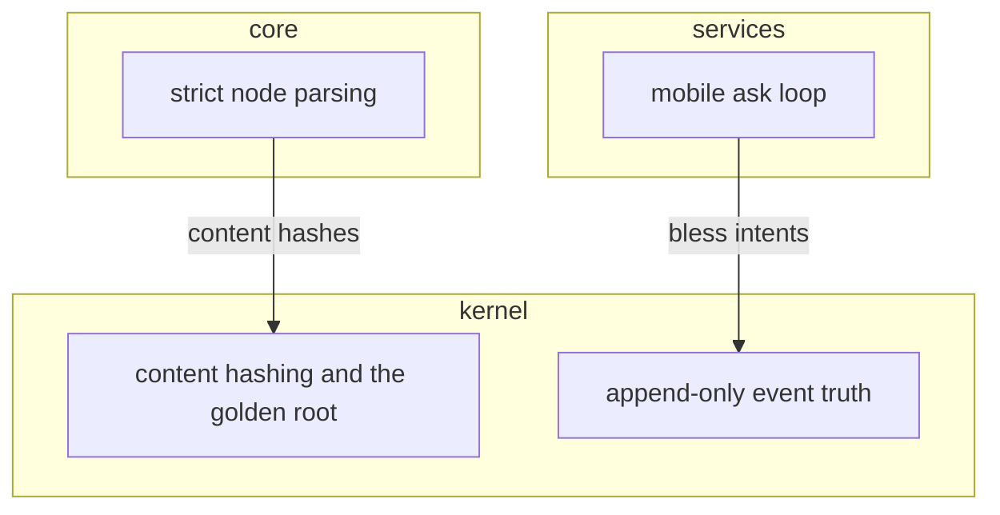
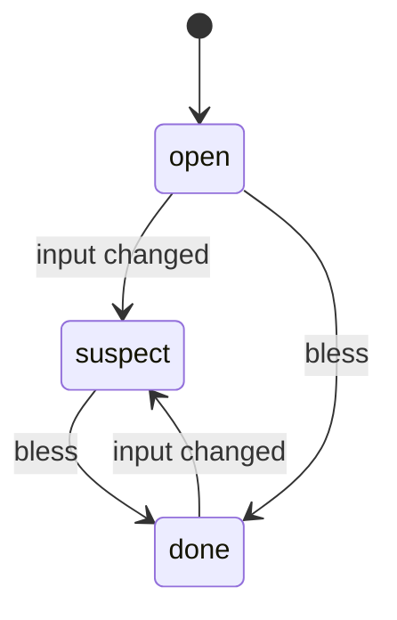
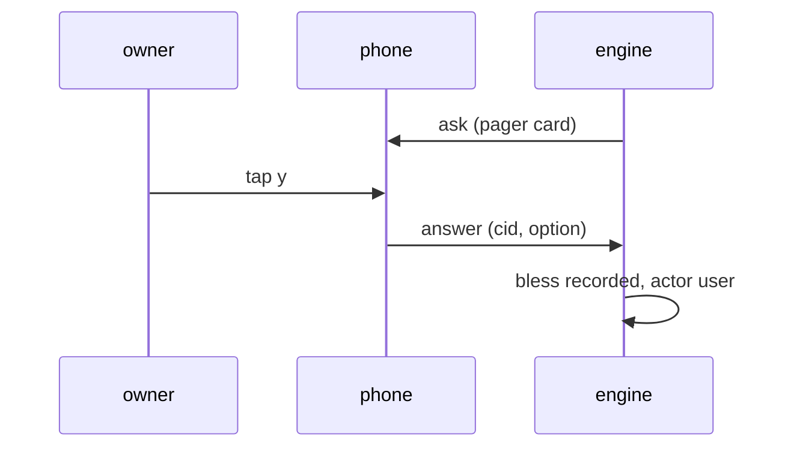

# Structural models - the pinned syntax, by example

A structural model is a Mermaid file the engine checks. You edit the file; the engine extracts its semantic graph; the ledger hashes the GRAPH, never the bytes. The syntax below is the PINNED SUBSET - anything beyond it is a lint finding (the file still parses past it).

## The discipline (all kinds)

- Models live in `spec/models/`, one node each; `quack mint model --kind <kind>` seeds the skeleton from the registry (`method/models/`).
- Declare every element FIRST, one per line. Then the flows, on declared names only.
- A flow to an undeclared name is a dangling reference. Lint.
- Every flow carries a payload label. An empty label is a lint finding.
- No coordinates, ever. Layout derives (the report and the book render the graph).
- ELEMENTS ARE DESIGN REGIONS; FILES ARE THEMES. The model allocates each marked region to one rank or band; a file may span ranks - it groups regions by theme (the Schlauch), derived from co-location, and the renders cluster by it. Unmarked local helpers are architecturally invisible.
- Elements are allocated AHEAD of code. The design-marker id is the join:
  - allocated here, no realizing `design:` region yet -> an honest planned hole.
  - a `design:` region no model allocates -> the sky-fall lint ("no device falls from the sky").

## The onion physics (layers-flow; adr-onion-physics)

- Rank = ABSTRACTION GRADIENT, innermost first: the kernel holds the core algorithms; the rim touches the world and stays mechanical.
- Dependencies point inward, at any depth. An inner element naming an outer one is a divergence.
- Only the rim does external I/O; the kernel is pure. (One recorded exemption: telemetry is cross-cutting - adr-logging-ambient.)
- TRANSFORMS live in SEAM BANDS: `subgraph outer--inner` owns the adapter code between two coordinate systems - a band is not a layer, has no rank, and is exempt from the no-flow smell. Identity transit is legal: an unchanged signal routes through without an invented transform.
- AMBIENT (`subgraph ambient`) holds meaning-free utilities: callable from every rank, may call only ambient.
- Say movements A-TO-B (rim-to-graph, graph-to-rim), never "input/output" - those words flip meaning with the speaker's seat.

## Layers + flow (kind: layers-flow)

- `subgraph <layer>` ... `end` - one block per layer. Declaration order IS the rank, innermost first.
- `<element-id>["<responsibility>"]` - one line per element, inside its layer. The id joins the code's design marker; the label is the one-line responsibility.
- `a -->|payload| b` - a flow. Dependencies must point inward; an outward or undeclared inter-layer code dependency is a conformance divergence.
- A layer whose elements originate and terminate no flow is the NO-FLOW SMELL: push its infrastructure a level down.

## State machine (kind: state)

- States and labeled transitions only. The transition label names the trigger.
- The extractor checks the code's transition set against this graph (conformance), and flags unreachable states.

## Sequence (kind: sequence) - one per killer use case

- Participants declared first (the TikZ discipline again). Messages carry their payload as the label.

## Hash behavior - what ripples and what does not

- COSMETIC (hash unchanged, nothing goes SUSPECT): comments, whitespace, reordering element lines WITHIN a layer, reordering flow lines.
- SEMANTIC (hash moves, dependents ripple): adding or removing an element or flow, renaming an id, changing a payload label or a responsibility, changing the LAYER ORDER.
- Proven in the i16 M5 spike: the cosmetic variant hashed bit-identical; one added flow moved it.

## Practical notes

- Files may carry a UTF-8 BOM; the extractor strips it (a PowerShell-written file bit us once).
- The file previews as a diagram natively in Obsidian and on GitHub - the truth file IS viewable. The report and book render the richer derived views (the onion drill-down).
- Adding a new function later: add its element line to its layer, add its flows, then implement the design region with the same id. The model leads; the code follows.

## Rationale (not load-bearing)
Decided at i16 M4 (adr-element-major-format, adr-text-first-models): element-major TikZ discipline in a lint-pinned Mermaid subset - constrained mainstream, no owned grammar (the ownership law). Documented by example at the owner's instruction, 2026-07-09.
