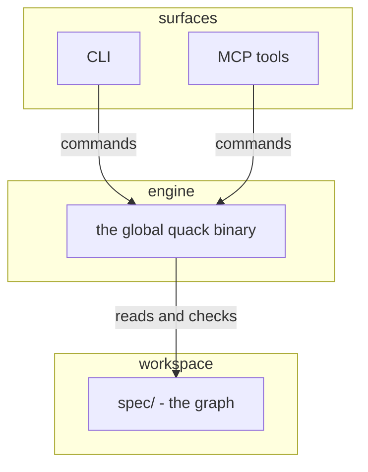

<!-- ai:3 -->
# From zero to a running ledger
<!-- ai:3 -->
A design ledger only helps if starting it is trivial. This IFU takes a fresh machine to a running quackitect in a few minutes.
---
<!-- ai:3 -->
# Starting state
<!-- ai:3 -->
Truly nothing: a machine without the repo, without the engine, without a session. This is the one IFU that starts from scratch. Every other IFU starts where this one ends.
---
<!-- ai:3 -->
# Get the repo, run the launcher
<!-- ai:3 -->
Clone or copy the project, then run `.\quack version` at its root. The launcher bootstraps the ONE global engine binary from the vendored source. No Go on the machine? The bundled shim builds anyway.
---
<!-- ai:3 -->
# Attest the session
<!-- ai:3 -->
An agent channel earns its session key through the contract's attest ritual: the owner mints a grant at the console, the agent redeems it after the visible recital. The interactive console itself is never gated.
---
<!-- ai:3 -->
# Pair a phone, if you want one
<!-- ai:3 -->
`quack pair` mints the topic credential and renders a QR code. From then on a gate question can ride to the lockscreen, and one tap answers it. Optional, and worth it.
---
<!-- ai:3 -->
# The idle state
<!-- ai:3 -->
This is the state every IFU calls idle:
<!-- ai:3 -->
- The global engine binary is built and current.
- The workspace loads: `quack boot` reports green or yellow.
- `quack next` names the next ready check, or says done.
- The command surface of your choice is up, CLI or MCP.
|||

---
<!-- ai:3 -->
# Covered use cases
<!-- ai:3 -->
Setting up exercises these journeys:
[uc-onboard-newcomer](uc-onboard-newcomer), [uc-run-dep-free](uc-run-dep-free).
Note: The coverage slide is the machine-readable reference home. Story slides stay clean.
