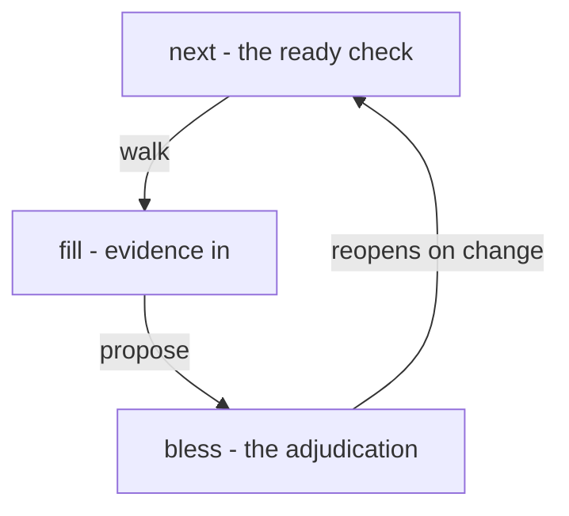

<!-- ai:3 -->
# Work that advances without eroding trust
<!-- ai:3 -->
The problem with agent-built work is not speed. It is trust in work you did not watch. The loop makes every advance a filled check and every judgment call an adjudicated gate.
---
<!-- ai:3 -->
# Starting state
<!-- ai:3 -->
The idle state from [the setup IFU](ifu0001-setup): engine current, workspace loaded, session attested.
---
<!-- ai:3 -->
# Plan with engage start
<!-- ai:3 -->
`/engage start` opens an iteration: retro first, then triage, then the baked checklist. The plan becomes checks in the ledger, not prose in a document.
---
<!-- ai:3 -->
# Walk with engage next
<!-- ai:3 -->
`/engage next` walks ONE ready check: fill it, propose the adjudication, stop at gates. The agent fills. The owner blesses. A killer gate always waits for its person.
|||

---
<!-- ai:3 -->
# Refine in a spike
<!-- ai:3 -->
`/engage refine` explores an idea without touching the ledger, then captures the keeper backward. Once a build exists, refine is the default lane.
---
<!-- ai:3 -->
# Grants, phones, and gates
<!-- ai:3 -->
A standing grant scopes what an agent may bless alone. A paired phone answers a gate with one tap. Everything else stops and asks. That split is the whole trust model.
---
<!-- ai:3 -->
# Ship
<!-- ai:3 -->
`/engage ship` packages the deliverable once the gates are green. An iteration ends with its record complete and its output out the door.
---
<!-- ai:3 -->
# Covered use cases
<!-- ai:3 -->
The loop journey exercises:
[uc-engage-start](uc-engage-start), [uc-engage-next](uc-engage-next), [uc-engage-refine](uc-engage-refine), [uc-engage-ship](uc-engage-ship), [uc-lawful-walk](uc-lawful-walk), [uc-mobile-adjudicate](uc-mobile-adjudicate), [uc-scoped-grant](uc-scoped-grant), [uc-work-register](uc-work-register).
Note: The coverage slide is the machine-readable reference home. Story slides stay clean.
