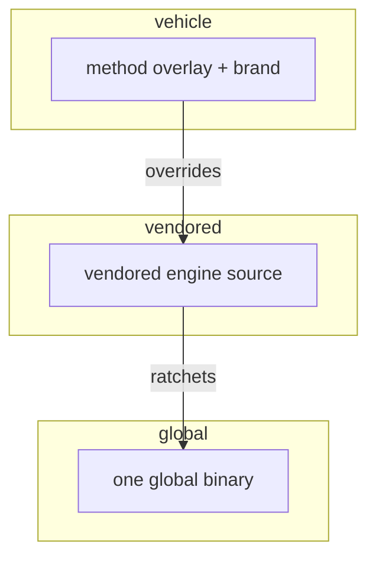

<!-- ai:3 -->
# One engine should carry many projects
<!-- ai:3 -->
Copying a method into every repo means every repo drifts. The engine stays ONE global binary; each project carries only its truth and its overlay.
---
<!-- ai:3 -->
# Starting state
<!-- ai:3 -->
The idle state from [the setup IFU](ifu0001-setup), on a machine that may hold several workspaces.
---
<!-- ai:3 -->
# Drive any workspace
<!-- ai:3 -->
Every command takes `--base <path>`: the same binary drives another project's workspace without switching context. Caches and outputs land in that workspace's own data home, never in the repo.
---
<!-- ai:3 -->
# Vendor a vehicle
<!-- ai:3 -->
`quack start init` scaffolds a full vehicle: vendored engine source, a committed method overlay, its own brand. The vehicle ratchets its engine forward from its OWN repo and works offline.
|||

---
<!-- ai:3 -->
# Modules scope the graph
<!-- ai:3 -->
A grown workspace splits into modules: imported, nested, each with scoped views. A team sees its slice; the trace stays whole underneath.
---
<!-- ai:3 -->
# The MCP lane
<!-- ai:3 -->
A harness with MCP support gets the command surface as discoverable tools, per-session attested, hot-swapped mid-session when the engine rebuilds. The CLI stays the universal fallback.
---
<!-- ai:3 -->
# Portable by construction
<!-- ai:3 -->
Any machine, any harness, any number of projects: the truth sits in each repo, the engine sits once on the machine, and nothing else is required.
---
<!-- ai:3 -->
# Covered use cases
<!-- ai:3 -->
The workspace journey exercises:
[uc-mcp-drive](uc-mcp-drive), [uc-module-import-update](uc-module-import-update), [uc-module-nesting](uc-module-nesting), [uc-module-scoped-views](uc-module-scoped-views), [uc-run-dep-free](uc-run-dep-free), [uc-vehicle-extends](uc-vehicle-extends), [uc-vehicle-se-doc](uc-vehicle-se-doc), [uc-vendor-engine](uc-vendor-engine).
Note: The coverage slide is the machine-readable reference home. Story slides stay clean.
