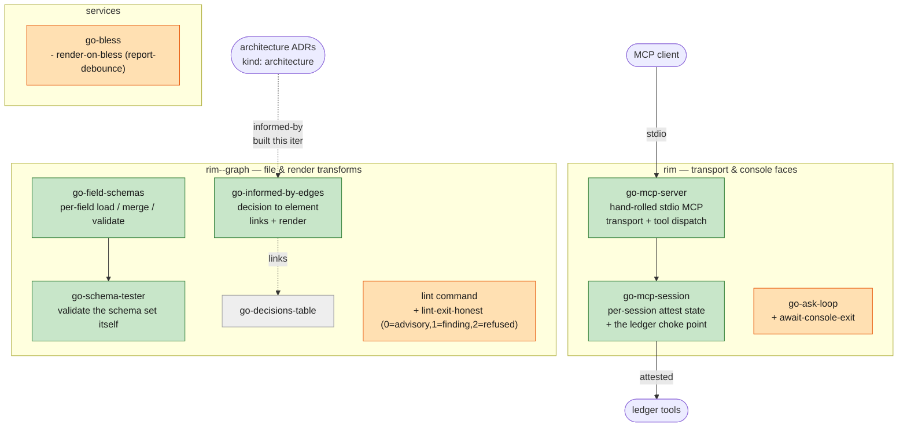

# i18 architecture review — the diagram to approve

The five NEW blocks (green, planned/unrealized until M6 fills them) and the three
existing blocks with BEHAVIOR CHANGES (amber). The build adheres to this — it may
fill these blocks and invent no others.

**Green = new blocks** · **amber = existing blocks with a behavior change** · grey = existing, unchanged (shown for context).

The onion (full engine model, all bands) lives in [model-engine-layers.md](../../models/model-engine-layers.md); this is the focused i18 delta for review.
