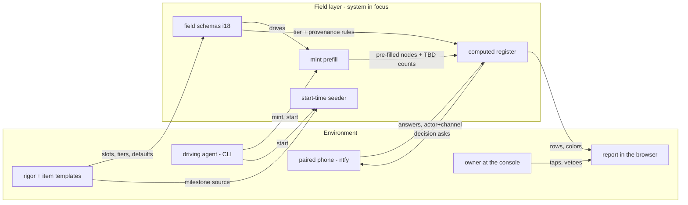

# M2 — Requirements (i0021_field_ux)

## Inputs captured → i21-m2-inputs

Context - the system in focus is the ENGINE's field layer. Everything it touches, with
direction:

One line: templates and schemas feed the mint and the seeder. Everything the human sees is the
register's computed surface. Every answer returns over the recorded ask path.

Stakeholders by role (no role left out):

- **Owner / adjudicator** - works the register at the console; rules the open question.
- **Mobile adjudicator** - the same person away from the desk; answers red-row asks by tap.
- **Driving agent** - mints, composes, proposes every value; never adjudicates killers.
- **Newcomer** - meets a seeded, pre-filled workspace instead of blank templates (the
  onboarding chapter's promise made real).
- **Maintainer** - owns schema/template evolution; the seeding-drift risk names their hazard.
- **Assessor / book reader** - reads the drivers table and lint results the ride-alongs fix.

Use cases:

- [uc-work-register](uc-work-register.md) (killer, new)
- [uc-engine-mediated-io](uc-engine-mediated-io.md) (new)
- the reused spine - uc-field-schemas (i18), uc-engage-start, uc-mobile-adjudicate, uc-onboard-newcomer, uc-workshop-smooth, uc-book-tables

The function tree IS the requirement set composed at plan time; no shadow tree is authored.

Non-killer review; blessed by the driving agent.

## Stakeholder coverage → i21-m2-stakeholders

The M2-inputs roles swept against the full always-on class set. The remainder, explicitly:

- **Integrator (vehicle builder)** - REAL consideration: schemas and the seeder must resolve
  through the overlay (workspace -> vehicle overlay -> engine), so a vehicle's own schemas
  win. Carried into M3 as a candidate criterion.
- **Tester** - touched by the battery-tiers ride-along; their full battery stays one explicit
  command (req-selftest-tiers.2).
- **Communicator** - served by the drivers-table rework (the book's ch 10.5 tells the
  architecture story from derived data).
- **Acquirer, operator-sysadmin** - no surface of this iteration touches them (dogfood tool,
  no ops change); recorded as consciously out.

No role left out. Non-killer review; blessed by the driving agent.

## Prior art checked against the concrete set → i21-m2-prior-art

The M1 scan positioned the IDEA; this pass holds the 13 composed requirements against it and
against the standard requirement-set checks (ISO 29148 discipline as baked into this rigor):

- **Verifiability / traceability**: every requirement carries a test and traces to a need -
  the two derived checks compute it live; all statements EARS-shaped (compose lint, zero new
  findings).
- **Asymmetric error class** (tax evidence): held by req-register-colors.4 (provenance-only
  colors) and raid-provenance-gamed. No change needed.
- **Two-level disclosure ceiling** (verified HCI constraint): held exactly by
  req-register-render.2 (collapsed / first expand / second expand). No third level exists to
  cut.
- **Habituation instrumentation** (research obligation 3): PARTIAL - the data is recorded
  (req-register-ask.2 stamps actor+channel per answer), the killer-guard and two-greens hold
  the structural line, but no requirement ANALYZES scrutiny over time. RECORDED as a miss
  deferred to the field loop: the retro reads the recorded answers; a metrics requirement
  would be premature before one field iteration of data exists.
- **Single-schema pressure** (both major form frameworks grew a second UI artifact): recorded
  as an M4 watch-item - presentation hints stay INSIDE the one schema or don't exist; a
  second schema artifact is the named failure smell.
- **Seeding fidelity**: no external best-practice miss found; the template-drift discipline
  (raid-seeding-drift) mirrors the owner's template-book render law.

Misses added: none. Misses recorded: habituation metrics (field-loop deferral), single-schema
watch-item (M4). Non-killer review; blessed by the driving agent.

## Environment assumption probed → i21-m2-probe

Probed live, not from memory - [schemas.go](../../../product/engine-go/schemas.go) and the
shipped schema home (`method/config/schemas/`):

- **Mechanism: fully sufficient.** The flat sebot shape carries `type_`, `enum_`, `pattern_`,
  `min_`, `max_`, **`tier_` (core|deferrable)** and **`default_`** per field, plus a
  `required` list; a `common` schema merges into every per-type one; defaults live IN the
  schema. Everything req-field-tier and req-mint-prefill assume is already loadable.
- **Data: thin, and that is the work.** Four schemas ship (common, adr, requirement, test).
  `common` already tiers class/killer as core WITH defaults; adr/requirement tier their kind
  as deferrable. Gaps recorded:
  1. No schemas yet for usecase, need, question, raid, model, or the item kinds - authoring
     them is M6 build content, not a blocker.
  2. Defaults exist only in `common` - consistent with req-mint-prefill.1's "default OR
     derived proposal"; the deriver carries the rest.
  3. No provenance attribute exists in the shape - where a value's source/justification lives
     is an M3/M4 design decision (watch the single-schema pressure recorded above).

Assumption holds; no requirement changes. Non-killer review; blessed by the driving agent.

## Milestone review → i21-m2-gate

1. **Verify.** Inputs carry the context figure and full role set. The stakeholder sweep walked
   every always-on class with two consciously-out records. Prior-art held the 13 requirements
   against the verified scan (2 misses RECORDED, none silently dropped). The probe looked at
   the live code and shipped schema files rather than memory. `req-has-test` and `req-traced`
   computed green by the engine - every requirement has a test and traces to a need.
2. **Validate.** The set covers exactly the approved scope: schema consumption (2 reqs) +
   register (4) + seeding (1) + ride-alongs (5) + apply generalization (1). Nothing entered
   beyond the plan. The open question q-io-lane-scope correctly blocks M3/M4, not M2.
3. **Red-team.** Weakest statement hunted: req-register-render.3 "visually distinct" - held:
   its test asserts distinct DOM marks, not taste. req-drivers-derived's hand-tag
   leans on the existing architecturally-significant tag - confirmed present in the ledger.
   No requirement failed the falsifiability probe.

**Verdict: PASS.** Killer milestone gate. Blessed by the driving agent under the owner's
standing overnight grant (2026-07-13); collected for the morning review.
