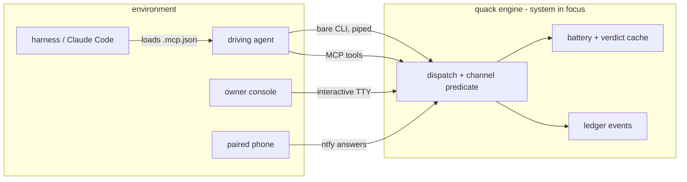

# M2 — Requirements (evidence)

## inputs captured  → i22-m2-inputs-captured-context

Context: the engine sits between four channels and two stores. The guards land on the
agent-facing edges.

One line to see: every guard of this iteration attaches to the agent edges (CLI, MCP)
or to the battery. The console edge stays refusal-free (raid-over-blocking).

Probes run 2026-07-14 (the real channel, not the datasheet):

- [.mcp.json](../../../.mcp.json) exists at the root and names `quack mcp`.
- `quack mcp` answers a `tools/list` over stdio with the full command surface. Probe verified live.
- THIS session has no quack MCP tools loaded. The gap is harness-side (project-server approval or config), not engine-side.
- The channel predicate exists: [trust.go resolveActor](../../../product/engine-go/trust.go) stamps by `--by` override, else interactive console = user, piped call = agent. The new guards reuse it.

The battery lanes, named:

- `selftest` runs the full battery
- `verify <check>` re-runs one check eagerly
- every walk command answers lazily from the verdict cache (req-lazy-verdicts; i21)
- a build's hand-back runs the battery once per slot

The grant lifecycle, named: record (scope / expiry / empty collection) → live (in-scope
agent blesses stamp the grant id) → close (expiry or owner order) → morning review
(the collection presented - each bless confirmed or reopened).

## prior art checked  → i22-m2-prior-art-checked

The requirement set, held against the M1 sources' checklist for policy enforcement:

- Bypass story: covered. The guards live in the engine that writes the record. No engine, no record.
- Refusal observability: covered. req-selftest-gate.2 and req-cli-steer name the lawful lane in the refusal.
- Escape hatch: covered. The console channel takes no new refusal (raid-over-blocking mitigation).
- Audit: covered. The call log records dispatches; the ledger records blesses; the grant records its collection.
- Policy versioning: covered structurally. Guards ship inside the engine binary; the build stamp names the version.
- Approval granularity: covered. The grant carries scope; per-tool "always/never" (the OpenAI/Codex pattern) maps to grant scope classes.
- Over-implementation detection: NOT covered, recorded as a MISS. TDD Guard also validates that the implementation stays minimal for the failing test. Out of scope here; the trace's designs-realized coverage is the nearest existing control. No new requirement added; the miss is this record.

One addition made at compose (already in the set): req-first-green-guard exempts
tests carrying an explicit exemption marker, mirroring adr-red-unobservable. Prior
art (TDD Guard) has the same escape for untestable-red cases.

## stakeholder coverage  → i22-m2-stakeholder-coverage-no

Held against the default type's always-on classes:

- agent: the primary subject. Every guard binds its channel; the MCP lane serves it.
- project-owner: the adjudicator. The grant and the morning review are theirs; the two rulings (q-cli-steering, q-grant-honesty) came from them.
- assessor: served. Refusals, grant records, and lint flags are readable evidence.
- user: same person as the owner on this project; the console lane stays untouched for them.
- newcomer: not affected. No entry document changes in scope; the lints touch node statements, not the README.
- communicator: not affected. No book or report structure changes in scope.
- acquirer: not affected. No packaging surface changes beyond the normal ship.
- developer-maintainer (software class): served. The guards are small, tested Go units; the miss record (over-implementation) is honest about limits.
- tester (software class): served. Every requirement carries an executable selftest; the timing-flake risk is mitigated at assertion level.

No role is left out; three are recorded as deliberately unaffected.

## Review rounds and verdict  → i22-m2-gate

Round 1, verify: the context diagram names all four channels and both stores. The
probes ran live (MCP handshake verified; the channel predicate located at its
file). The derived checks computed green: every requirement refines a use-case
(req-traced) and carries a test (req-has-test).

Round 2, validate: the requirement set realizes exactly the four approved clusters.
Both owner rulings are woven in (req-cli-steer says refuse; need-engage carries the
amended criterion). The environment assumptions a requirement builds on were
probed, not assumed: .mcp.json, the MCP handshake and the channel predicate.

Round 3, red-team: the sharpest attack is the harness-side MCP gap. The engine
can serve tools all day, and a harness that never loads .mcp.json leaves
req-mcp-discoverable unmet in practice. Held with a boundary: the requirement
binds the ENGINE's offer. The harness approval step is configuration, and M5
spikes it on this machine. The recorded miss (over-implementation detection)
stays a miss, not scope creep.

Verdict: PASS. Blessed under the standing grant; collected for the morning review.
