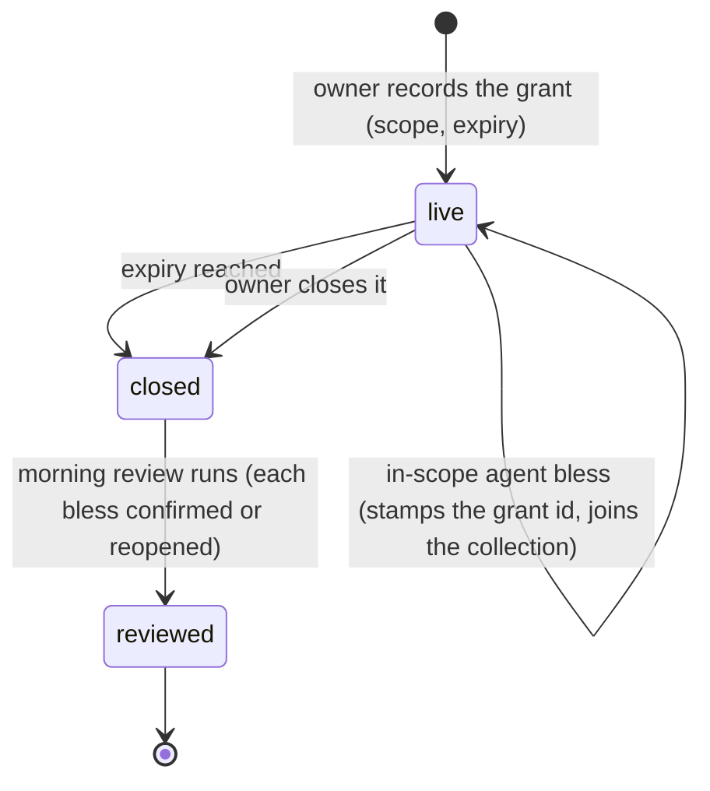

## Rationale (not load-bearing)
One line to see: three states, and no path back to live - a new stretch records a NEW
grant, so no grant quietly outlives its review.

The self-loop on live is the whole point: every in-scope bless leaves a stamped,
collectable trace. The reviewed exit realizes q-grant-honesty ruling A - the owner's
confirmation is what turns the collection into owner-authorized history. The state
enum and its transition set are the conformance contract for go-grant-store.
