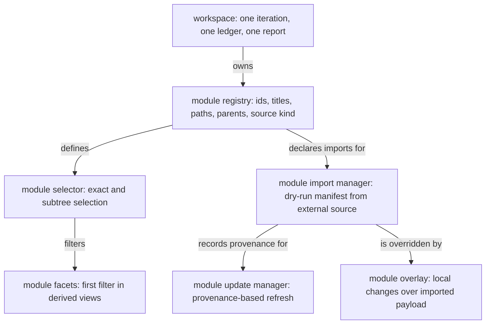

# M4 Architecture Evidence

## Chosen architecture stated -> i23-m4-chosen-architecture-stated

The architecture is a workspace-level module system.

It has these rules:

- The workspace keeps one iteration, one ledger, one report, and one book.
- Modules are ownership and filtering units.
- Nested modules are dotted ids, such as `doc.review`.
- Selecting a parent module includes its dotted children in views.
- Parent modules do not own separate timelines, ledgers, or recursive gate semantics.
- Imported modules are read-only source payloads with recorded provenance.
- Module import and update run through a deterministic dry-runnable manifest.
- Single-module workspaces remain the trivial case and hide module controls.

## Choice traced to weighted criteria -> i23-m4-choice-traced-to

The chosen architecture is the dotted-module model with one workspace iteration and one ledger.

Trace to weighted criteria:

- One ledger and one timeline (0.25): satisfied by `adr-one-ledger-modules`.
- Module-first filtering (0.20): satisfied by `adr-module-filter-first`.
- Deterministic import/update (0.20): satisfied by `adr-module-import-manifest`.
- Backward compatibility (0.15): satisfied by default-module assignment in `req-node-module` and hidden module controls for single-module workspaces.
- Implementation cost and risk (0.10): satisfied by rejecting recursive module semantics in `adr-dotted-module-ids`.
- Future local vehicle modules (0.10): satisfied by `adr-vehicle-se-doc` and `req-vehicle-module-setup`.

The selected candidate wins because it adds the needed ownership and import boundaries without adding nested timelines or nested ledgers.

## Model authored -> i23-m4-model-authored-the

The architecture diagram is `model-module-architecture`.

It allocates these elements before implementation:

- workspace process
- module registry
- module selector
- module facets
- import manager
- update manager
- module overlay

The diagram shows the ownership structure and the update boundary. It deliberately uses `element-tree`, not a runtime-flow model.

## Structuring method considered -> i23-m4-structuring-method-considered

DSM, DMM and MDM were considered and skipped for this first cut.

Reason: the module split is already forced by ownership boundaries:

- workspace process
- module registry
- module selection and filtering
- deterministic import/update
- local overlays over imported payloads

The architecture does not yet need coupling analysis to discover modules. If implementation reveals unexpected coupling, module clustering can be revisited through a later architecture review.

## Views chosen -> i23-m4-views-chosen-model

Chosen view:

- `model-module-architecture` as `element-tree`: shows ownership boundaries and build elements for the first implementation.

Rejected views for this iteration:

- state model: useful later for import/update lifecycle states, not needed before the first build plan.
- sequence model: useful later for module import command flow, but the current decision is structural.
- context view: already derived from neighbour notes when needed.

No runtime-flow structural model is used. The architecture is not about signal flow between runtime services; it is about workspace/module ownership and deterministic update boundaries.

## ADR recorded and traced -> i23-m4-adr-recorded-and

Architecture ADRs are recorded under `spec/decisions/` and traced through the addresses lane.

Key ADRs:

- `adr-one-ledger-modules`
- `adr-dotted-module-ids`
- `adr-module-filter-first`
- `adr-module-import-manifest`
- `adr-vehicle-se-doc`
- `adr-module-views`

## Review Verdict -> i23-m4-gate

Verify: the selected architecture is stated and traced to criteria. It is represented as a model and backed by ADRs.

Validate: the architecture preserves one workspace timeline and ledger. It adds module ownership, dotted child rollups and deterministic imports.

Red-team: the design keeps parent modules as rollup views, not separate process owners. Child modules still use the normal workspace process and gates.

Verdict: M4 is ready for adjudication.