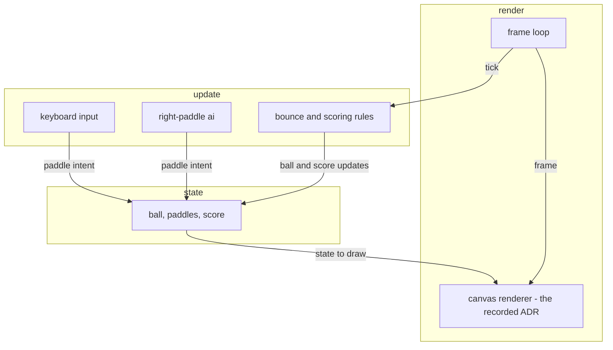

<!-- Minutes mapping (owner ruling 2026-07-12): the timeline shows the REAL walk - the spike
  measured 10:24 total, but that included friction FIXED at i19 (legacy-edge scaffold, unclean
  stub examples) and a one-off attest hiccup; the walk itself measured 4:46. Fixed hiccups do
  not belong in a timeline a newcomer will live. Rounded to half-minute steps:
  s1 Get it                   0.5
  s2 Start the loop           1.0  (the attest grant + compose)
  s3 Design input             1.0  (M1 + M2)
  s4 Design output            1.5  (M3-M6, the build is the meat)
  s5 Validation & packaging   0.5  (M7 + M8)
  s6 Discussion               0.5  (talk time)
  Sum = 5.0 minutes, grounded in the measured 4:46. -->
<!-- ai:3 -->
# Get it
Two ways in. Both end with a verified toolchain.

<!-- ai:3 -->
**Prerequisites - either way:**
- An AI agent on your system (Claude, ChatGPT, or similar) - it drives the loop for you.
- Windows: Winget. It ships with Windows 11 and current Windows 10.
- Linux: apt-get, dnf, or apk.
- The Go toolchain. Missing? The installer puts it there for you, and says why.

<!-- ai:3 -->
**Option A - clone the repo, run the installer:**

```
git clone https://github.com/mb-89/quackitect
tools\RUNME.ps1    (Windows)
tools/RUNME.sh     (Linux)
```

<!-- ai:3 -->
**Option B - say to your agent, verbatim:**

```
clone https://github.com/mb-89/quackitect, and lets start a new project
```

<!-- ai:3 -->
Your agent handles the rest, including the install.
Minutes: 0.5
Note: the installer only installs and verifies. It creates no workspace and no project. This deck is self-contained on purpose - everything you need is on the slides.
---
<!-- ai:3 -->
# Start the loop
Three moves open a project.

<!-- ai:3 -->
- Tell your agent what you want. One sentence is enough.
- The agent starts the loop. quackitect confirms the project type and the rigor WITH you. It never assumes the fit.
- The grant - your one console command. It proves the contract was read before any work moves the ledger:

```
./quack attest --grant
```

<!-- ai:3 -->
The start exchange, message by message:

<svg viewBox="0 0 560 244" role="img" aria-label="The start exchange as a chat: you ask for a pong game, the agent flags systematic rigor as overkill, you keep it to show every milestone, the agent composes 24 checks and asks for the one-command grant." style="max-width:620px" xmlns="http://www.w3.org/2000/svg"><text x="15" y="14" font-size="11" fill="#888" font-family="system-ui,sans-serif">your agent</text><text x="545" y="14" font-size="11" fill="#888" font-family="system-ui,sans-serif" text-anchor="end">you</text><rect x="280" y="22" width="265" height="26" rx="10" fill="#d9efd9" stroke="#9cc79c"/><text x="292" y="39" font-size="12" fill="#222" font-family="system-ui,sans-serif">a pong game, one file, plays to five</text><rect x="15" y="58" width="290" height="62" rx="10" fill="#eef1f6" stroke="#b9c6d8"/><text x="27" y="76" font-size="12" fill="#222" font-family="system-ui,sans-serif">starting the loop. project type: default.</text><text x="27" y="94" font-size="12" fill="#222" font-family="system-ui,sans-serif">rigor: systematic - overkill for a</text><text x="27" y="112" font-size="12" fill="#222" font-family="system-ui,sans-serif">pong-sized project. keep it?</text><rect x="350" y="130" width="195" height="26" rx="10" fill="#d9efd9" stroke="#9cc79c"/><text x="362" y="147" font-size="12" fill="#222" font-family="system-ui,sans-serif">yes - show every milestone.</text><rect x="15" y="166" width="290" height="62" rx="10" fill="#eef1f6" stroke="#b9c6d8"/><text x="27" y="184" font-size="12" fill="#222" font-family="system-ui,sans-serif">composed: 25 checks. one console</text><text x="27" y="202" font-size="12" fill="#222" font-family="system-ui,sans-serif">command grants the session:</text><text x="27" y="220" font-size="12" fill="#222" font-family="monospace">./quack attest --grant</text></svg>

<!-- ai:3 -->
What to see above: the whole start step is four messages. The rigor warning is part of it - systematic is overkill for pong, kept deliberately to show every milestone.
Minutes: 1.0
Note: the grant is one console command; composing the checklist takes the agent about a minute. After that, the board shows all 25 checks - the whole road, visible before any work.
---
<!-- ai:3 -->
# Design input
First the WHAT: agreed before anything is built.

<!-- ai:3 -->
- M1 - vision. Say why, in one paragraph. The board turns its first row green.
- M2 - requirements. Short, testable statements - each with a test. The engine computes the pairing; nobody ticks that box by hand.

<!-- ai:3 -->
Pong's three most important requirements:
- paddle control - the player moves the left paddle with the keyboard
- ball physics and scoring - the ball bounces off paddles and walls; first to five wins
- single file - the whole game ships as one HTML file, zero dependencies

<!-- ai:3 -->
Pong's design-input register, as its own book renders it:

<table class="q-table u-table" style="max-width:640px"><thead><tr><th scope="col">id</th><th scope="col">statement</th><th scope="col">verified by</th></tr></thead><tbody><tr><td>need-pong</td><td>a playable pong, from nothing, in minutes</td><td>-</td></tr><tr><td>uc-play-pong</td><td>a player opens one file and plays to five</td><td>-</td></tr><tr><td>req-paddle-control</td><td>the player moves the left paddle with the keyboard</td><td>test-paddle-control</td></tr><tr><td>req-ball-scoring</td><td>the ball bounces off paddles and walls; first to five wins</td><td>test-ball-scoring</td></tr><tr><td>req-single-file</td><td>the whole game ships as one HTML file, zero dependencies</td><td>test-single-file</td></tr></tbody></table>

<!-- ai:3 -->
What to see above: pong's whole design input - one need, one use case, three requirements, each with its test. The engine computes the pairing; this book's own register (chapter 6) is the same table at project scale.
Minutes: 1.0
Note: three requirements, three tests, pairing computed by the engine - about a minute of walk.
---
<!-- ai:3 -->
# Design output
Then the HOW: the architecture, the design, the deliverable taking shape.

<!-- ai:3 -->
- M3 - candidates. One real fork: canvas rendering vs DOM elements. Both written down before deciding.
- M4 - decision. One line decides: canvas wins on frame cost. The decision is a recorded ADR - traced, never folklore.
- M5 - spike. Nothing risky left? Say so, on the record. Here the whole build IS the spike.
- M6 - build. About 110 lines later: a playable game. The engine computes "every requirement has realized design".

<!-- ai:3 -->
Pong's architecture, rendered the way every model renders in a quackitect book:



Minutes: 1.5
Note: the build is the meat of the walk - about two minutes to a playable game, with two headless screenshots as run proof.
---
<!-- ai:3 -->
# Validation and packaging
- M7 - validate. The code is read back against each requirement. "Meets the need" is a judged gate, not a feeling.
- M8 - ship. One command packages everything.

<!-- ai:3 -->
It ships MORE than the deliverable:
- the game - pong.html, 3.8 KB
- a small BOOK - pong's own spec, rendered like this document
- the report - the live board, 25 of 25 checks green
- the README - the project's front door, scaffolded at the start
- RUNME - the installer, so the zip's receiver can set up the toolchain too
- one zip carrying all of it

<svg viewBox="0 0 380 194" role="img" aria-label="Five artifacts go into the ship step - the game, the book, the report, the README, and RUNME - and one zip comes out." style="max-width:300px" xmlns="http://www.w3.org/2000/svg"><style>.sb{fill:#fff;stroke:#888}.st{font:12px system-ui,sans-serif;fill:#333}.sl{stroke:#888;fill:none}</style><rect class="sb" x="10" y="10" width="110" height="26" rx="4"/><text class="st" x="20" y="27">pong.html</text><rect class="sb" x="10" y="47" width="110" height="26" rx="4"/><text class="st" x="20" y="64">the book</text><rect class="sb" x="10" y="84" width="110" height="26" rx="4"/><text class="st" x="20" y="101">the report</text><rect class="sb" x="10" y="121" width="110" height="26" rx="4"/><text class="st" x="20" y="138">README</text><rect class="sb" x="10" y="158" width="110" height="26" rx="4"/><text class="st" x="20" y="175">RUNME</text><path class="sl" d="M120 23 h45 M120 60 h45 M120 97 h45 M120 134 h45 M120 171 h45 M165 23 v148 M165 97 h40"/><path d="M205 91 l12 6 -12 6 z" fill="#888"/><rect class="sb" x="222" y="80" width="120" height="34" rx="6"/><text class="st" x="248" y="101">pong.zip</text></svg>

<!-- ai:3 -->
What to see above: five artifacts go in, one zip comes out - install, docs, and deliverable travel together.
Minutes: 0.5
Note: the timeline across the bottom is the real walk, about five minutes from empty folder to shipped zip - measured, with the friction this iteration fixed taken out.
---
<!-- ai:3 -->
# Discussion
|||
<!-- ai:3 -->
The shipped game, live from this page. The court is always here; start runs the simulation, stop halts it, start runs it fresh again. Leaving the slide stops it too.

```embed auto
// re-homed for the book: this page has no #court/#msg/#start, so the embed builds
// its own elements inside its slot on the slide's first entry (the court shows
// immediately, static). START runs the simulation; STOP halts it; START again
// restarts fresh. Leaving the slide stops the loop through slot.__stop; the
// court and the buttons stay.
var slot = document.getElementById('man-deck-pong-s6-e1').parentNode;
Array.prototype.slice.call(slot.querySelectorAll('.pong-el')).forEach(function(n){ n.parentNode.removeChild(n); });
var raf = 0, stopped = true;
var msg = document.createElement('p');
msg.className = 'pong-el';
msg.textContent = 'First to 5 wins. W/S or the arrow keys move the left paddle.';
var canvas = document.createElement('canvas');
canvas.className = 'pong-el';
canvas.width = 800; canvas.height = 500;
canvas.style.cssText = 'background:#000;border:2px solid #444;max-width:100%;display:block';
var bs = 'font-size:1rem;padding:8px 22px;cursor:pointer;border-radius:6px;border:1px solid #666;background:#222;color:#eee;margin-right:10px';
var startBtn = document.createElement('button');
startBtn.className = 'pong-el';
startBtn.textContent = 'start';
startBtn.style.cssText = bs;
var stopBtn = document.createElement('button');
stopBtn.className = 'pong-el';
stopBtn.textContent = 'stop';
stopBtn.style.cssText = bs;
stopBtn.disabled = true;
slot.appendChild(msg); slot.appendChild(canvas); slot.appendChild(startBtn); slot.appendChild(stopBtn);
startBtn.addEventListener('click', function(){ startPong(); });
stopBtn.addEventListener('click', function(){ haltPong(); });
slot.__keys = slot.__keys || {};
if (!slot.__keysWired) {
  slot.__keysWired = true;
  document.addEventListener('keydown', function(e){ slot.__keys[e.key] = true; });
  document.addEventListener('keyup',   function(e){ slot.__keys[e.key] = false; });
}
function haltPong() {
  stopped = true;
  if (raf) cancelAnimationFrame(raf);
  startBtn.disabled = false;
  stopBtn.disabled = true;
}
slot.__stop = haltPong;
drawCourt();
function drawCourt() {
  var ctx = canvas.getContext('2d');
  ctx.fillStyle = '#000'; ctx.fillRect(0, 0, canvas.width, canvas.height);
  ctx.strokeStyle = '#333'; ctx.setLineDash([8, 12]);
  ctx.beginPath(); ctx.moveTo(canvas.width/2, 0); ctx.lineTo(canvas.width/2, canvas.height); ctx.stroke(); ctx.setLineDash([]);
  ctx.fillStyle = '#eee';
  ctx.fillRect(0, (canvas.height-90)/2, 12, 90);
  ctx.fillRect(canvas.width-12, (canvas.height-90)/2, 12, 90);
  ctx.beginPath(); ctx.arc(canvas.width/2, canvas.height/2, 8, 0, 7); ctx.fill();
}

function startPong() {
  var ctx = canvas.getContext('2d');
  var W = canvas.width, H = canvas.height;
  var PW = 12, PH = 90, R = 8, WIN = 5;
  var keys = slot.__keys;
  var state;

  function reset(dir) {
    return { bx: W/2, by: H/2, vx: 5*dir, vy: 3*(Math.random()*2-1),
             ly: state ? state.ly : (H-PH)/2, ry: state ? state.ry : (H-PH)/2,
             ls: state ? state.ls : 0, rs: state ? state.rs : 0, over: false };
  }

  function step() {
    // left paddle: player keys
    if (keys['w'] || keys['ArrowUp'])   state.ly -= 7;
    if (keys['s'] || keys['ArrowDown']) state.ly += 7;
    state.ly = Math.max(0, Math.min(H-PH, state.ly));
    // right paddle: simple AI follows the ball
    var target = state.by - PH/2;
    state.ry += Math.max(-5, Math.min(5, target - state.ry));
    state.ry = Math.max(0, Math.min(H-PH, state.ry));
    // ball
    state.bx += state.vx; state.by += state.vy;
    if (state.by < R)   { state.by = R;   state.vy = -state.vy; }
    if (state.by > H-R) { state.by = H-R; state.vy = -state.vy; }
    // paddle bounces (angle depends on where the ball hits the paddle)
    if (state.vx < 0 && state.bx-R < PW && state.by > state.ly && state.by < state.ly+PH) {
      state.bx = PW+R; state.vx = -state.vx*1.03;
      state.vy += (state.by-(state.ly+PH/2))/12;
      // moving WITH the hit puts spin on the ball: the paddle's motion bends the angle
      if (keys['w'] || keys['ArrowUp'])   state.vy -= 2.5;
      if (keys['s'] || keys['ArrowDown']) state.vy += 2.5;
    }
    if (state.vx > 0 && state.bx+R > W-PW && state.by > state.ry && state.by < state.ry+PH) {
      state.bx = W-PW-R; state.vx = -state.vx*1.03;
      state.vy += (state.by-(state.ry+PH/2))/12;
    }
    // score
    if (state.bx < -R)  { state.rs++; endRally(-1); }
    if (state.bx > W+R) { state.ls++; endRally(1); }
  }

  function endRally(dir) {
    if (state.ls >= WIN || state.rs >= WIN) {
      state.over = true;
      msg.textContent = (state.ls > state.rs ? 'You win!' : 'Computer wins!');
      startBtn.disabled = false; stopBtn.disabled = true;
    } else {
      var keep = state; state = reset(dir); state.ls = keep.ls; state.rs = keep.rs;
    }
  }

  function draw() {
    ctx.fillStyle = '#000'; ctx.fillRect(0, 0, W, H);
    ctx.strokeStyle = '#333'; ctx.setLineDash([8, 12]);
    ctx.beginPath(); ctx.moveTo(W/2, 0); ctx.lineTo(W/2, H); ctx.stroke(); ctx.setLineDash([]);
    ctx.fillStyle = '#eee';
    ctx.fillRect(0, state.ly, PW, PH);
    ctx.fillRect(W-PW, state.ry, PW, PH);
    ctx.beginPath(); ctx.arc(state.bx, state.by, R, 0, 7); ctx.fill();
    ctx.font = '40px monospace'; ctx.textAlign = 'center';
    ctx.fillText(state.ls, W/2-60, 50); ctx.fillText(state.rs, W/2+60, 50);
  }

  function loop() {
    if (stopped) return;
    if (!state.over) { step(); draw(); raf = requestAnimationFrame(loop); }
  }

  document.addEventListener('keydown', function(e){ keys[e.key] = true; });
  document.addEventListener('keyup',   function(e){ keys[e.key] = false; });
  stopped = false;
  startBtn.disabled = true; stopBtn.disabled = false;
  msg.textContent = 'First to 5 wins.';
  state = null; state = reset(1); state.ls = 0; state.rs = 0;
  draw();
  raf = requestAnimationFrame(loop);
}
startPong();
```
|||
<!-- ai:3 -->
Pong is not an example you would usually use quackitect for. That is why quackitect warned you that it is overkill. We used Pong as a small example to show you how the workflow works. The bigger the project, the more the rigor pays off. quackitect itself will tell you if the rigor does not match the project.

<!-- ai:3 -->
Behind that, two points:
- the rigor mismatch catches misfit in BOTH directions - too much ceremony for a toy, too little structure for a real system
- for throwaway vibe coding you would not use quackitect at all
Minutes: 0.5
Note: the same lazy law the shipped file obeys - the embed stays inert text until you press start; leaving the slide stops the game, and coming back asks for a fresh start.
