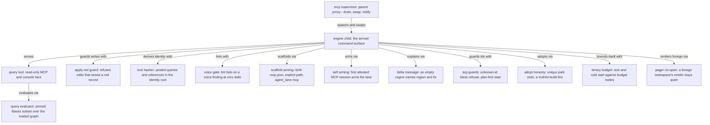

Placement rationale: the supervisor sits outside the engine child, so a swap never kills the served connection. The query face is a thin adapter over the one evaluator. Every guard attaches to the engine seam it protects.
