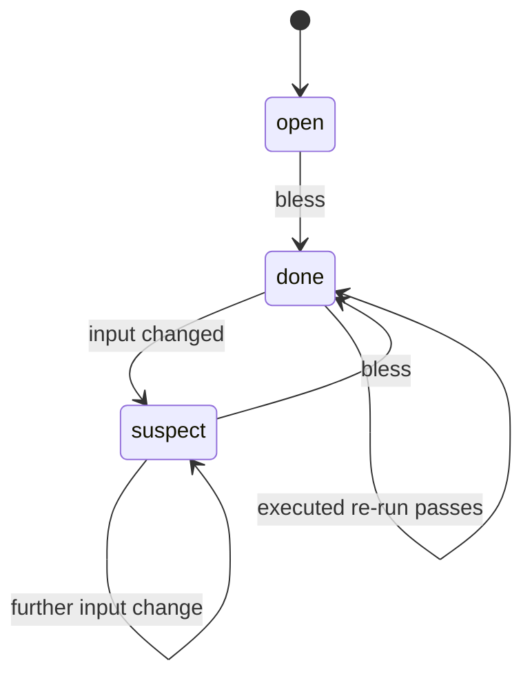

## Rationale (not load-bearing)
The engine's most load-bearing behavior as its second model (adr-views-engine, i16 b9). A check is born OPEN; a bless makes it DONE; ANY input change flips DONE to SUSPECT (never back to open - the history stands); a bless re-attests it DONE. Executed checks re-run instead of taking a user bless - the self-loop on done. Conformance target: the gateState/suspect machinery in the kernel.
