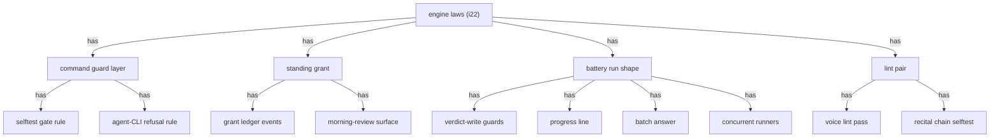

## Rationale (not load-bearing)
One line to see: four groups, eleven leaves; every leaf is a future `design:` marker id
the M6 build fills (the M4-allocation the sky-fall rule checks against).

Placement and contract, one line per leaf:

- go-guard-selftest: in the dispatch guard layer, because the rule must fire before ANY handler. In: command name, channel, gate readiness. Out: pass, or a refusal naming quack verify and the gate.
- go-guard-cli: same layer, same reason. In: command name, channel, the workspace's declared agent lane. Out: pass, or a refusal naming the MCP tools.
- go-grant-store: beside the other ledger events, because a grant IS an adjudication fact. In: scope, expiry. Out: grant id; a scope match verdict for a bless.
- go-grant-review: on the grant, because the collection is the grant's own exit ritual. In: a closed grant. Out: the collected blesses, listed for confirmation.
- go-verdict-guard: wrapping the ONE verdict-write path, because i21 proved per-test guards miss. In: a run result plus busy flag and red-record state. Out: recorded verdict, or a discard with its reason.
- go-battery-progress: in the battery runner, where the loop counter lives. In: test index, total. Out: one numbered console line per test.
- go-battery-batch: at the battery entry, where the cache is consulted. In: content hash state. Out: a cache answer, or a full run.
- go-battery-parallel: in the battery runner's loop. In: the independent test list. Out: the same verdicts, recorded through the one guarded write path.
- go-voice-lint: in the lint pass list, beside the EARS check. In: authored statement fields. Out: flags.
- go-recital-chain: in the selftest corpus, beside the entry-chain checks. In: contract.md and AGENTS.md bytes. Out: pass or fail.
