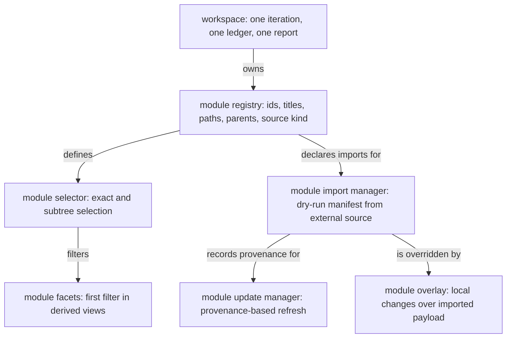

Placement rationale: the workspace process stays above modules. The registry is the structural root for module metadata. Selection and facets are view behavior. Import, update, and overlay are the file-ownership boundary.
