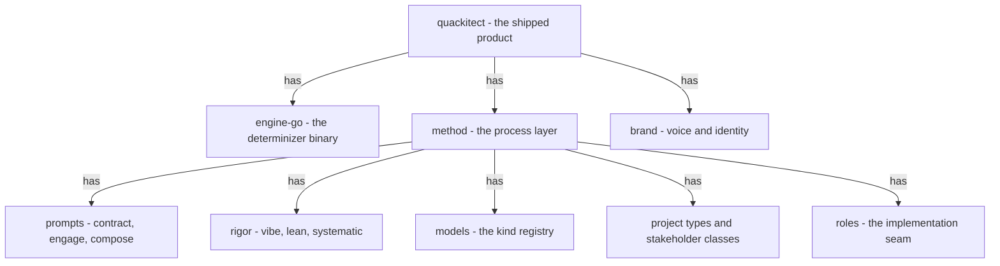

## Rationale (not load-bearing)
The third model (owner ruling 2026-07-10: "flow doesn't catch all"). Part-of only - composition of the shipped product/ tree; ranking stays in model-engine-layers, an orthogonal dimension. Conformance target: the product/ directory tree itself.
