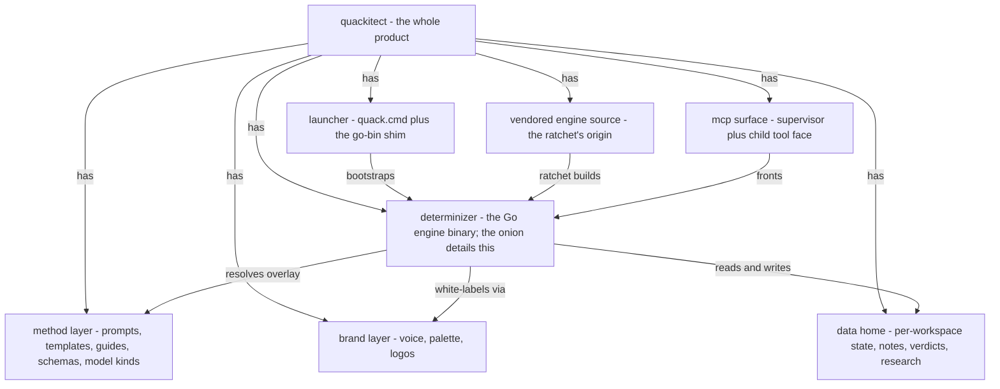

## Rationale (not load-bearing)
The middle altitude of the reading path (req-structure-layers): the context model shows quack as a black box; this model opens it into its parts; the determinizer element opens into the onion. Authored at i0027 M4 for the owner's diagram review. The driven WORKSPACE stays outside: it belongs to the driven project, a neighbor's material, not a part of quack. Overlap question for the owner: model-product-tree answers a part-of question this model may absorb.
