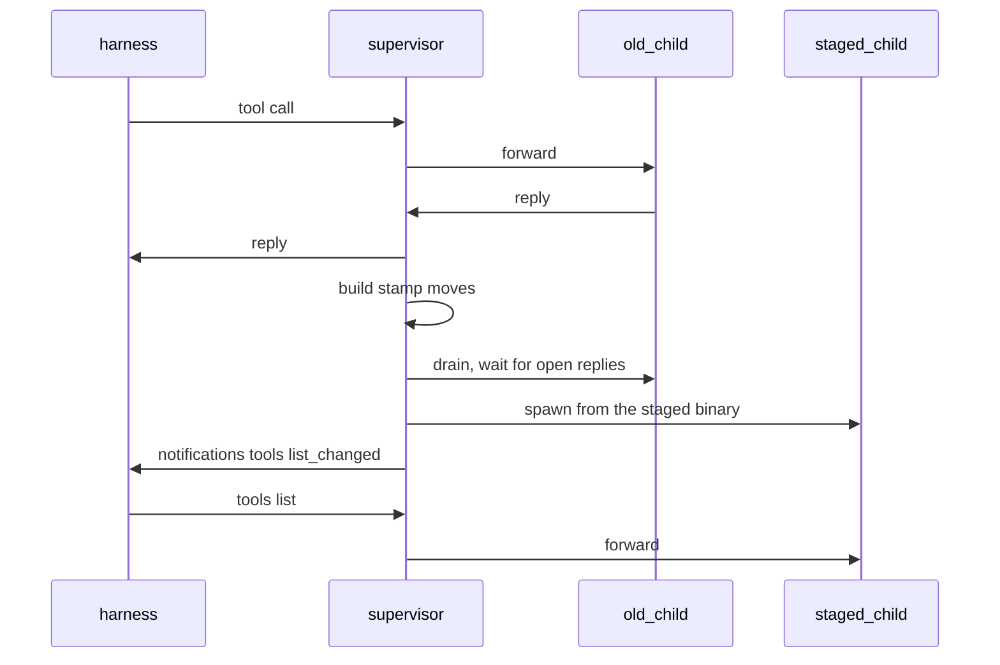

```mermaid
sequenceDiagram
  participant harness
  participant supervisor
  participant old_child
  participant staged_child
  harness->>supervisor: tool call
  supervisor->>old_child: forward
  old_child->>supervisor: reply
  supervisor->>harness: reply
  supervisor->>supervisor: build stamp moves
  supervisor->>old_child: drain, wait for open replies
  supervisor->>staged_child: spawn from the staged binary
  supervisor->>harness: notifications tools list_changed
  harness->>supervisor: tools list
  supervisor->>staged_child: forward
```

Placement rationale: the drain precedes the spawn, so no in-flight reply is lost. The notification follows the spawn, so the refreshed list is already servable when the client re-queries.
