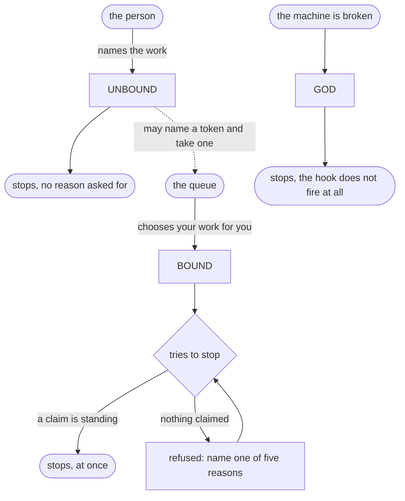

# The three rungs

What the binding means, and what the code does. Where the two differ it says so.

Open this file's preview to see the diagram.

Every row is now what the engine does. The tests that hold each one are named at
the bottom.

## The claim belongs to the queue

A bound agent names a reason before it stops. The queue chose its work and will
choose the next, so putting the work down is a decision the queue is owed a
reason for.

An unbound agent stops when it likes. The queue chose it nothing and hands out
nothing, so it has no standing to ask a person's agent why it is stopping.

A god-mode agent meets no hook at all. It is there because something in the
machine is broken and a person is watching.

When a claim is asked for, one is enough. A standing claim naming a sanctioned
reason is granted at once, whatever is still open. The engine used to push back
twice and grant the third claim. That went under wk-8863048da6.

## What each rung means

| | bound | unbound | god |
|---|---|---|---|
| what it means | bound to the queue | not bound to the queue | the machine is broken |
| who chooses the work | the queue hands it to you | the person names it | whoever is fixing it |
| a stop names a reason first | **yes** | **no** | no |
| the stop hook fires at all | yes | yes | **no** |
| a standing claim is granted | at once | not asked for | not asked for |
| forced to spawn before pulling | **yes** | no | no |
| mint your own token | yes, always | yes | yes |
| the queue chooses your work | yes | **no** | no |
| you may name a token and take it | yes | **yes, always** | yes |
| a token on every write | yes | **yes** (measured) | no |
| a token on every shell command | yes | **yes** (measured) | no |
| the note ceiling holds work | yes | no | no |
| notes in git before a stop | yes | no | no |
| every other engine guard | on | on | **off** |
| talk, read, search, answer | always | always | always |
| the person's own hold and ask | on | on | **on, god cannot silence them** |

## One sentence each

- **bound**: you name a reason before you stop, and the queue chooses your work.
- **unbound**: you stop when you like, you still name a token on every write, and
  you may take work from the queue by naming it.
- **god**: the machine is broken and a person is watching, so nothing the engine
  has may refuse you.

## Two things that are true at every rung

You can always mint a token. Finding a defect while working on something else
and writing it down is not a thing the queue owns.

You can always talk, read, search and answer.

## Choosing and being chosen for

These are two different things and the engine separates them.

Being handed the next token is the queue choosing your work. That is what
unbinding switches off. An unbound tree asked for the next token answers that it
hands out nothing.

Naming a token and taking it is you choosing. That stays open at every rung, and
the refusal above points straight at it.

So the queue is a list you may shop from rather than a conveyor you are strapped
to. Taking a token off it does not bind you: the rung is a state on disk, and
nothing in the queue writes it. `TestTakingATokenNeverMovesTheRung` holds that.

## Where the code differs today

Nothing. Every row above is what the engine does.

God and the stop hook closed under `wk-85d5b0ec27`. `decideStop` read the rung
nowhere, so a stop in god still needed a claim. It now returns at the top when
the rung is god.

The argument over a claim went under `wk-8863048da6`. A standing claim is now
granted at once, at every rung, and `challenge.go` is deleted.

## What is already right, and was measured

**A write and a shell command still name a token when unbound.** Both were sent
without a token on an unbound tree and both were refused. So the message the
engine writes when you unbind is true: write your own token and name it.

**God drops every engine guard.** `decidePreToolUse` returns at the god check
before any of them is reached.

**The person's hold and ask survive god.** They are enforced above that return,
deliberately, so an override cannot silence whoever is holding the work down.

**The spawn demand holds the pull only.** Changed in September 2026 under
`wk-bd4008ff45`. It used to hold every write, run and test, which is why a
question was once answered with a demand to spawn.

**The stop hook does not fire in god.** Changed in September 2026 under
`wk-85d5b0ec27`. `TestGodSilencesTheStopHook` drives a stop with work in hand
and nothing claimed, at all three rungs, and only god lets it go.

**A standing claim stops, at once, at every rung.** Changed in September 2026
under `wk-8863048da6`. `TestAValidClaimStopsAtOnce` runs on a bound tree with a
token in hand and every sanctioned reason is granted on its first claim.

**Taking a token never moves the rung.** Held by
`TestTakingATokenNeverMovesTheRung` under `wk-d846f231df`, rather than left true
by construction.

## Two things that read the rung and never run

`AskToStop` in `src/engine/pull.go` answers nothing when the tree is unleashed,
so it reads as a queue rule that unbinding switches off. Nothing calls it.

An earlier version of this file listed it as enforced when bound. That was
wrong, because a function was read without asking whether anything ran it. The
same shape had already been met once, in `NoGuardsAtAll`, which read the rung
and had no caller either until god was given the stop hook.

Its rule is now live, in `decideStop` rather than in it: unbound stops without
naming a reason. So `AskToStop` is a second writer of a rule that has a home,
and `wk-a8dda96e61` decides whether it goes.

`src/engine/hook.go` line 1216 guards the write-token rule with `binding.At !=
God`. The god check at line 838 returns from the same function first, so that
comparison can never be false. `wk-98c5a03545` deletes it.

Both are the same defect: code that reads the rung and never runs teaches a
reader a rule the engine does not have.
